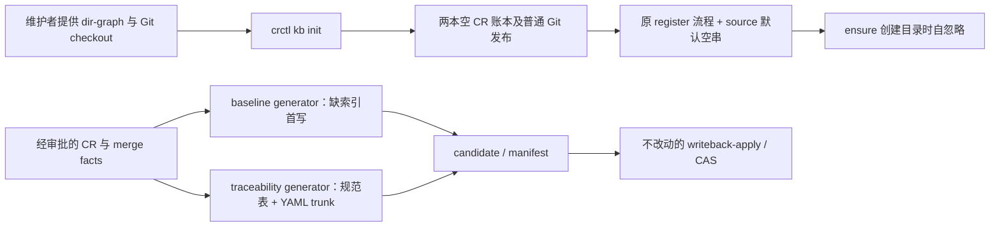

# CR-2026-074 — 新 KB 初始化与首次回写兼容方案

## 1. 架构概览

本设计承接已审批 `prd.md` 的 FR-1～FR-10、AC-01～AC-12，目标版本继承 `cr.md` 的 `0.47`。仅 tools 仓交付代码/说明/自动化测试，knowledge-base 仓承载本 CR 文档，multica 仓参与流程但无代码变更。代码路径取 Pipeline `resources[].worktreePath`；业务文档取 `workspace inspect.operationalWorkspace`。不以会话 cwd 或主 checkout 的陈旧 CR 快照作为编辑 authority。

设计依赖 `dep-1`～`dep-15`。本轮只读 tools `ARCHITECTURE.md`；初始化属于无 CR 的显式引导，不建立第二事务框架。新增私有 `cmdKbInit` 留在 `crctl.mjs`，Git 执行依赖 `dep-3`，文件独占创建依赖 `dep-2`，不新增模块或导出。新增入口保留显式 workspace 守卫，只对 `kb` 分支绕开必须已有 `change-requests/` 的检测与 gates 加载。



### 1.1 术语预检与边界场景

首次状态推进前核对以下语义，未发现需要作者自行裁决的冲突：

| canonical term | 实现命名/边界 | 代表场景 |
| --- | --- | --- |
| KB 主 checkout | `workspace` 入参、`deriveInstallRoot`、resolver 的 KB `rootPath`，三者 realpath 必须相等 | linked worktree 即使含 dir-graph，也不可作为 init 目标 |
| 无外部来源 | 新注册缺省/显式空串；历史 `manual` 不做全局别名 | 旧 key 未传 source 导致指纹冲突时必须拒绝，不迁移旧 journal；本 CR 的人工例外只作用于已注册事实 |
| 缺索引 | 文件不存在，不等于内容为空/缺 features | 空文件仍畸形，不获得首写豁免 |
| 规范表 | 表头单元格匹配，不依赖标题/章节号 | readiness 表含 FR 行但表头不同，不进入交付链 |
| 首次回写 | 已经处于 merging/writing-back 的 generator 场景 | 不通过 init 预建 specs 索引来掩盖 generator 缺文件路径 |
| 可重入 | 文件/Git阶段续跑，无跨阶段原子性承诺 | push 失败保留本地提交，同命令补推；不引入初始化 journal |

### 1.2 既有实现依赖与事实

以下为本次在 resources HEAD 核验的事实，正文只按 `dep-N` 引用；所有相对路径以各自 repo 根为基准。编号不复用，代码事实以稳定符号和行为共同绑定，不以文件存在替代行为证明。

| 标识 | repo | commit SHA | relative path | stable symbol/对象 | 依赖结论 |
| --- | --- | --- | --- | --- | --- |
| dep-1 | tools | 41b112ed4d97baaaca3b82367a72f35520dc3d4b | skills/shared/crctl/scripts/crctl.mjs | main / requireExplicitWorkspace / detectWorkspace / resolveToolsRoot | 非 help 入口先要求显式根，再检查 change-requests 并加载 gates；tools 仅由 install root 的 tools_package_path 与四标志解析，失败码原样输出 |
| dep-2 | tools | 41b112ed4d97baaaca3b82367a72f35520dc3d4b | skills/shared/crctl/scripts/crctl.mjs | createFileExclusive | wx 独占创建；EEXIST 返回 CAS_CONFLICT；自身写失败关闭 fd 并清理自身新文件，不删除他人先建文件 |
| dep-3 | tools | 41b112ed4d97baaaca3b82367a72f35520dc3d4b | skills/shared/crctl/scripts/lib/workspace-transactions.mjs | deriveInstallRoot / resolveRepositories / gitRun / gitMust | resolver 读取 YAML，排除 inactive，要求一 active KB，验证相对路径与末段 realpath；gitRun 返回 status/stdout/stderr，gitMust 非零抛 TX_GIT_FAILED；两 Git helper 已导出 |
| dep-4 | tools | 41b112ed4d97baaaca3b82367a72f35520dc3d4b | skills/shared/crctl/scripts/crctl.mjs | auditLog / cmdGit | auditLog 创建自忽略 .crctl 并写 JSONL；cmdGit 的白名单调用有审计，成功 push 可发 CR checkpoint outbox，因此 init 不经 cmdGit |
| dep-5 | tools | 41b112ed4d97baaaca3b82367a72f35520dc3d4b | skills/shared/crctl/scripts/lib/workspace-transactions.mjs | ensureRepoWorkspace.create | 建立 repo.worktreePath 后执行 worktree add，创建路径未写 .rayai-worktrees/.gitignore；这是 FR-4 的窄修改点 |
| dep-6 | tools | 41b112ed4d97baaaca3b82367a72f35520dc3d4b | skills/shared/crctl/scripts/lib/workspace-transactions.mjs | registerCr 的 source / inputDigest / loadOrCreateJournal | source 缺省为 manual 且参与 inputDigest；同 key 不同指纹转 REGISTRATION_INPUT_MISMATCH，指纹校验早于注册账本副作用 |
| dep-7 | tools | 41b112ed4d97baaaca3b82367a72f35520dc3d4b | skills/writeback/scripts/writeback-prd-sdd.mjs | buildIndex | 缺 specs/_index.yml 报 STRUCTURE_MISMATCH；新 spec 在 features 后插入；已有目标条目缺 cr-history 仍报结构错误 |
| dep-8 | tools | 41b112ed4d97baaaca3b82367a72f35520dc3d4b | skills/writeback/scripts/lib.mjs | readFile / readHashRaw / writeCandidate | 文本读取规范行尾；before 锚点按磁盘字节；candidate 输出 blobs/manifest，缺文件 before 为 null，不写 authority |
| dep-9 | tools | 41b112ed4d97baaaca3b82367a72f35520dc3d4b | skills/shared/crctl/scripts/lib/workspace-transactions.mjs | writebackAllowlist / applyWriteback | baseline 白名单含 specs/_index.yml；应用通过 manifest 与 recoverable write-set，并沿用事务恢复 |
| dep-10 | tools | 41b112ed4d97baaaca3b82367a72f35520dc3d4b | skills/shared/crctl/scripts/lib/durable-tx.mjs | applyWriteSet / recoverWriteSet 的 beforeSha256 分支 | null 表示目标缺失，已有异内容不满足 before/after 时拒绝；已完成 after 可识别重放，不覆盖并发异内容 |
| dep-11 | tools | 41b112ed4d97baaaca3b82367a72f35520dc3d4b | skills/writeback/scripts/writeback-traceability.mjs | buildNewMilestone / trunkOf | 整篇扫描 FR/cmd 行且覆盖 cells.filter(Boolean) 丢空位；trunk 正则依赖 - id 首键与非引号值；TASK/test-report/merge facts 交叉校验在后续构造与 validator 中 |
| dep-12 | tools | 41b112ed4d97baaaca3b82367a72f35520dc3d4b | skills/shared/crctl/scripts/lib/yaml-subset.mjs | parseYaml | 可解析 repositories 的映射/序列及引号标量；供 resolver 使用，可由 traceability 直接 import，无需新增 YAML 依赖 |
| dep-13 | tools | 41b112ed4d97baaaca3b82367a72f35520dc3d4b | skills/shared/controlled-shell/rules.json | git[sub=merge-base].shapes | 仅允许 origin/trunk 对 HEAD 与 is-ancestor 对 origin/ref 两种形态，裸提交对当前不在 shape 中 |
| dep-14 | tools | 41b112ed4d97baaaca3b82367a72f35520dc3d4b | skills/requirement/write-requirement-prd/SKILL.md | Step 2 source 校验 | 非空 source 必须在 KB worktree 内且存在；空串不进入此条件；不需要改 writer 通用合同 |
| dep-15 | tools | 41b112ed4d97baaaca3b82367a72f35520dc3d4b | ARCHITECTURE.md | §4/§5/§8 | 零依赖、状态/门禁经 crctl、目录与权限单一事实源；新增写入子命令触发地图维护，必须先过设计评审 |

待核实依赖：无。历史样本用于测试，不作为本次功能已通过证据。CR-2026-061/066 的 PLAN 从 knowledge-base `change-requests/<CR>/plan.md` 裁剪，实施时记录原文 SHA（规范行尾）与来源 commit，再纳入 tools 测试 fixture，不修改签字源。

## 2. 数据模型

### 2.1 初始化输入及两账本

业务输入仅目标 KB 根的 `dir-graph.yaml`；tools 身份与 repositories 解释设计依赖 `dep-1`、`dep-3`。必须声明非空 `workspace.tools_package_path` 与恰好一 active KB 的 `id/path/trunk/role`，id 不写死。其他 active 仓同样声明其代码 role、路径、trunk；inactive 不要求现场。

仅创建以下 UTF-8/LF 文本（末尾换行、null 根，不改成空数组）：

```yaml
# change-requests/_backlog.yml 的实际内容不包含此注释
schema: cr-backlog/v2
change-requests:
```

```yaml
# change-requests/_index.yml 的实际内容不包含此注释
change-requests:
```

`dir-graph.yaml` 保持人提供的原文。检查已有账本时只做 CRLF→LF，然后与完整模板逐字比较；不 trim、不解析后重写。已使用账本有条目即冲突，不以 schema 正确当作已初始化。不存在才调用独占创建；初始化不生成 specs/delivery 索引、根 .gitignore、CR/task/outbox、journal/锁/故障点。

### 2.2 首次 baseline candidate 与 trace 数据

缺 `specs/_index.yml` 时 `buildIndex` 的内存文本起始为 `schema: specs-index/v1\n\nfeatures:\n`，再插入本 spec。此 LF 转义仅说明字符串值，实际文件保留真实换行。不存在才取该文本；空文件或缺 features 的已存在文件不得被替换为模板。新索引不增加顶层 updated。设计依赖 `dep-7`～`dep-10`，只改变 generator 的缺文件输入分支，保留 manifest 的 `beforeSha256:null` 与生成后的应用边界。

规范表仅提供 `fr-chain` 的 FR/SDD/TASK/evidence 与命令 ID 集合；`code` 来自 merge facts。trunk 来自解析后的 `repositories[]`，不从 ref 当前 HEAD 推断。新设计不改 manifest 版本、trace event payload、TASK/test-report/merge 证据 schema 或 validator。

### 2.3 source 与历史指纹

FR-10 唯一代码变更为 `registerCr` 的 `input.source ?? ''`（设计依赖 `dep-6`、`dep-14`）；新省略与显式空串均进入同一空 source 指纹及持久化值。显式路径值不归一成 manual/空串，不改 containment 规则。

历史重放按以下矩阵验收，而非宣称“所有旧省略调用仍自动幂等”：

| 事务已存 source | 本次输入 | 预期 |
| --- | --- | --- |
| manual，旧省略注册 | 仍省略 source | 新计算为空，REGISTRATION_INPUT_MISMATCH；零账本重写/零新增 CR，保留原 journal 指纹 |
| manual | 显式 source=manual，其他指纹字段一致 | 原指纹匹配，按注册深原语续跑/noop，保留 manual，不重新分配 CR-ID |
| 显式路径 | 同一路径与相同字段 | 原指纹匹配，原续跑/noop |
| 空串 | 省略或显式空串，其他字段相同 | 指纹匹配，原续跑/noop |

这是 PRD FR-10 指纹冲突合同的显式边界；不修改旧 recovery argv/journal，也不为旧默认值引入兼容重归一化。遇历史省略调用冲突报告原错误与旧输入事实，不新 key 重注册。已有 `CR-2026-074` 的 manual 放行仅以 PRD §1.2 Ray 裁定为依据。

## 3. 接口契约

### 3.1 CLI

公开形态：`node <tools-root>/skills/shared/crctl/scripts/crctl.mjs kb init --workspace <KB 主 checkout>`。无额外业务 flag、CR-ID、owner、trunk 或 version；不需要 TTY。只接受 positional=`['init']` 与 workspace flag，未知子命令、额外位置参数/flag 返回 BAD_ARGS。先验证 workspace 非空字符串，再验证 kb 形态；缺根不会被 BAD_ARGS 或 WORKSPACE_NOT_FOUND 掩盖。help 保持无根可用，其他非 help 入口保持原检测路径。

成功 stdout（只在发布步骤成功后输出）：

```typescript
type KbInitResult = {
  op: 'kb-init';
  changed: boolean; // 本次创建、提交或推送至少发生其一；成功审计不使 noop 变 true
  created: string[]; // 本次独占创建的两账本相对路径，按固定路径顺序；重跑通常 []
  commit: string; // 成功后的完整 HEAD SHA，noop/补推也返回同一 HEAD，不用 null
  pushed: boolean; // 本次是否实际普通 push；远端已含 HEAD 时 false
};
```

无新投影器：初始化直接使用统一 `ok`，输出以上完整字段。`commit` 不表示本次必定新建提交；只在暂存三文件有差异时 commit。成功每次追加一行 `auditLog(ws,{op:'kb-init',actor,...result})`，无 CR outbox。失败不写成功审计/不输出成功 JSON。

### 3.2 错误与优先级

失败统一非零，stderr=`{error:{code,message,...}}`；原错误 detail 不抹除。严格依 PRD FR-2 顺序：

1. WORKSPACE_REQUIRED → kb 形态 BAD_ARGS。
2. `resolveToolsRoot` → `resolveRepositories`，透传各自原错误，不把 tools 缺失改成 graph 错误。
3. 主 checkout/仓根/origin/代码仓远端 trunk 只读核验失败：KB_INIT_PRECONDITION，reason=repo-invalid。
4. KB 分支不等声明 trunk：KB_INIT_PRECONDITION，reason=trunk-mismatch。
5. 工作树或 index 夹带三文件外变更：KB_INIT_PRECONDITION，reason=dirty。
6. KB 远端核验失败/有远端而无本地 HEAD/远端非 HEAD 祖先：KB_INIT_PRECONDITION，reason=remote-diverged。
7. 已有账本规范文本异内容：KB_INIT_CONFLICT，paths 列出冲突相对路径。
8. 独占创建并发 EEXIST：CAS_CONFLICT，设计依赖 `dep-2`；I/O 失败走 INTERNAL_ERROR；add/commit/push 错误走 TX_GIT_FAILED，附 stage=add|commit|push 与 Git 原因，设计依赖 `dep-3`。

前置失败不写业务文件/index/commit/远端/audit/CR 状态；只读 fetch 的本地对象/跟踪引用更新不回滚。创建失败仅容许之前完整创建的模板，Git 失败仅容许合法模板/index/本地提交；不 force、不删除他人文件、不补造事务。远端在前置后竞争推进时普通 push 拒绝，重跑重新执行全部前置。

### 3.3 authority 与调用面

kb init：业务根是显式主 checkout；init 对 linked worktree 不提供自动转换/ensure。baseline/trace：业务根由交付 Pipeline authority 解析，generator 只写 candidate；apply 设计依赖 `dep-9`、`dep-10`。本 CR 作者/实施者只在 resources 的 tools worktree 改代码，不因 KB 初始化能力而修改任何其他 Issue 的现场。

## 4. 关键算法与流程

### 4.1 初始化（FR-1～FR-3）

接线：`main` 在 `requireExplicitWorkspace` 后、`detectWorkspace/loadGates` 前，将 cmd=kb 派到私有 `cmdKbInit(path.resolve(flags.workspace),positional,flags)`；该函数先查形态，再走以下步骤。其他分支逐字沿用检测/gates，不扩展隐式根。设计依赖 `dep-1`。

```text
tools = resolveToolsRoot(ws)；ctx = resolveRepositories(ws)
real(ws) == real(ctx.installRoot) == real(KB.rootPath)
逐 active repo：Git show-toplevel 等于 rootPath；不是 bare；有 origin
逐 active code repo：ls-remote origin refs/heads/<trunk> 成功且有该 trunk
KB symbolic-ref HEAD 等于声明 trunk（允许 unborn HEAD）
status --porcelain -z：工作树/index 的每个路径仅限 dir-graph 与两账本
  rename/copy 必须检查源、目标；不因字符串包含空格而截断路径
查询 KB remote trunk：成功空结果允许；存在则 fetch 明确 trunk
  有 remote、无 HEAD：拒绝；有 HEAD：merge-base --is-ancestor <remoteSHA> <HEAD>
逐账本：不存在记待创建；规范全文等模板跳过；其他汇总 conflict
以上检查全部成功后，才 mkdir 账本父目录并 createFileExclusive 待建文件
git add -- dir-graph.yaml change-requests/_backlog.yml change-requests/_index.yml
diff --cached --quiet：0 跳过 commit，1 commit -m 'kb init'，其他 exit 视 Git 失败
取新 HEAD：remote 缺失或不含该 HEAD 时普通 push HEAD:refs/heads/<trunk>
成功 audit 一行，然后 ok(result)
```

root/checkout 核验使用 realpath；输入路径大小写/别名按文件身份处理，不拿裸字符串路径推断另一 checkout。对代码仓仅核验，不 add/commit/push。网络失败不得当“空远端”。Git 命令均为固定 argv，shell=false，导入已导出的 gitRun/gitMust；不扩展 controlled-shell 的 commit 白名单以允许任意 `kb init` 文本，不借 cmdGit 发 CR 事件。账本父目录不得通过 symlink/junction 逃逸主 checkout（归 repo-invalid），不以可读模板内容豁免写入边界。

三文件是 init 提交的唯一候选内容；允许 dir-graph 已经在此前 HEAD 中，初始化提交 tree 仍必须含三者。本流程无串行锁，检查与写入之间不承诺整体原子：新账本竞争由 wx 保证不覆盖，远端竞争由普通非快进拒绝保证不覆盖；并行 Git index 操作须由操作者避免，不宣称新增跨进程事务隔离。

重入：两账本正好模板但未提交 → add/commit/push；本地 init 提交未推 → 无新 commit，仅 push；远端已包含 HEAD → noop。远端 HEAD 比本地领先即使只有初始化文件也不能自动 pull/reset；属于 remote-diverged。成功之后使用原 register 业务命令，无隐式注册动作。

### 4.2 自忽略与注册默认值（FR-4、FR-10）

设计依赖 `dep-4`～`dep-6`。在 `ensureRepoWorkspace` 建立 worktree 的 create 路径，确保 install root 的 `.rayai-worktrees/` 已建，并写其包自管 `.gitignore` 为 `*\n`，再创建下层 repo.worktreePath 和 worktree。只写运行时目录自身文件，根用户 `.gitignore` 原文不动；不扩展到其他目录。新注册 source 仅改缺省字面值，owner/version/spec/CR 分配/锁/journal/指纹算法/显式 source 均不改。

### 4.3 baseline 缺文件首写（FR-5）

`buildIndex` 中 `readFile(indexPath)===null` 才取新首部；其后进入同一条 features/spec 插入及历史累积代码。设计依赖 `dep-7`、`dep-8`。before 从原索引路径读取而不是从内存模板推导，缺文件保持 null。candidate 后他人创建索引时由 apply 拒绝，不写 authority、不修改 CAS 函数；同事务重放沿 `dep-9`、`dep-10`。不通过新建根索引绕过畸形既有文件错误。

### 4.4 PLAN 规范表提取（FR-6）

在 traceability 脚本内加入私有取表函数，不新增导出/模块。先 LF 归一，用 `split(/\r?\n/)`；表头去两端管道、各格 trim，但不丢空格，数组必须逐字等于：

- `['FR/关键AC','SDD交付项','主责/关联TASK','验收证据','回滚']`
- `['证据ID','repo','cwd','executable','args','timeout']`

匹配表头紧接一行 Markdown 分隔行；分隔格按 `^:?-{3,}:?$` 验证且与表头列数一致。每类恰一张，否则 STRUCTURE_MISMATCH；只读分隔行后连续的管道数据行，到首个非表行停止，不全篇筛 FR/cmd。章节号、其他表及表外诱饵不参加集合。

覆盖数据行：去外侧管道后 split，保留中间空格，恰 5 格且首格匹配 `^FR-\d+`；不丢空单元格以凑列。按 FR 数字顺序构造链，列 1/2/3/4/5 依次对应 FR标题/SDD/TASK/evidence/rollback，rollback 不进入链。命令数据行：只取首个单元格检查 `^cmd-\d{2}$`；不检查数据行列数，不解析 args 内的 `|` 为命令列错误。空数据集合仍不能构成可解析链/证据表，STRUCTURE_MISMATCH。

设计依赖 `dep-11`；取表结果传入其下游交叉校验，不删 TASK 账本、test-report 命令 ID、merge facts 和最终 validator 的检查。不新增重复 FR/cmd 限制，不改已批准 PLAN 的写法来适配 parser。失败在 `writeCandidate` 前发生，不触 authority/本阶段 journal。

### 4.5 trunk 的 YAML 解释（FR-7）

设计依赖 `dep-11`、`dep-12`。导入 `parseYaml`，读入 dir-graph 先 LF 归一，从 `doc.repositories` 按字符串 trim 后 id 定位 active 条目，trunk 要求非空字符串；有效目标缺失/不唯一/无有效 trunk 返回 TRUNK_UNKNOWN，绝不回退 master/main。引号由 YAML parser 解码，id 的键序不影响定位。不调用现场 repository resolver 做磁盘检查：trace 输入是冻结的业务根声明，不把代码仓本地 checkout 可达性新增为 generator 前置。merge facts 的 sha/branch 构造和 required 校验保持不变。

### 4.6 裸提交判定（FR-9）

设计依赖 `dep-13`。仅追加 shape `^--is-ancestor [0-9a-f]{7,40} [0-9a-f]{7,40}$`；不改 callers、forbiddenFlags、protectedPaths、其余命令。Git exit=0/1 分别表示祖先/非祖先；exit=1 不是 FORBIDDEN_SUBCOMMAND。无效对象可通过 shape 但仍由 Git 自身拒绝，不假报 ancestor。两条旧 shape 单独回归，非法形态必须“不匹配全部三条”才预期白名单拒绝。

## 5. 技术选型、测试与回滚

### 5.1 选型

Node ≥18，零新依赖；YAML 设计依赖 `dep-12`，不引入第三方 parser。初始化采用独占文件创建+普通 Git阶段重入而非新 durable transaction；这是 PRD 的明确边界，不记录无真实权衡的独立 ADR。没有 HTTP/IPC/schema/数据库迁移，不生成 OpenAPI、DDL 或 down migration。

### 5.2 验证落点与可达性

沿 tools 的 `scripts/test` 体系加定向用例，不新增 Skill 或生产模块。初始化用三仓+bare origin 场景，抽取 register-tx 同构 fixture 到测试文件局部即可，不为了几条用例新增通用 fixture 框架。所有新 Git 配置仅发生在临时测试仓，禁止触及用户全局身份。

| 测试入口（相对 tools） | 证据范围 |
| --- | --- |
| skills/shared/crctl/scripts/test/crctl.test.mjs | init happy/noop/全部前置优先级、失败残留与恢复；普通命令 workspace 守卫；裸提交祖先/非祖先及拒绝形态 |
| skills/shared/crctl/scripts/test/register-tx.test.mjs | init 后 register、无根忽略的 clean 主 KB；空 source 与历史指纹矩阵 |
| skills/writeback/scripts/test/writeback.test.mjs | baseline 缺/畸形/已有索引；两规范表正负场景、空位/管道/诱饵、YAML trunk、LF/CRLF |
| skills/shared/crctl/scripts/test/writeback-tx.test.mjs | makeCodeApprovedFixture 无索引变体，apply 并发/重放、完整归档及仅 trace 重放 |
| skills/shared/crctl/scripts/test/caller-contract.test.mjs | 非 help 命令集合与 two-word 发现加入 kb；缺根/空根与文档入口契约 |
| skills/shared/crctl/scripts/test/lint-prompts.test.mjs；skills/shared/crctl/scripts/test/gate-registry.json | 说明与可执行命令一致；按实际新增用例同步计数，不动门禁定义 |

测试命令使用 `node --test <上述定向文件>`，正式 cwd/完整 argv/timeout 与证据 ID 由 PLAN 规范表冻结。设计阶段不把尚未执行的 AC 当 pass。

并发/I/O/Git故障测试不新增生产 faultPoint：在隔离子进程通过测试专用 preload 对 fs.openSync 注入一次 EEXIST/写失败，或使用测试 PATH shim 仅拒绝固定 add/commit/push 阶段；不修改生产环境变量语义，不在真实 workspace 使用 shim。前置失败前后比较业务文件、index tree、HEAD、远端 trunk、audit/outbox；只读 fetch 不要求对象库不变。创建失败断言失败文件清理与之前完整模板残留，Git 失败断言 stage 和无成功审计，然后去掉测试注入同命令续跑。

历史 PLAN fixture 同时保留规范表期望结果与诱饵/管道最小上下文：061 的 args 管道、066 的表外 FR 诱饵；先建立旧解析仅针对规范片段的基准结果，再比较新解析集合，不把旧全篇误收也冻结为期望。历史样本行尾规范后存来源摘要，测试执行不读取其他 KB trunk。

source 的 writer 路径规则属于 prompt 合同（`dep-14`），测试以真实 register 产物空值 + 不变合同断言为证据，不声称 CLI 自动执行了 writer；存在/不存在/越界的非空输入逐项对照该合同，正式需求编写仍由 writer 执行。AC-12 使用测试 fixture 构造规范审批证据，不在真实 CR 中代签；写回前后的 PLAN/approval/merge/test-report 规范行尾哈希必须不变。

### 5.3 回滚与风险

- 未 merge 前代码可在批准范围内回修；发布后由正常 Git revert/新 CR 恢复代码，不手改受控账本、不 force trunk。恢复旧 source 默认后，新空 source 历史仍不迁移。
- init 没有自动 rollback；合法模板/暂存/本地 commit 的保留是接口合同。已使用账本不能 init 修复。成功审计写失败不伪报成功，按 INTERNAL_ERROR 报告，业务发布事实可已存在，重跑重新核验。
- generator 只写 candidate，失败不覆 authority；既有事务恢复设计依赖 `dep-9`、`dep-10`，不得删除在途 journal 或重做签字源。CAS 以 dep-8 的字节锚点为准，不在本 CR 中改变其协议；兼容测试的语义哈希/解析比较先 CRLF→LF。
- 网络步骤每次一次、有界 CLI 执行，无常驻 watcher/轮询；输入规模为 repositories、PLAN 行数，解析 O(n)，不新增日志扫描或全仓遍历。
- 模板账本相等但工作树有其他变更仍拒绝；KB 无 HEAD但代码仓必须已存在远端 trunk，是不同角色前置，不误过滤 AC-01 的空 KB。

## 6. FR 与 AC 逐项映射

### 6.1 FR 覆盖

| FR | 技术落点 | 验收关联 |
| --- | --- | --- |
| FR-1 | §1、§3.1、§4.1，入口特判不改普通命令 | AC-01、AC-02 |
| FR-2 | §3.2、§4.1、§5.2，固定前置与失败残留 | AC-02、AC-03 |
| FR-3 | §2.1、§3.1、§4.1，两模板/发布/重入 | AC-01、AC-03、AC-04 |
| FR-4 | §4.2，ensure create 自忽略 | AC-04 |
| FR-5 | §2.2、§4.3，缺索引仅 candidate 首写 | AC-05、AC-12 |
| FR-6 | §4.4，两规范表、空格位、命令管道 | AC-06、AC-07、AC-12 |
| FR-7 | §4.5，YAML trunk | AC-08、AC-12 |
| FR-8 | §8，说明/命令发现/测试计数 | AC-09 |
| FR-9 | §4.6，仅 shape+能力说明 | AC-10 |
| FR-10 | §2.3、§4.2，空默认与历史边界 | AC-11 |

### 6.2 AC 输出合同

| AC | 设计落点 | 可观测结果 | 可达性说明 |
| --- | --- | --- | --- |
| AC-01 | §2.1/§3.1/§4.1，crctl init fixture | 精确模板、提交 tree 只含三候选文件、远端首 trunk、五输出字段、无 CR/task/outbox；二次 changed=false/无新 commit/push | kb 分支 symbolic-ref 不要求 HEAD，KB 空远端不当网络失败；code 仓另有远端 trunk |
| AC-02 | §3.2 的有序检查 | 每项固定 code/reason；前置前后业务/index/HEAD/remote/audit 相同 | kb 特判先于 detectWorkspace，错误 priority 先 tools 后 graph 再 repo/branch/dirty/remote/ledger；双重错误 fixture 验证最先失败 |
| AC-03 | §4.1/§5.2，wx 与 Git续跑 | 未提交补 commit，未推送补 push；并发内容保留、I/O 自清理、Git stage/residue，无成功审计；去注入后续跑 | 测试在全部前置通过后注入 create 或 Git阶段，避免被 dirty/账本冲突提前截断；不新增生产 faultPoint |
| AC-04 | §4.2，register 三仓场景 | 第一 CR 分配、全部 worktree、主 KB clean、runtime ignore=*、根 ignore 哈希不变 | fixture 不预装根 runtime ignore，新 CR 必经 ensure create；init 不预建 CR |
| AC-05 | §4.3 + apply fixture | before=null，新索引 apply/重放一次；坏索引/并发文件原文不变、旧历史保留 | 删测试 baseline 索引但保持 merging/writing-back 合法 authority；并发在 candidate 后/apply 前注入 |
| AC-06 | §4.4，061/066 与合成诱饵 fixture | 新链/命令 ID 与规范片段期望一致，表外无误收，空位不移列 | 标准表保留、换章节号，args 含管道仅验首格；诱饵表不满足表头不参与 |
| AC-07 | §4.4/§5.2，各正负 LF/CRLF 对 | 结构错 STRUCTURE_MISMATCH；authority/本阶段 journal 不变；集合/错误在两行尾下相同 | 在合法 writing-back/其他证据齐全时变动目标表，让负测触达 parser，而非状态/缺证据先失败 |
| AC-08 | §4.5，trunk 与交叉证据回归 | 引号/非首键 trunk 正确；缺有效 trunk 为 TRUNK_UNKNOWN；原 TASK/test/merge 负测保留 | 仅改测试 graph 文本或交叉输入，不调用磁盘 resolver 提前排除有效冻结声明 |
| AC-09 | §8、caller-contract/说明检查 | 四手工模板消失、其他 docs 模板保留；显式根/role/tools/不代跑可见；相关定向测试计数一致 | 保留 ordinary command 入口负测；未改状态机/gates/Pipeline/Agent/矩阵的 diff 断言 |
| AC-10 | §4.6，受控入口真实 Git fixture | 7/40 位裸提交通过 shape；exit=0/1 原语义，非法形态 FORBIDDEN_SUBCOMMAND；两旧 shape 通过 | 真/假使用真实可解析提交对象；拒绝样例须同时不匹配旧两 shape，不把旧放行误判回归 |
| AC-11 | §2.3/§4.2/§5.2，source及合同检查 | 新 source 空串；显式路径合同不变；历史 manual/指纹不写、无重复 CR；旧省略冲突与显式同值重放矩阵 | 历史 fixture 用变更前 manual 注册指纹/现场，不由新代码重新造“旧默认”；空 source 不进入 writer 非空条件 |
| AC-12 | §4.3～§4.5，writeback-tx enriched fixture | 无索引 merge→三阶段→archive；独立 trace 重放不改 baseline/tasks事务与签字源规范哈希 | fixture 内证据/状态满足各阶段；独立重放仍保持 writing-back，不先 archive，不伪造真实审批 |

### 6.3 SDD-CLOSE

| ID | PRD 延后项（七维术语口径） | 关闭结论 |
| --- | --- | --- |
| SDD-CLOSE-01 | 接口契约：初始化接线、错误优先级/输出 | §3.1～§3.2/§4.1 定义输入、根解析、输出字段、错误、普通入口隔离及消费；不使用 HTTP 语义 |
| SDD-CLOSE-02 | 数据模型完整性：模板、manifest、source历史 | §2 定义生成/存储；§3/§4 定义返回与消费、CAS；§2.3 明确历史降级为原冲突而非强写，源 schema 不改 |
| SDD-CLOSE-03 | 多仓架构约束：根与 resources authority | §1/§3.3/§4.1 明确作者资源、init 主根与交付 authority 三个上下文，不以代码 worktree代替业务根 |
| SDD-CLOSE-04 | 可测试性：解析、恢复、测试拆分 | §4.4～§4.5 与 §5.2、逐 AC 给出输入生产/解析/消费/错误与可达性；管道、空格位、LF/CRLF、旧注册/故障重入闭合 |
| SDD-CLOSE-05 | 性能与安全：零覆盖及可恢复残留 | §3.2/§4.1/§5.3 限定 wx/非快进/CAS，明确 init 无全事务隔离与实际残留，不暗示覆盖/自动 rollback |

待办关闭项：无。技术设计/测试拆分不代替未来执行证据，评审结论由独立 reviewer 产生。

## 7. 安全与性能考量

设计依赖 `dep-1`～`dep-4`、`dep-9`、`dep-10`、`dep-15`。显式根/realpath/role 校验先于业务写；固定 argv 不插入 shell，普通 push 不 force/lease、不修改凭据，操作系统/Git权限照常。初始化不承担人类审批权限。既有账本异内容硬拒绝，新索引并发由 before=null CAS 拒绝。性能仅 O(PLAN行数+仓库数) 与有界 Git网络调用；不增加全量真实人工 E2E 门槛。

## 8. Prompt 采纳影响与文档同步

本 CR 触及 `crctl.mjs` dispatch，因此本节必填；guard deny 面保持不变。设计依赖 `dep-1`、`dep-13`、`dep-14`、`dep-15`。

| Skill / 文档路径（tools 相对） | 现状/依赖 | 应改为的调用或说明 |
| --- | --- | --- |
| skills/shared/crctl/SKILL.md | 子命令发现与根入口说明（dep-1） | 表增 kb init；workspace 必填，只有该入口可在无 change-requests 下引导；删 cwd向上探测说法；完整成功/失败边界 |
| skills/requirement/requirement-register/SKILL.md | 注册前置与失败分类 | 加 WORKSPACE_NOT_FOUND/REPO_GRAPH_NOT_FOUND/TOOLS_PACKAGE_NOT_FOUND 的引导：人先提供最小 dir-graph、运行显式 kb init；Skill 不自动代跑、不重复注册；source 默认空串说明与历史指纹冲突边界 |
| skills/shared/controlled-shell/SKILL.md | merge-base 能力解释（dep-13） | 同步裸提交对，强调三 shape 与 Git exit语义，不扩展 protectedPaths |
| README.md | 流程总览 | 简短“新 KB先写dir-graph→显式kb init”入口，说明不是新 Pipeline/Skill |
| docs/QODER-使用指南.md | 旧初始化模板段 | 删除 backlog/CR index/specs index/delivery task index 四模板；保留 docs 索引模板；示例补 tools_package_path、KB/code role 与声明 trunk，不写本机路径 |
| ARCHITECTURE.md | 地图维护规则（dep-15） | 本轮只读；技术审批通过后的实施 TASK 内按 §8 补无 CR 初始化写入入口与权限/事务边界，非新增业务能力，随代码评审检查 |

不改 `write-requirement-prd/SKILL.md` 通用校验（dep-14）；不让 writeback/approve 等 Skill 自动调用初始化。代码 HELP 追加 `kb init`，caller-contract 的首词集合/TWO_WORD 加 kb，gate-registry 按新增入口相关用例实际计数同步。不新增 active skill，不改 Agent、Pipeline或矩阵。

## 9. 批准范围

- **scope_in**：FR-1～FR-10、AC-01～AC-12 全部。tools `skills/shared/crctl/scripts/crctl.mjs` 私有初始化入口/HELP；`skills/shared/crctl/scripts/lib/workspace-transactions.mjs` 仅 ensure create 自忽略与 source 缺省值；`skills/writeback/scripts/writeback-prd-sdd.mjs` 仅缺索引首部；`skills/writeback/scripts/writeback-traceability.mjs` 仅两表提取与 YAML trunk；`skills/shared/controlled-shell/rules.json` 仅追加一个 merge-base shape；§5.2 所列定向测试及必要 fixture/计数；§8 说明同步。治理必需的 `ARCHITECTURE.md` 地图维护仅在技术审批后实施，不借此改架构不变量。本 CR 的 PRD/SDD/PLAN/TASK及规范测试证据按各节点受控生成，不改历史源。
- **scope_out**：状态机、gates 定义、Pipeline、Agent/权限矩阵、tools dir-graph.required_roots、multica代码/CUSTOM；新 Skill/生产模块/导出；初始化锁/journal/故障点/daemon/watcher；账户/远端/Git仓创建；source-set或历史source迁移；修复异内容旧 KB账本；其他 Issue/KB 的现场恢复（含 AIFI-35）；全量真实人工审批E2E。
- **zero_diff**：`durable-tx.mjs` 全文件、`workspace-transactions.mjs` 的 applyWriteback/writebackAllowlist/指纹计算与注册其余行为、`write-requirement-prd/SKILL.md` 通用source路径合同；`rules.json` 其他git形态/callers/forbiddenFlags/protectedPaths；既有签字 PLAN/approval/merge证据及本 CR cr.md 注册source/摘要/历史指纹（状态变化仅由crctl）；用户根.gitignore；其他docs索引模板。§4.2 两处必要例外明确属于 scope_in，不以“注册核心不改”重新否定 FR-10。
- **follow_up**：AIFI-35工具安装版本确认与无在途trace事务后的原节点恢复，仍由其负责Agent独立执行，不是当前AC必要条件；无其他当前交付依赖延期。初始化跨Git index并发事务隔离不在本需求承诺内，若以后确有需求另立CR，不用它替代本轮wx/非快进测试。

## 10. 变更记录

| 日期 | 版本 | 说明 |
| --- | --- | --- |
| 2026-09-30 | 0.1 | 承接需求审批；完成10 FR/12 AC设计闭环、15项既有依赖与5项SDD-CLOSE；等待独立技术评审 |
