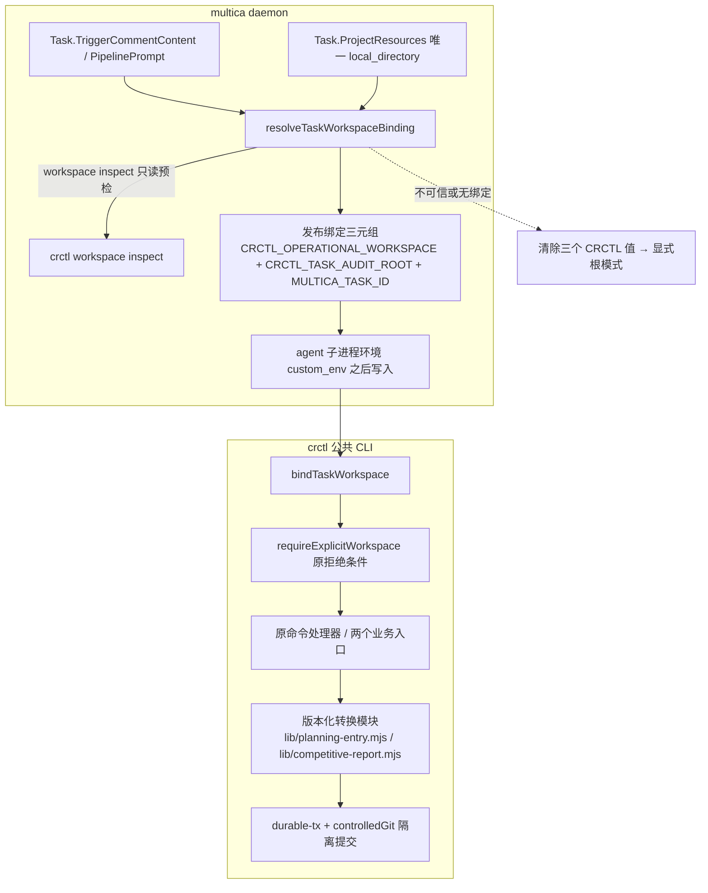

# CR-2026-075 — CR 执行入口与声明一致性修订方案 技术设计

## 1. 架构概览

本设计承接已审批 `prd.md` 的 FR-01～FR-16 与 AC-A1～A8、AC-B1～B20，目标版本继承 `cr.md` 的 `0.48`。交付面为三仓：tools 承载公共 CLI 归一、两个业务受控写入入口与确定性转换模块、合同/提示对齐；multica 承载 task 级 operational 绑定与普通 Issue 委派接线；knowledge-base（ai-first-platform-docs）只承载本 CR 文档与（若有）部署记录，不承载业务代码。代码与文档路径一律取 `crctl workspace inspect CR-2026-075 --workspace <workspace>` 的 `resources[].worktreePath` 与 `operationalWorkspace` 原样值（`dep-1`、`dep-7`），不按目录命名拼接、不用主 checkout 的陈旧 CR 快照。

PRD 的内部任务分解对应两段设计：**A 段**（FR-01～04、14）把一个已验证的 operational 绑定从 daemon 预检发布到 task 环境，并让公共 CLI 在入口处消费它；**B 段**（FR-05～13、15、16）补齐两个业务受控写入入口、确定性转换与合同/部署对齐。B 段在第 4.9 节的 A 段验证门槛满足后才启用 FR-14 的提示收敛。



分层与依赖方向沿用 `dep-24`：Agent → Pipeline → Skill → crctl →（转换模块 → 事务原语）。绑定解析（daemon）与绑定消费（CLI）是同一事实的两个消费面，不建立共享可覆写 context 文件；转换模块是纯函数层，不反向依赖 CLI，也不形成第二命令入口（`dep-2`）。

### 1.1 术语预检与边界场景

首次状态推进（`requirement-approved → tech-designing`）前核对以下术语；本 CR 未发现需要需求负责人裁决的语义冲突，但存在一处 PRD 未逐字展开、且改变机器可观察行为的边界，按「canonical term → 实现命名」显式硬化并给出代表场景，供评审与人工审批核对。

| canonical term（PRD/附件） | 实现命名 / 边界 | 代表场景（本次已验证边界） |
| --- | --- | --- |
| 「两个 CRCTL 绑定变量」（FR-03 第 1 条） | `CRCTL_OPERATIONAL_WORKSPACE` + `CRCTL_TASK_AUDIT_ROOT`（FR-02 列举的三个变量中唯二 CRCTL 前缀者；`MULTICA_TASK_ID` 是第三个、由第 1 条另行要求有效） | `CRCTL_TASK_AUDIT_ROOT` 单独存在（今日普通任务的既有环境）**不得**被判为「完整绑定」→ 见 1.3 DEC-2 的成对写入约束 |
| 「可信绑定」（FR-02「无可信绑定时清除旧 CRCTL 绑定值」） | 扩展 `taskCRWorkspaceRoot` 的既有定义：Pipeline 预检根，或任务自身唯一 `local_directory` 项目根且该根真实携带 CR 账本（`dep-28`） | 无 `execution_context` 的普通任务若其项目根带 `change-requests/`，仍是有可信绑定的任务（否则会静默丢掉 `dep-29` 的 gitguard 归因） |
| 「旧 `CRCTL_WORKSPACE` 不参与判断」 | 该变量仍是既有环境变量（`dep-28` 写入），但**不是**绑定声明、不作根来源、不参与完整性判定 | 只设 `CRCTL_WORKSPACE` + `MULTICA_TASK_ID` 的环境仍是显式根模式，缺根报 `WORKSPACE_REQUIRED` |
| 「遗漏 workspace」（FR-03 第 2 条） | 仅 `flags.workspace === undefined`（真缺参）；空串、纯空白、裸 `--workspace`（布尔）均**不是**遗漏，走原 `WORKSPACE_REQUIRED` | `crctl advance CR-2026-075 --to X --trigger Y --workspace ""` 在绑定环境仍报 `WORKSPACE_REQUIRED` |
| 「合法别名」（FR-03 第 2 条） | 同真实目录的路径别名：符号链接/junction、Windows 大小写、尾分隔符、`\\?\` 前缀；**不**包含「同一 installation 的主 checkout 与 CR worktree」 | 绑定=worktree 时显式传 KB 主 checkout → `WORKSPACE_CONTEXT_MISMATCH`；传 worktree 的大小写变体 → 接受 |
| 「互相冲突」（FR-03 第 3 条） | 绑定两值不属于同一 installation root（`deriveInstallRoot` 不同，`dep-7`） | operational 指向 A 项目 worktree、audit root 指向 B 项目根 → 拒绝 |
| 「索引路径及责任唯一」（FR-08） | 解析顺序：目标项目根 `dir-graph.yaml#knowledge-docs.subdirs.<kind>.path|index`（存在时）→ 调用方合同固定默认路径；任一时刻只维护解析出的单一索引 | 项目根未声明 `knowledge-docs` 时不得因此新建第二份索引；同一目录下 `_index.yml` 与 `_index.yaml` 同时存在 → `BUSINESS_WRITE_SCOPE_DENIED` |
| 「已完成重放」（FR-12） | 内容判定：当前关联文件与本次确定性候选的业务投影一致，且该内容所属的本地隔离提交可解析；`finishLedgerTransaction` 完成后 journal 目录被删除（`dep-5`），因此**不得**以「存在 complete journal」作为重放依据 | 首次成功后同 payload 重跑 → `changed=false` 且 `commit` 与首次一致；内容一致但提交不可解析 → `TX_RECOVERY_CONFLICT`（不返回成功） |
| 「未声明维度」（FR-05） | `dir-graph` 未声明该类型的 `naming`/`locations`：WARN + `notChecked` 显式列出；声明存在但配置畸形 → FAIL（不用 WARN 豁免） | KB 当前未声明 `knowledge-docs`，`crctl validate change-requests/CR-2026-075/cr.md` 应 WARN「naming/locations 未检查」且仍 `valid: true` |

### 1.2 既有实现依赖与事实

以下为本次在 resources HEAD 核验的事实，正文只按 `dep-N` 引用；相对路径以各自 repo 根为基准。编号按正文首次出现顺序分配、只增不改。核验覆盖「行为成立」，不以「文件或符号存在」代替。

| 标识 | repo | commit SHA | relative path | stable symbol/对象 | 依赖结论 |
| --- | --- | --- | --- | --- | --- |
| dep-1 | ai-first-platform-docs | e125917b7d8a136cf665611dc30db7db1251fc97 | change-requests/CR-2026-075/cr.md | status / owners / target-version / target-spec-id | 本 CR 当前 status=`tech-designing`、三 owner 同一人、目标版本 `0.48`、目标 spec `ai-first-platform`；设计只消费不回写这些字段 |
| dep-2 | tools | 061a12ff0a40028b7aba979108c2977313e1fb11 | skills/shared/crctl/scripts/crctl.mjs | main / parseArgs / requireExplicitWorkspace / detectWorkspace / authorityWorkspace / realpathOrSelf / sameRealPath | 全部非 help 子命令在 `loadGates` 与任何 CR 读写之前要求显式非空 `--workspace`；`CRCTL_OPERATIONAL_WORKSPACE` 存在时必须与 authority realpath 相等，否则 `OPERATIONAL_WORKSPACE_MISMATCH`；`CRCTL_WORKSPACE` 与 cwd 已不作根来源 |
| dep-3 | tools | 061a12ff0a40028b7aba979108c2977313e1fb11 | skills/shared/crctl/scripts/crctl.mjs | main 的分派 switch / `cmdKbInit` 特判 | 新增子命令必须在此登记；已存在「在显式根校验之后、`detectWorkspace`/`loadGates` 之前特判派发」的先例，可用于不要求 `change-requests/` 的入口 |
| dep-4 | tools | 061a12ff0a40028b7aba979108c2977313e1fb11 | skills/shared/crctl/scripts/crctl.mjs | fail / ok / auditLog / controlledGit / loadShellRules | 失败固定走 `fail(code,…)`→stderr 单一 JSON + 非零退出；成功固定走 `ok(obj)`→stdout 单一 JSON；`controlledGit` 对 join 后的参数逐条匹配 `rules.json` 形态，`git commit` 仅接受 `^-m (wip: |[cr] |merge().*$` |
| dep-5 | tools | 061a12ff0a40028b7aba979108c2977313e1fb11 | skills/shared/crctl/scripts/lib/durable-tx.mjs | beginLedgerTransaction / abortLedgerTransaction / finishLedgerTransaction / recoverLedgerTransaction / hasLedgerTransaction / journalDir | 锁 + journal + recoverable write-set + before/after 双哈希 CAS 复用面；`finishLedgerTransaction` 在标记 complete 后删除 tx 目录，故已完成事务不留下可查询的持久事实 |
| dep-6 | tools | 061a12ff0a40028b7aba979108c2977313e1fb11 | skills/shared/crctl/scripts/lib/durable-tx.mjs | loadExistingJournal / loadOrCreateJournal / TX_INPUT_CONFLICT | 同 key 不同 `inputDigest` 硬失败；journal 目录按 `{op}/{cr-or-key}` 分桶，key 即幂等作用域，可在无 CR 场景以业务身份作 key |
| dep-7 | tools | 061a12ff0a40028b7aba979108c2977313e1fb11 | skills/shared/crctl/scripts/lib/workspace-transactions.mjs | deriveInstallRoot / resolveRepositories / getRepository / crWorktreePath | installation root 由 `git rev-parse --git-common-dir` 解析，CR worktree 与主 checkout 得到同一 install root；repositories 只读 install root 的 `dir-graph.yaml` |
| dep-8 | tools | 061a12ff0a40028b7aba979108c2977313e1fb11 | skills/shared/crctl/scripts/lib/workspace-transactions.mjs | gitRun / gitMust / matchFrontmatter / refreshCrMdUpdated | 固定 argv、`shell:false`；`gitRun` 返回 status/stdout/stderr 供只读查询，`gitMust` 非零抛 `TX_GIT_FAILED` |
| dep-9 | tools | 061a12ff0a40028b7aba979108c2977313e1fb11 | skills/shared/crctl/scripts/lib/yaml-subset.mjs | parseYaml / matchEntryBlock | 零依赖行级 YAML 子集解析与块定位；解析/匹配失败必须硬失败，禁止静默降级为空结果（工程纪律 #1） |
| dep-10 | tools | 061a12ff0a40028b7aba979108c2977313e1fb11 | skills/shared/crctl/scripts/crctl.mjs | cmdVersionSet 步骤 1～10 / ledgerTxKey / beginLedgerCommand / recoverLedgerCommand / queryTrackedChanges / gitHeadSha | 既有「受控多文件写入」模板：可恢复优先 → tracked-clean 前置 → 行级纯函数编辑 → `beginLedgerTransaction`(expectedHash 取调用前 SHA) → `controlledGit add` 受限路径 → staged 集合恒等复核 → 带 `AI-First-Tx:` trailer 的 commit → `finishLedgerTransaction` → `auditLog` → `ok({changed, files, commit})`；add/commit 失败走既有回滚 |
| dep-11 | tools | 061a12ff0a40028b7aba979108c2977313e1fb11 | skills/shared/crctl/scripts/crctl.mjs | cmdValidate 的 artifact 分支 / UNKNOWN_ARTIFACT | 现支持 `cr.md`、`_backlog.yml`、`review-annotations/*.yml`（及同名 basename）、`test-report.md`、`approval.yml`、`traceability.yml`；其余一律 `UNKNOWN_ARTIFACT` 非零退出，`prd.md`/`sdd.md` 在此列 |
| dep-12 | tools | 061a12ff0a40028b7aba979108c2977313e1fb11 | skills/shared/validate-doc/SKILL.md | 触发条件 / 校验维度 / 执行时机 | 现文本承诺「任何文档写入/修订完成后」与「所有写入型 Skill 在写入后自动调用」，并把 naming/locations 描述为读 `dir-graph.yaml`；是 FR-05 要消除的失实自动调用承诺 |
| dep-13 | tools | 061a12ff0a40028b7aba979108c2977313e1fb11 | skills/shared/engineering-docs/SKILL.md | 支持类型表 / 委派约定 | 只承诺 PRD/SDD/MODULE/PLAN/TASK/RELEASE/FORM（及 OpenAPI/ARCHITECTURE 模板）范围；无 DESIGN-DOC/COMPETITIVE 类型体系，是 FR-06 要删除的通用委派来源 |
| dep-14 | tools | 061a12ff0a40028b7aba979108c2977313e1fb11 | skills/shared/engineering-docs/schemas/common-defs.schema.json | definitions.isoDate / baseFrontmatter.created|updated | `isoDate` pattern 固定 `^\d{4}-\d{2}-\d{2}$`；`created`/`updated` 引用它，故渲染值必须是纯日期，不得放宽 pattern |
| dep-15 | tools | 061a12ff0a40028b7aba979108c2977313e1fb11 | skills/shared/engineering-docs/scripts/src/utils/slug.ts | today() | 用 `new Date()` 的宿主本地日历字段拼 `YYYY-MM-DD`，宿主时区（本机为 UTC）与北京日历跨日时会产生错日期；另有 base.ts 的 `vars.today` 与 index-sync.ts 的 `updated` 两处消费 |
| dep-16 | tools | 061a12ff0a40028b7aba979108c2977313e1fb11 | skills/planning/write-planning-entry/SKILL.md | 参数 / 执行步骤 / 禁止事项 | 规划落盘合同：DESIGN-DOC frontmatter、`docs/product-planning/{YYYY-MM-DD}-{slug}.md`、`_index.yml` 追加（id/title/status/target-version/source/owner/created-at）、须经人工确认、禁止覆盖同名（slug 冲突追加短 hash）、禁止改 specs/ 与 change-requests/；步骤 1 读 `dir-graph.yaml#knowledge-docs.subdirs.product-planning.path` |
| dep-17 | tools | 061a12ff0a40028b7aba979108c2977313e1fb11 | skills/planning/planning-draft/SKILL.md | 输出文档格式（DESIGN-DOC） / 落盘责任说明 | 草稿只入对话上下文、不落盘，frontmatter id 留 `<待分配>`，落盘与正式 id 分配由调用方在确认后执行；是 FR-10「未确认零业务写入」的上游事实 |
| dep-18 | tools | 061a12ff0a40028b7aba979108c2977313e1fb11 | skills/competitive/write-competitive-report/SKILL.md | 阶段 A / 阶段 B / 读写清单 / 注意事项 | 竞品落盘合同：报告 `docs/competitive/reports/{id}-{YYYY-MM-DD}.md`、frontmatter（id/competitorId/reportDate/addedAt/docRole/sources，addedAt 为 `YYYY-MM-DDTHH:mm:ss+08:00`）、`updates[]` 按 `(date,title)` 去重追加、`reports/_index.yml` 按 reportDate 倒序且 `status: new`、竞品主文件 body 不变、`confirmed=true` 前零写入、报告已存在时由用户选择覆盖或改日期 |
| dep-19 | tools | 061a12ff0a40028b7aba979108c2977313e1fb11 | agent-skill-matrix.yml | actors.product-planning-agent / actors.competitive-analyst-agent / pipeline-owners | 两个业务 Agent 目前只有 owns/can-call（Skill 级）声明，未登记 `crctl` 调用关系；矩阵不解析子命令权限 |
| dep-20 | tools | 061a12ff0a40028b7aba979108c2977313e1fb11 | agents/product-planning-agent.md / agents/competitive-analyst-agent.md | 职责与可调用能力小节 | 两 Agent 文档未声明 crctl 关系；落盘步骤以「调用 engineering-docs/write-*」描述，是 FR-13 的定点登记对象 |
| dep-21 | tools | 061a12ff0a40028b7aba979108c2977313e1fb11 | skills/shared/controlled-shell/rules.json | git[sub=commit].shapes / protectedPaths.deny|ask | commit 形态仅三种前缀；`protectedPaths` 只覆盖 change-requests 账本、specs/delivery 与 test-report.md，**不含** `docs/` 下的规划/竞品索引 |
| dep-22 | tools | 061a12ff0a40028b7aba979108c2977313e1fb11 | pipeline-templates/architecture-design.pipeline.json / code-implementation.pipeline.json | 各节点 prompt 中的 `--workspace` 示例 | 受控 CR 后续节点逐命令重复手填 workspace；绑定生效后按 FR-14 收敛，bootstrap 与 daemon 预检示例保留明确根 |
| dep-23 | tools | 061a12ff0a40028b7aba979108c2977313e1fb11 | skills/cr/cr-review-record/SKILL.md 等七个 Skill | 12 处 `crctl advance` 调用/说明文本 | cr-review-record(2)、review-code(2)、review-dev-plan(2)、review-tech-design(1)、write-dev-tasks(1)、write-tech-design(2)、review-requirement(2) 共 12 处缺显式 `{cr_id}` 位置参数；是 FR-13 的机械清单 |
| dep-24 | tools | 061a12ff0a40028b7aba979108c2977313e1fb11 | ARCHITECTURE.md | §3 crctl.mjs / §4 分层 / §5 不变量 / §6 刻意不做 / §8 维护规则 | 零第三方依赖、状态与账本单一写者、行尾与硬失败纪律、Skill 通用约束归仓；「crctl 新增写入子命令」属触发本文档修订的变更，须先过设计评审；§6 否决第二套事务框架与账本脚本库 |
| dep-25 | tools | 061a12ff0a40028b7aba979108c2977313e1fb11 | skills/shared/crctl/scripts/test/caller-contract.test.mjs | CR_DATA_FIRST_WORDS / PROJECTED / NON_EXEC_CR_DATA_HITS | 扫描面覆盖 skills/pipeline/agents/README，按首词集合判定「必须显式 `--workspace`」，并对投影命令强制 `--detail`；新增子命令须同步分类，否则红 |
| dep-26 | tools | 061a12ff0a40028b7aba979108c2977313e1fb11 | skills/shared/crctl/scripts/test/gate-registry.json / suite-gate.mjs | manifest.files / `--run` | 套件事实源为磁盘测试文件集合与 manifest 的逐文件用例数比对；新增测试文件必须登记进 manifest，否则 `SUITE_MANIFEST_FILE_DRIFT` 硬失败 |
| dep-27 | multica | 56bdc70db62f4fe2473b238f0ed36b05712af3a9 | server/internal/daemon/pipeline_task.go | preparePipelineTask / findPipelineCRRoot / inspectPipelineWorkspace / installPipelineCrctlLauncher / configurePipelineGitEnvironment / pipelineCRIDPattern | 已有预检链：CR 根唯一性 → `crctl workspace inspect` 全仓 healthy → operational 路径在 CR 根内 → 写 Git trust config、注入 `GIT_CONFIG_GLOBAL` 与 `CRCTL_OPERATIONAL_WORKSPACE`、返回 auditDir；launcher 生成 `crctl`/`crctl.cmd` shim |
| dep-28 | multica | 56bdc70db62f4fe2473b238f0ed36b05712af3a9 | server/internal/daemon/daemon.go | injectTaskCRWorkspaceEnv / taskCRWorkspaceRoot / layerCustomEnvAndHermesHome / 装配顺序（custom_env → 绑定 → pipeline Git 环境）/ installPipelineCrctlLauncher 调用点 / pipelineAuditDir | 绑定恒在 `custom_env` 之后写入；无绑定时删除三个 CRCTL 值；`taskCRWorkspaceRoot` 只认 Pipeline 预检根或任务自身唯一 `local_directory` 项目根（且该根真实带 `change-requests/`），无主机根列表回退；`installPipelineCrctlLauncher` 与 Git 环境配置当前仅在 `PipelinePrompt != ""` 时执行 |
| dep-29 | multica | 56bdc70db62f4fe2473b238f0ed36b05712af3a9 | server/cmd/multica/cmd_gitguard.go | taskAuditRootEnv / spoolTaskDenial | gitguard 拒绝事件只写 `CRCTL_TASK_AUDIT_ROOT` 下的 `.crctl/outbox`；无该变量则「本任务无诚实落点」而跳过审计，故该变量不可为满足成对规则而被静默清除 |
| dep-30 | multica | 56bdc70db62f4fe2473b238f0ed36b05712af3a9 | server/internal/daemon/types.go | Task.PipelinePrompt|PipelineCrID|PipelineWorkspace|PipelineLocalWorkDir|TriggerCommentContent|ProjectResources / ProjectResourceData | 设计所需输入均在 claim 载荷中可得：触发评论文本、项目资源、预检结果字段 |
| dep-31 | multica | 56bdc70db62f4fe2473b238f0ed36b05712af3a9 | server/internal/daemon/cr_workspace_binding_test.go / pipeline_task_test.go | 既有绑定与预检用例 | 既有测试组织（同包、表驱动、无框架）可直接扩展 A 段向量；`TestInjectTaskCRWorkspaceEnvPipelineTask` 等断言需按成对写入语义同步 |
| dep-32 | multica | 56bdc70db62f4fe2473b238f0ed36b05712af3a9 | server/go.mod | gopkg.in/yaml.v3 v3.0.1 | `execution_context` 的 YAML 解析可在 server 模块内用既有依赖完成，不新增第三方依赖 |

待核实依赖：无。历史 CR 的 SDD/测试只作为格式与组织参照，不作为本次功能已通过证据。

### 1.3 决策记录

| 编号 | Decision | Context | Alternatives | Consequences |
| --- | --- | --- | --- | --- |
| DEC-1 | 绑定归一实现为 `crctl.mjs` 内的私有 `bindTaskWorkspace(cmd, flags, env)`，在 `parseArgs` 之后、`requireExplicitWorkspace` 之前执行，只改 `flags.workspace` | `dep-2` 的入口检查是全部非 help 命令的唯一显式根关卡；把绑定塞进各命令处理器会同时改业务面与失败面，且与 FR-03「不补 CR-ID、不改业务处理器」冲突 | ①在各处理器内部分别归一（改动面大、易漏）；②新增公共 `--bound` 旗标（扩公开面、破坏原拒绝条件）；③在 `detectWorkspace` 内回退 env（正是 CR-2026-072 删除的行为，会重开错根隐患） | 归一集中一处、失败关闭先于任何文件读取；原 `WORKSPACE_REQUIRED`/`WORKSPACE_CONTEXT_MISMATCH` 语义与优先级保留 |
| DEC-2 | 绑定三元组成对发布：有可信绑定 → 写 `CRCTL_OPERATIONAL_WORKSPACE` + `CRCTL_TASK_AUDIT_ROOT`；无可信绑定 → 三个 CRCTL 值全部清除。普通任务的可信绑定沿用 `taskCRWorkspaceRoot` 定义（其项目根本身即 operational 根） | FR-03 第 1 条要求「任一 CRCTL 绑定变量存在即按绑定声明检查，两者必须完整有效」；而 `dep-29` 证明 audit root 不可丢：它是 gitguard 拒绝事件的唯一落点 | ①无 CR 上下文的任务一律清除两个变量 —— 会让普通任务的 gitguard 拒绝事件失去归因（`dep-29` 明确记录那条路径「本项目 B 的事件记到项目 A」正是被它修掉的缺陷），与 NFR-02 不降级冲突；②仅要求 `CRCTL_OPERATIONAL_WORKSPACE` 存在才算绑定 —— 与已审批 FR-03 第 1 条明文冲突，不在本阶段自行改写需求 | 普通任务获得「默认 workspace = 自身项目根」的行为；这是**有意**的放松，边界与风险在 §7 显式列出，并在 A 段测试中逐条覆盖（含「绑定不能被显式异根覆盖」） |
| DEC-3 | 两个业务入口命名为 `crctl planning-entry` 与 `crctl competitive-report`，均为单词形子命令，不改造 `CR_DATA_FIRST_WORDS`/`TWO_WORD` 结构；两者都不接 CR-ID、不带 gates/状态机 | FR-09 明确「非 CR 规划/竞品显式使用可信项目根，不伪造 CR-ID，不纳入 CR 状态机」；`dep-3` 提供 `kb init` 同款特判先例 | ①`crctl planning write` 两词形态（`TWO_WORD` 需扩张，扫描面与投影口径连带变化）；②挂到 `engineering-docs` 下（把业务写入塞进文档生成器，正是 FR-06 要消除的通用委派）；③新增独立 CLI（第二命令入口，违反 `dep-24` §6） | `dep-25` 只需在两个分类集合中登记新首词/命令；不扩公开面到 CR 账本 |
| DEC-4 | 确定性转换模块落 `skills/shared/crctl/scripts/lib/planning-entry.mjs` 与 `.../competitive-report.mjs`，纯函数 + 复用 `yaml-subset.mjs`（`dep-9`），由 `crctl.mjs` 独占调用 | 方案 §1.2 把「版本化脚本/模块」与 crctl 的职责分开：转换归模块、受控执行归 crctl；`dep-24` §3 规定 lib 不反向依赖 CLI、不形成第二入口 | ①放进 `skills/writeback/scripts/`（writeback 专属，跨语义域）；②直接写进 `crctl.mjs`（把业务转换与治理 CLI 混层，违反 §1.2 职责表）；③新增 npm 依赖做 YAML/日期处理（违反零依赖不变量） | 转换可单测、可回放；`crctl.mjs` 只做参数/范围校验、事务与回执 |
| DEC-5 | 两个业务入口的隔离提交沿用既有 commit 形态（`[cr] planning-entry …` / `[cr] competitive-report …`），不新增 `rules.json` 形态 | `dep-4`/`dep-21` 的交集只留下非 `wip:` 前缀的既有形态；FR-15 明文「不改 controlled-shell 白名单」 | ①新增 `docs(` 形态（越界改白名单）；②用 `wip: `（语义误导，且会让恢复判定把业务提交误读为临时提交） | 提交可被既有审计与恢复语义识别；`[cr] ` 前缀同时满足 KB `repositories[].commit_prefixes` 现有声明 |
| DEC-6 | 北京时间日历的唯一规则 = UTC+8 固定偏移（`Asia/Shanghai` 自 1991 年起无夏令时），工程文档侧在 `slug.ts` 实现、业务 timestamp 侧在 crctl lib 实现，两处用同一组边界向量做一致性测试 | FR-07 要求「不依赖宿主机默认时区」并保持 schema；`dep-14` 固定 `isoDate` pattern，`dep-15` 是宿主时区依赖的根因，而 engineering-docs 是独立 TS 包（带第三方依赖），crctl 侧必须零依赖，无法共享实现 | ①只在调用方提示词里写「用北京时间」（无机器证据，违反 FR-16）；②把 engineering-docs 改成零依赖 JS（超范围重构） | 两处实现必须同时通过同一向量集（§5.2），任一处漂移即红 |

## 2. 数据模型

### 2.1 绑定三元组（A 段核心数据）

绑定是「task 子进程环境里的三个字符串」，不是新账本、不是新 persisted 结构，也不落地任何可覆写 context 文件。

| 变量 | 语义 | 有效性条件（任一不满足 → 该次调用拒绝，零业务写入） |
| --- | --- | --- |
| `MULTICA_TASK_ID` | 当前 task 身份 | 去空白后非空（既有变量，`dep-30` 的 claim 载荷携带） |
| `CRCTL_OPERATIONAL_WORKSPACE` | 本 task 的 operational workspace（CR worktree；普通任务为其项目根） | 去空白后非空、绝对路径、`realpathSync` 存在且为目录 |
| `CRCTL_TASK_AUDIT_ROOT` | 本 task 的 gitguard 审计根（CR 根；普通任务为其项目根） | 去空白后非空、绝对路径、`realpathSync` 存在且为目录 |

判据（`bindTaskWorkspace` 唯一实现，FR-03 第 1～4 条）：

```text
declared(op|audit)  = 变量存在于 process.env（含空串/空白）
present(op|audit)   = 变量存在且去空白后非空
若 !declared(op) 且 !declared(audit)         → 不作归一（显式 CLI 模式，help 等命令不受影响）
否则（绑定声明存在）:
  present(op) ∧ present(audit) ∧ present(taskId) ∧ 两路径有效 ∧ sameInstallRoot(op,audit)
      → 绑定有效
  否则                                        → WORKSPACE_CONTEXT_MISMATCH（非零、零业务写入）
```

跨字段一致性：`deriveInstallRoot(op)` 必须等于 `deriveInstallRoot(audit)`（`dep-7`）；不相等即「互相冲突」。

### 2.2 `execution_context` 输入（FR-01）

普通 Issue 委派的输入是**本次触发评论** `Task.TriggerCommentContent` 中的唯一 YAML 块，不接受历史评论补齐、不以 `PipelinePrompt` 为空作为跳过理由。

```yaml
execution_context:
  cr_id: CR-YYYY-NNN            # 必填，^CR-[0-9]{4}-[0-9]{3,}$
  operational_workspace: '<abs>'# 必填，非空
  resources: [...]              # 可选；本设计只消费前两项，其余键原样忽略（不构成冲突）
```

解析规则（全部硬失败，无降级）：扫描围栏代码块（```yaml/```yml/``` 与无语言标记）；以 `yaml.Node` 解析以识别重复键；含顶层键 `execution_context` 的块必须**恰有一个**；块内 `cr_id`/`operational_workspace` 必须各出现一次、类型为字符串、取值合法；同一评论内多个 `execution_context` 块、重复键、非法值、类型不符 → 停止节点准备。文本中完全不含 `execution_context` → 该任务不是 CR 委派，走 2.1 的普通任务分支，不报错。

### 2.3 业务写入意图与回执

两个业务入口的输入是 Skill 已确认的 JSON payload（`--from <file>`，沿用 `dep-10` 的 `--from`/`--plan` 先例）。payload 只承载**业务字段**；路径由模块推导后与 payload 内声明比对，拒绝任意文件清单。

**规划 `ai-first.planning-entry/v1`**

| 字段 | 类型 | 说明 |
| --- | --- | --- |
| `schema` | string | 固定 `ai-first.planning-entry/v1` |
| `confirmed` | bool | 必须 `true`；否则 `BUSINESS_CONFIRMATION_REQUIRED` 零写入 |
| `source` | string | 上游草稿来源（`dep-16` 的 `source`） |
| `title` | string | 非空 |
| `slug` | string | `^[a-z0-9][a-z0-9-]*$`，`dep-14` 的 slug 口径；正式 id = `{YYYY-MM-DD}-{slug}` |
| `target_version` | string | `MAJOR.MINOR[.PATCH]` 或 `unassigned`；经 `normalizeTargetVersion` 规范化后持久化（输入可带 v/V） |
| `owner` | string | 非空；缺省 `product-owner` |
| `body` | string | 已确认正文（不含 frontmatter） |
| `path` | string | 可选；声明期望目标路径。与推导路径不一致 → `BUSINESS_WRITE_SCOPE_DENIED` |
| `index_path` | string | 可选；同上，仅用于一致性核对 |

**竞品 `ai-first.competitive-report/v1`**

| 字段 | 类型 | 说明 |
| --- | --- | --- |
| `schema` | string | 固定 `ai-first.competitive-report/v1` |
| `confirmed` | bool | 必须 `true`；否则 `BUSINESS_CONFIRMATION_REQUIRED` 零写入 |
| `competitor_id` | string | 必须已在竞品索引中登记（`dep-18` 的错误处理口径） |
| `report_date` | string | `^\d{4}-\d{2}-\d{2}$`（北京时间日历） |
| `title` / `sources[]` / `body` | string / string[] / string | 报告正文与来源 |
| `updates[]` | array | 每条 `{date,title,source,summary}`；`(date,title)` 为去重键 |
| `conflict_strategy` | enum | `overwrite` \| `new-date`；报告文件已存在时必须显式给出（`dep-18` 的选择规则），缺失 → `BUSINESS_CONFIRMATION_REQUIRED` |
| `path` / `index_path` | string | 可选；与推导路径不一致 → `BUSINESS_WRITE_SCOPE_DENIED` |

**成功回执（stdout 单一 JSON，逐字满足 FR-12 表）**

```json
{
  "op": "planning-entry",
  "phase": "complete",
  "changed": true,
  "identity": { "kind": "planning", "id": "2026-10-02-x", "path": "docs/product-planning/2026-10-02-x.md" },
  "artifacts": ["docs/product-planning/2026-10-02-x.md", "docs/product-planning/_index.yml"],
  "commit": "<40-hex>"
}
```

竞品同构：`identity = {kind:"competitive", competitorId, reportDate, path}`，`artifacts` 恰三项（报告、竞品主文件、reports 索引）。`phase` 的取值域在本 SDD 内只有 `complete`；失败一律不输出该对象（`dep-4`）。

### 2.4 受影响文件与索引（路径权威）

| 业务 | 目标文档 | 索引 | 路径权威 |
| --- | --- | --- | --- |
| 规划 | `<docsRoot>/{YYYY-MM-DD}-{slug}.md` | `<docsRoot>/_index.yml` | `docsRoot` = `dir-graph.yaml#knowledge-docs.subdirs.product-planning.path`（存在时）→ 否则合同默认 `docs/product-planning` |
| 竞品 | `<compRoot>/reports/{competitor-id}-{YYYY-MM-DD}.md` + `<compRoot>/{competitor-id}.md` | `<compRoot>/reports/_index.yml` | `compRoot` = `dir-graph.yaml#knowledge-docs.subdirs.competitive.path`（存在时）→ 否则合同默认 `docs/competitive` |

规则：解析出的相对路径必须落在项目根内（真实路径包含检查，不用字符串前缀）；同一目录下同时存在 `_index.yml` 与 `_index.yaml` → `BUSINESS_WRITE_SCOPE_DENIED`（不双写、不改名）；索引不存在时由本次写入创建（规划/竞品的索引是该业务合同的一部分），但**不**为其他文档类型新建索引（`dep-16`/`dep-18` 之外的索引不在本 CR 范围）。

### 2.5 CR 侧字段

正文不修改 `cr.md` 的 status/owners/target-version/target-spec-id（`dep-1`），不新增 `_backlog.yml` 字段、不新增状态机状态或转换。FR-13 的版本口径修正只改文本示例与说明，不改 `normalizeTargetVersion` 行为与持久化格式。

## 3. 接口契约

### 3.1 crctl 公共入口（新增与扩展）

```text
crctl planning-entry   --from <confirmed-payload.json> [--workspace <project-root>]
crctl competitive-report --from <confirmed-payload.json> [--workspace <project-root>]
```

- 两者都**不接** `cr_id` 位置参数（`requireCr` 不适用）；`--workspace` 在绑定环境下可省略（按 2.1 归一），无绑定时必须显式给出，否则 `WORKSPACE_REQUIRED`。
- 两者在 `main()` 中按 `dep-3` 的特判先例派发：在 `requireExplicitWorkspace`（及 `bindTaskWorkspace`）之后、`detectWorkspace`/`loadGates` 之前，因此不要求项目根存在 `change-requests/`、不加载状态机与 gates。
- 参数面收窄：只接受上表 flags；任何未登记旗标 → `BAD_ARGS`（沿用 `dep-4` 的旗标袋语义）。`--from` 缺失/不可读 → `BAD_ARGS`/`BUSINESS_INPUT_INVALID`。
- 成功输出逐字为 §2.3 的回执；失败为 stderr 单一 `{error:{code,message,...}}` 且非零退出。两者都不注册 summary 投影（`dep-25` 的 `PROJECTED` 不含新命令），默认即完整字段。

### 3.2 绑定归一（扩展现有入口）

```text
crctl <任何非 help 子命令> [--workspace <path>]
```

- 有完整有效绑定且未传 `--workspace` → 使用 `CRCTL_OPERATIONAL_WORKSPACE` 的真实路径。
- 显式 `--workspace` 与绑定为同一真实目录或合法别名（§1.1）→ 接受。
- 显式路径不同、绑定不完整或互相冲突 → `WORKSPACE_CONTEXT_MISMATCH`（非零、零业务写入、先于 `detectWorkspace`）。
- 无绑定声明 → 原显式 CLI 模式；缺 `--workspace` 仍 `WORKSPACE_REQUIRED`；`help` 等不受影响。

### 3.3 daemon 侧接口（multica）

| 接口 | 形态 | 说明 |
| --- | --- | --- |
| `resolveTaskWorkspaceBinding(ctx, task, localAssignment) (workspaceBinding, error)` | 内部函数，`server/internal/daemon/pipeline_task.go` | 唯一绑定解析点；返回 `{CRRoot, Operational}`，或空绑定（不是错误） |
| `preparePipelineTask` | 既有函数，语义不变 | Pipeline 分支的预检链复用（`dep-27`）；失败即终止任务准备 |
| `parseExecutionContext(text) (execCtx, error)` | 内部函数，同文件 | §2.2 的解析；错误即终止任务准备 |
| `injectTaskCRWorkspaceEnv(agentEnv, task, localAssignment, binding)` | 既有函数扩参 | §2.1 的成对写入/成对清除；仍是 `custom_env` 之后执行的唯一写入点（`dep-28`） |
| `configureTaskGitEnvironment(agentEnv, binding) (auditDir, error)` | 由 `configurePipelineGitEnvironment` 泛化 | 写 Git trust config、置 `GIT_CONFIG_GLOBAL`；`PipelinePrompt` 与「普通 CR 委派」两个调用点共用 |
| `installCrctlLauncher(binDir)` | 既有 `installPipelineCrctlLauncher` | 由「仅 Pipeline」放宽为「有绑定的任务」，同环境直接 `node crctl.mjs` 与 launcher 同结果 |
| `taskWorkspaceBinding`（新增内部结构） | 两个字符串字段 | 不持久化、不序列化回服务端；不引入新 API/DB 字段 |

`crctl workspace inspect <cr_id> --workspace <root>` 仍是**唯一**的 CR authority 核实通道（只读），daemon 不自行解析 `dir-graph.yaml` 判定 workspace 健康度。

### 3.4 校验通道（FR-05）

`crctl validate <file> --workspace <ws>` 的失败/成功契约不变（`dep-11`），新增**维度报告**：

```json
{ "file": "…", "valid": true,
  "dimensions": { "checked": ["frontmatter"], "notChecked": [ { "dimension": "naming", "reason": "not-declared" }, { "dimension": "locations", "reason": "not-declared" } ] },
  "warnings": ["naming：dir-graph 未声明该类型规则，本次未检查"] }
```

- 声明存在且文件违反 → 仍进 `errors` 并 `valid:false` 非零退出（保留全部既有分支）。
- 声明存在但配置畸形（无法解析、字段类型错）→ FAIL（`SCHEMA_INVALID` 类既有码），不用 WARN 豁免。
- 声明缺失 → 新增 WARN + `notChecked`；`prd.md`/`sdd.md` 仍 `UNKNOWN_ARTIFACT`，不扩大纠正集合。
- 触发条件改为「调用方步骤规定或用户显式请求」（`dep-12` 的 blanket 承诺删除）。

## 4. 关键算法与流程

### 4.1 A 段：绑定解析与发布（FR-01～02）

```text
resolveTaskWorkspaceBinding(task, localAssignment):
  if task.PipelinePrompt != "":
      # 既有路径：preparePipelineTask 已用 findPipelineCRRoot + workspace inspect 填充
      if task.PipelineWorkspace == "" or task.PipelineLocalWorkDir == "": return 空绑定
      return {CRRoot: clean(task.PipelineWorkspace), Operational: clean(task.PipelineLocalWorkDir)}
  ctx, err := parseExecutionContext(task.TriggerCommentContent)   # 2.2
  if err: return err                                              # 停止节点准备
  if ctx == nil:                                                  # 非 CR 委派
      return 普通任务绑定(localAssignment)                         # 下述
  root, err := 唯一已验证 KB local_directory 根(task.ProjectResources, localAssignment)
  if err: return err                                              # 无根/歧义 → 停止
  inspected, err := inspectPipelineWorkspace(ctx, root, ctx.CRID)  # 只读复检，dep-27
  if err: return err                                              # 坏 worktree/越界/非 healthy → 停止
  if !sameRealPath(realpath(ctx.Operational), realpath(inspected)): return err   # 声明≠预检
  return {CRRoot: root, Operational: inspected}

普通任务绑定(localAssignment):
  root := taskCRWorkspaceRoot(task, localAssignment)   # 既有定义（dep-28）
  if root == "": return 空绑定
  return {CRRoot: root, Operational: root}
```

发布（`injectTaskCRWorkspaceEnv`，仍**只**在 `layerCustomEnvAndHermesHome` 之后执行，保证 `custom_env` 不可覆写）：

```text
delete(agentEnv, "CRCTL_WORKSPACE"); delete(agentEnv, "CRCTL_OPERATIONAL_WORKSPACE"); delete(agentEnv, "CRCTL_TASK_AUDIT_ROOT")
if 绑定为空 or agentEnv["MULTICA_TASK_ID"] 为空: return          # 成对清除，绝不留半绑定（DEC-2）
agentEnv["CRCTL_OPERATIONAL_WORKSPACE"] = realpath(Operational)
agentEnv["CRCTL_TASK_AUDIT_ROOT"]        = realpath(CRRoot)
```

随后（有绑定即执行，不再限于 Pipeline）：`configureTaskGitEnvironment` 写 `<CRRoot>/.crctl/task-gitconfig` 并置 `GIT_CONFIG_GLOBAL`；`installCrctlLauncher(env.GitShimDir)`；Codex 提供者沿用 `pipelineCodexWritableRootConfig(auditDir)` 追加可写根。手工构造的执行上下文（注册 bootstrap、独立 CLI/CI、daemon 只读预检）没有绑定 → 保持显式根。

### 4.2 A 段：CLI 归一与拒绝（FR-03～04）

```text
bindTaskWorkspace(cmd, flags, env):
  opRaw, auditRaw = env.CRCTL_OPERATIONAL_WORKSPACE, env.CRCTL_TASK_AUDIT_ROOT
  if opRaw === undefined and auditRaw === undefined: return          # 显式 CLI 模式
  taskId = trim(env.MULTICA_TASK_ID ?? "")
  op, audit = trim(opRaw ?? ""), trim(auditRaw ?? "")
  if taskId == "" or op == "" or audit == "" or !isExistingDir(op) or !isExistingDir(audit)
     or deriveInstallRoot(realpath(op)) != deriveInstallRoot(realpath(audit)):
      fail("WORKSPACE_CONTEXT_MISMATCH", "绑定不完整或互相冲突；拒绝任何 CR 数据读写")
  if flags.workspace === undefined:
      flags.workspace = realpath(op); return                         # 真遗漏才归一
  if typeof flags.workspace !== "string" or trim(flags.workspace) == "":
      return                                                         # 空串/裸旗标 → 原 WORKSPACE_REQUIRED
  if !sameRealPath(realpathOrSelf(flags.workspace), realpath(op)):
      fail("WORKSPACE_CONTEXT_MISMATCH", "显式 workspace 与任务绑定不同根；绑定不可被覆盖")
```

调用位置：`main()` 内 `requireExplicitWorkspace(cmd, flags)` 之前（DEC-1）。失败面与业务处理器零改动；`kb` 特判分支不受影响（bootstrap 无绑定）。

**本地纠正约定（FR-04）**：`crctl` 代码不做业务纠正、不自动重试、不切 CLI 版本；两种允许的一次纠正（旧显式入口缺根、额外 `validate prd.md`）由调用方 Skill 在节点日志可证明「预检零业务写入」时执行一次，第二次失败或权限/绑定/写入不明一律走既有停止或事务恢复路径。`BAD_ARGS` 不在纠正集合内。

### 4.3 B 段：两个业务入口的执行骨架（FR-09、FR-12）

```text
cmdBusinessEntry(wsRoot, flags, kind):
  1 语法解析：--from 必填且可读；未登记旗标 → BAD_ARGS
  2 可信上下文：项目根 = realpath(--workspace 或绑定归一值)；必须在项目根内解析 dir-graph（存在时）
  3 业务字段：payload 校验（schema/必填/枚举/日期/版本）→ BUSINESS_INPUT_INVALID
  4 范围校验：推导文档路径与索引路径（2.4），与 payload 声明比对，真实路径包含检查 → BUSINESS_WRITE_SCOPE_DENIED
  5 确认与冲突策略：confirmed === true；报告已存在时 conflict_strategy 必填 → BUSINESS_CONFIRMATION_REQUIRED
  6 幂等/恢复：recoverLedgerCommand(key) → 内容重放判定（4.5）→ BUSINESS_INTENT_CONFLICT / TX_RECOVERY_CONFLICT
  7 事务与提交：beginLedgerTransaction(commitRequired=true) → controlledGit add(仅推导路径) → staged 集合恒等 → commit(AI-First-Tx trailer) → finishLedgerTransaction → auditLog → ok(回执)
```

首失败即唯一结果；第 1～6 步全部零业务写入，第 7 步按 `dep-5` 的 write-set 恢复语义收敛，未收敛不返回 `phase=complete`、不输出成功回执（FR-12 / AC-B18）。

`tracked-clean` 前置与 `expectedHash` 取调用前 SHA 的 CAS 语义逐字沿用 `dep-10`：候选生成后并发修改 → `CAS_CONFLICT`，不覆盖第三值（AC-B17）。

### 4.4 B 段：确定性转换（FR-06～08、10～11）

`lib/planning-entry.mjs`（纯函数，零第三方依赖）：

```text
buildPlanningEntry(input, current) -> { docText, indexText, identity, artifacts } | TxError
  id        = `${beijingDate(input.now)}-${input.slug}`
  docPath   = join(docsRoot, `${id}.md`)                 # docsRoot 由调用方解析后传入（2.4）
  frontmatter = DESIGN-DOC 字段集（dep-16）+ created/updated = beijingDate(now)
  body      = input.body（原文，不重排、不补写）
  indexText = 在现有 index 实体块中按 id 追加/更新条目（created-at = beijingIso(now)）
  slug 冲突（同名不同内容）→ 不覆盖：由 Skill 用追加短 hash 的新 slug 重新确认（BUSINESS_INTENT_CONFLICT 返回）
```

`lib/competitive-report.mjs`：生成报告文本（frontmatter 含 `addedAt` = `beijingIso(now)`，`reportDate` 纯日期）；对竞品主文件只重写 `updates[]` 条目集合，正文逐字保留；`(date,title)` 已存在则跳过（既不重复写也不因 source/summary 变化替换）；reports 索引按 `reportDate` 倒序重排并置 `status: new`。两份模块都不推进 CR 状态、不写审批、不读 `specs/`。

`yaml-subset.mjs`（`dep-9`）承担读写：块定位失败、字段缺失、跨行正则不匹配一律硬失败（工程纪律 #1），禁止静默降级。

### 4.5 B 段：幂等、重放与冲突（FR-10～12）

幂等作用域 = 「可信项目根 + 正式业务身份」：规划为正式 id/目标路径，竞品为 `(competitor-id, report-date)`/已确认报告路径。比较对象 = 已确认业务字段 + 正文/索引业务内容，**排除**本次执行自动生成的时间字段（规划 `created`/`updated`/`created-at`；竞品 `addedAt`/`updated`）与事务标识；时间字段在重放时从既有文件原样继承，不重写。

判定顺序（不得调换）：

```text
1 输入/范围/确认（4.3 的 1～5）—— 先于任何恢复与重放
2 未完成同意图事务：recoverLedgerCommand(key)（dep-5/dep-10）
3 已完成同意图重放：
   a 由 payload 推导候选 → 与当前关联文件比较业务投影
   b 若文件已等于候选（时间字段继承后）→ 解析隔离提交：gitRun("log","-1","--format=%H","--",<relPaths…>)
       且该提交对每个 artifact 的 blob 逐字等于当前文件 → ok(phase=complete, changed=false, 同 identity/artifacts/commit)
   c 文件等于候选但提交不可解析（无提交、blob 不符、或部分文件未纳入）→ TX_RECOVERY_CONFLICT（停止自动写入，请求裁决）
   d 文件与候选不同 → 走 7 正常写入（changed=true）；同身份不同已确认内容 → BUSINESS_INTENT_CONFLICT
4 超过上述范围（第三值、身份漂移、意图漂移）→ 原冲突码失败，不因曾完成而返回成功
```

### 4.6 B 段：合同与提示对齐（FR-05～08、13～14）

- `validate-doc`：§3.4 的维度报告 + 触发条件改写；`AGENTS.md` 改写为「validate-doc 或调用方规定的等价检查」，不新增通用校验闸门。
- `engineering-docs`：删除「frontmatter 必须通用委派」与固定 `owClient.writeFile` 表述；明确参考模板与完整执行的区别；规划/竞品不再请求不存在的 DESIGN-DOC/COMPETITIVE 通用类型（`dep-13`）。
- 日期：§4.7。
- 索引：§2.4 的单一解析顺序；`engineering-docs` 只维护调用方声明路径的索引。
- 12 处 `crctl advance` 补 `{cr_id}`（`dep-23`）；矩阵/Agent 定点登记两个业务 Agent 的 `crctl` 调用关系（`dep-19`/`dep-20`），只声明各自业务操作。
- FR-14 的提示收敛在 §4.9 的门槛满足后执行：删除受控 CR 后续节点中重复手填 workspace 的示例（`dep-22`），保留 execution_context 传递、显式 CR-ID、业务阶段与角色职责、写入/检查/发布要求、共享权威合同短指针；bootstrap 与 daemon 预检示例保留明确根。

### 4.7 日期渲染（FR-07）

唯一规则：`beijingDate(now) = new Date(now.getTime() + 8h)` 取 UTC 日历字段拼 `YYYY-MM-DD`；`beijingIso(now)` 同法拼 `YYYY-MM-DDTHH:mm:ss+08:00`。

- 工程文档侧（`dep-15`）：`today()` 改为 `today(now = new Date())` 走同一规则，`isoDate` pattern 不动（`dep-14`）；`base.ts` 与 `index-sync.ts` 的消费点随之修正。
- 业务 timestamp 侧：crctl lib 生成 `addedAt`/`created-at`；竞品 `reportDate` 仍是纯日期；CR/角色/审计的既有完整 timestamp 不动。
- 不批量重写存量文档，不调整前端 UTC 显示行为。

### 4.8 部署与回退（FR-15）

顺序：① tools 侧 CLI/绑定归一 + 两个业务操作（暂留原提示）；② 验证两条入口/直接脚本/业务失败与恢复；③ 同步 shared 与调用方合同、短提示、Agent instructions、部署副本与实际 imported Skills；④ 核对实际生效版本。回退：先恢复安全显式 workspace 调用，再撤绑定；撤业务操作前停止调用并收敛在途事务，无等价入口则暂停正式落盘、保留草稿。不迁移或重写已有 CR/指纹/账本/review attempt。

multica 侧部署副本 = `cr-prompts-revised/{requirement-writer,dev-agent,quality-reviewer-agent,cr-coordinator-agent}.md` 及其维护的部署副本、`delegation-contract.md` 与既有 delegation-contract 测试；"仓库已改" 不等于 "实际生效"，验收必须含生效版本比对（AC-B14）。

### 4.9 A 段验证门槛

FR-14 的提示收敛只在 A 段以下全部为真后执行：①A1～A8 向量有实际执行证据；②Pipeline 与普通 Issue 两条入口的绑定均覆盖；③绑定冲突/不完整/异根向量零业务写入。门槛未满足时提示保持原样，不借「文字已改」宣称行为已变。

## 5. 技术选型、测试与回滚

### 5.1 选型

| 选择 | 理由 | 被否方案 |
| --- | --- | --- |
| 复用 `dep-5`/`dep-10` 的锁 + journal + write-set + `AI-First-Tx` trailer | `dep-24` §6 否决第二套事务框架；两个业务操作的多文件一致性正是该 envelope 已表达的边界 | 自建 journal/锁；`casWriteMulti`（已删除） |
| 转换模块纯函数 + `yaml-subset.mjs` | 可单测、零依赖、不打乱既有文件字段序（`dep-24` 不变量 3） | 引入 `yaml`/`gray-matter` 通用序列化器（全量重排、扩 diff 面） |
| YAML 解析用 multica 既有 `gopkg.in/yaml.v3`（`dep-32`）+ `yaml.Node` | 需要检测重复键；不增新依赖 | 手写正则解析（无法可靠识别重复键/多块） |
| 北京时间 = UTC+8 固定偏移 | 与 `Asia/Shanghai` 在 1991 年后等价；无需 TZ 数据库、无需宿主时区（FR-07 要求不依赖宿主） | 依赖宿主 `Intl` 时区（宿主缺 tzdata 时静默降级）、依赖 `TZ` 环境变量 |
| 重放判定走内容 + Git 提交可解析 | `finishLedgerTransaction` 删除 journal，complete 事实不可持久查询（`dep-5`）；内容比较不引入注册式幂等键 | 新增持久化完成记录（FR-12 明文禁止注册式幂等键与持久化 attempt 账本） |

### 5.2 验证落点与可达性

| 向量 | 落点（复用既有组织，不新建框架） | 可观测结果 |
| --- | --- | --- |
| A1、A2、A6、A8 | tools `crctl.test.mjs`（绑定归一/显式模式/冲突/直接 node 调用/Windows 动态路径） | 首次缺参归一成功；异根与非完整绑定非零且零写入；help 不受影响 |
| A3、A4、A5、A7 | multica `pipeline_task_test.go`、`cr_workspace_binding_test.go`（同包表驱动） | 普通 Issue 预检/绑定；缺失/重复/冲突上下文与坏 worktree 停止节点准备；并发 task 隔离、`custom_env` 不可覆写、无绑定清旧值 |
| B1、B3、B4 | 节点日志/回放（Pipeline 提示词行为，以实际调用记录验收） | 一次本地纠正后业务 gate 正常；第二次失败走异常路径；短提示保留必要项 |
| B2、B5～B7 | tools `crctl.test.mjs`（validate 分支） | 额外 `validate prd.md` → `UNKNOWN_ARTIFACT`；维度 WARN 与未检查声明；`prd.md`/`sdd.md` 仍未知类型 |
| B8 | tools `engineering-docs/scripts`（vitest，跨宿主时区向量）+ crctl 侧同日向量 | 北京时间跨日边界两侧渲染匹配 `isoDate`；业务 timestamp 保持 |
| B9～B13、B16 | tools `crctl.test.mjs` + 新增 `planning-entry.test.mjs` / `competitive-report.test.mjs`（同目录、`node --test`） | 已确认落盘、未确认零写入、越界拒绝、索引唯一、CR-ID 补全、版本口径、审批前提 |
| B14 | 部署副本与实际 imported Skills 的版本比对（命令 + 结果入 `test-evidence/`） | 生效版本与仓库一致 |
| B15、B17～B18 | `crctl.test.mjs` 业务入口用例 + `fault-harness.test.mjs`/`durable-tx.test.mjs` 既有故障注入 | 首次成功回执字段齐全；重放 `changed=false` 同提交；CAS 冲突不覆盖；中断按原事务恢复 |
| B19、B20 | tools `check-skill-matrix.test.mjs`、`check-agents-contract.test.mjs`、`contract-scan.test.mjs`、`lint-prompts.test.mjs` | 合同一致性；矩阵只声明 Skill 级关系 |

新增测试文件必须登记进 `gate-registry.json#manifest`（`dep-26`），全量门禁以 `node suite-gate.mjs --run` 执行为准；tools 测试一律先规范化行尾（`\r\n → \n`），跨行匹配失败硬失败（工程纪律 #1）。Windows 动态路径用例必须在 Windows 运行（AC-A8）。

### 5.3 回滚与风险

- 回滚面分层：绑定（`injectTaskCRWorkspaceEnv` + `bindTaskWorkspace`）可独立回退到显式根模式，业务入口可独立停用（Skill 回到原步骤，草稿保留）。
- 风险：普通任务获得「默认 workspace = 自身项目根」（DEC-2）改变了缺失参数的观察行为；缓解 = 该行为只在存在可信绑定时生效，`--workspace` 显式异根仍拒绝，且 A 段测试逐条覆盖三种模式。
- 风险：`finishLedgerTransaction` 删除 journal 使重放依赖 Git 可解析性；缓解 = 提交由本操作独占生成且路径固定，判定失败时失败关闭（不返回成功），不引入持久完成记录。

## 6. FR 与 AC 逐项映射

### 6.1 FR 覆盖

| FR | 技术落点 | 验收关联 |
| --- | --- | --- |
| FR-01 | §2.2、§3.3、§4.1 | AC-A3、AC-A4 |
| FR-02 | §2.1、§4.1、§4.6 | AC-A1、AC-A2、AC-A7 |
| FR-03 | §1.1、§2.1、§3.2、§4.2 | AC-A5、AC-A6 |
| FR-04 | §4.2（纠正约定）、§4.6 | AC-B1～B3 |
| FR-05 | §3.4、§4.6 | AC-B5～B7 |
| FR-06 | §4.4、§4.6 | AC-B9 |
| FR-07 | §4.7 | AC-B8 |
| FR-08 | §2.4、§4.4 | AC-B10 |
| FR-09 | §3.1、§4.3、§4.4 | AC-B15、AC-B16、AC-B19 |
| FR-10 | §2.3、§4.4、§4.5 | AC-B9、AC-B15、AC-B17 |
| FR-11 | §2.3、§4.4、§4.5 | AC-B9、AC-B15 |
| FR-12 | §2.3、§4.3、§4.5 | AC-B15～B18 |
| FR-13 | §4.6、§5.1 | AC-B11～B13、AC-B20 |
| FR-14 | §4.6、§4.9 | AC-B4 |
| FR-15 | §4.8、§5.3 | AC-B14 |
| FR-16 | §5.2、§7 | 全部 AC 的证据面 |

### 6.2 AC 逐项设计与验收映射

A 段：

| AC | 设计落点 | 可观测结果 | 可达性说明 |
| --- | --- | --- | --- |
| AC-A1 | §4.1 发布 + §4.2 归一 | Pipeline 任务内 `crctl <cmd> <cr_id> …`（无 `--workspace`）首次成功，日志无 `WORKSPACE_REQUIRED`、无恢复委派 | 绑定在 `custom_env` 之后写入，晚于任何配置来源；`bindTaskWorkspace` 先于原检查，故不会先生成错误再纠正 |
| AC-A2 | §4.1 launcher + `GIT_CONFIG_GLOBAL` | 同环境 `node crctl.mjs …` 与 `crctl …`（launcher）输出一致 | 两者 argv 都进同一 `main()` 入口，绑定消费面唯一 |
| AC-A3 | §2.2、§4.1 | 有唯一 `execution_context` 的普通 Issue 任务获得绑定，不依赖 `PipelinePrompt` 非空 | `resolveTaskWorkspaceBinding` 对两分支分别判据，`TriggerCommentContent` 是普通分支唯一输入 |
| AC-A4 | §2.2、§4.1 | 缺失/重复键/多块/非法值、无根/歧义/越界/坏 worktree 一律停止节点准备或零写入失败 | 解析错误在绑定解析阶段返回错误、终止任务准备；`inspectPipelineWorkspace` 的越界与 healthy 检查原样复用 |
| AC-A5 | §4.2 | 同真实目录/合法别名接受；异根 `WORKSPACE_CONTEXT_MISMATCH` 且绑定未被覆盖 | 比较用 `realpathOrSelf` + `sameRealPath`；否则在 `detectWorkspace` 之前 `fail` |
| AC-A6 | §4.2 第 3 条 | 独立 CLI/bootstrap 显式根有效；仅 task ID 不绑定；旧 `CRCTL_WORKSPACE` 不作 fallback；缺根 `WORKSPACE_REQUIRED`；help 可用 | 声明判据只看两个 CRCTL 变量；`main()` 在 help 分支已提前返回 |
| AC-A7 | §4.1 写入点 + §7 | 并发 task 各自环境；`custom_env` 后注入；无绑定清三值；配置不能覆盖绑定 | `agentEnv` 每任务新构建；写入点固定在 `layerCustomEnvAndHermesHome` 之后 |
| AC-A8 | §4.2 + §5.2 | Windows 空格/中文路径、POSIX、`git --`/`--cwd` 的 argv 保持完整 | 绑定只写 `flags.workspace` 字符串，不重拼 shell 命令；`controlledGit`/`gitRun` 均 `shell:false` |

B 段：

| AC | 设计落点 | 可观测结果 | 可达性说明 |
| --- | --- | --- | --- |
| AC-B1 | §4.2 纠正约定 | 旧显式入口缺根、日志证明零写入 → 同节点同 run 补参一次成功 | 纠正由 Skill 执行；绑定模式下缺根已直接归一，两者可区分（前者无绑定声明） |
| AC-B2 | §4.6 | 额外 `validate prd.md` 得 `UNKNOWN_ARTIFACT` 后继续原 PRD 自检与登记/发布 | `dep-11` 保持 PRD/SDD 未知类型，纠正集合不扩大 |
| AC-B3 | §4.2、§4.3 | 第二次失败/权限/路径/绑定冲突/写入不明 → 既有异常或合法事务恢复 | 纠正上限是调用方约定，crctl 侧不做重试 |
| AC-B4 | §4.6 | 短提示仍含上下文/CR-ID/业务输入输出/职责/发布合同；显式与 bootstrap 说明未误删 | 收敛只删重复的 `--workspace` 示例，保留项逐条列出 |
| AC-B5 | §3.4、§4.6 | 无 blanket 自动调用承诺、无新增通用校验闸门；原必需自检与评审保留 | 触发条件改写 + AGENTS 措辞对齐 |
| AC-B6 | §3.4 | 未声明维度 WARN 且明确未检查；必需配置无效/违反规则仍失败 | WARN 只出现在声明缺失分支；畸形声明走 FAIL |
| AC-B7 | §3.4 | 既有评审 YAML 分支有效；`prd.md`/`sdd.md` 仍 `UNKNOWN_ARTIFACT` | 既有分支未改；错误码未扩 |
| AC-B8 | §4.7 | common 日期跨日边界正确、宿主时区无关；业务 timestamp 保留 | 两处实现同规则 + 同向量集 |
| AC-B9 | §4.4、§4.6 | 已确认规划/竞品按各自字段/id/章节落盘，不调用未支持通用类型；未确认零写入 | `confirmed !== true` 在事务前返回 |
| AC-B10 | §2.4 | 只维护解析出的单一索引；无合同不新建；无双索引、不全仓改名 | 索引路径解析唯一，双索引存在即拒绝 |
| AC-B11 | §4.6 | 12 处调用含 CR-ID，真实调用不在缺位置参数处 `BAD_ARGS` | 逐处文本修订 + 既有扫描测试兜底 |
| AC-B12 | §2.3、§4.6 | `0.16.0`/v 前缀输入规范化至无前缀值；边界维持 | `normalizeTargetVersion` 行为不改，只改文档表述 |
| AC-B13 | §4.6 | grant/TTY 与写入前提与实现一致；除定点业务登记外不放宽授权 | 审批/验签/白名单零改动 |
| AC-B14 | §4.8 | 仓库、部署副本、实际 imported Skills 与 Agent instructions 生效版本一致 | 部署步骤带生效版本比对证据 |
| AC-B15 | §2.3、§4.5 | 首次与重放回执字段、提交与身份一致；不重复登记 | 重放判定在事务前完成 |
| AC-B16 | §4.3 第 4 步 | 越界/任意文件清单/超范围输入在业务写入前拒绝 | 路径由推导产生，payload 声明只用于比对 |
| AC-B17 | §4.3 第 7 步、§4.5 | 候选生成后并发变化 → 既有 CAS/冲突结果，不覆盖、不由 Skill 补账 | `expectedHash` 取调用前 SHA |
| AC-B18 | §4.3、§4.5 | 中断非零退出、stderr 有既有错误/合法恢复、stdout 无成功回执；收敛后才 `phase=complete` | write-set + `AI-First-Tx` trailer 恢复语义原样复用 |
| AC-B19 | §2.4、§4.4 | 需索引但无获准入口 → 中止完整执行，只留参考模板/草稿 | 索引不可解析/不可写即失败，不跳过后报完成 |
| AC-B20 | §4.6 | 两角色矩阵/Agent/Skill/必要索引一致，只声明各自操作 | 只登记 Skill 级关系，不宣称子命令级授权 |

### 6.3 SDD-CLOSE（PRD 显式延后到 SDD 的设计项）

| 编号 | PRD 出处 | 关闭结论 |
| --- | --- | --- |
| SDD-CLOSE-01 | §1.3「模块名称、命令名称…由 SDD 确定」 | 命令名 `crctl planning-entry` / `crctl competitive-report`（DEC-3）；调用形态见 §3.1 |
| SDD-CLOSE-02 | §1.3、§7 任务 B「版本化转换模块落点由 SDD 确定」 | `skills/shared/crctl/scripts/lib/planning-entry.mjs`、`.../competitive-report.mjs`（DEC-4）；纯函数、零依赖、复用 `yaml-subset.mjs` |
| SDD-CLOSE-03 | FR-10「序列化算法由 SDD 定义」、FR-12「序列化算法归 SDD」 | 幂等比较对象（业务投影，排除自动时间字段）与 `inputDigest` 构造见 §4.5；候选文本用行级编辑生成，不改既有文件字段序 |
| SDD-CLOSE-04 | FR-12「事务实现方案由 SDD 确定」 | 复用 `beginLedgerTransaction`/`finishLedgerTransaction`/`recoverLedgerCommand` + `controlledGit` + `AI-First-Tx` trailer（§4.3、DEC-5） |
| SDD-CLOSE-05 | FR-12「完整错误枚举、校验实现…归 SDD」 | 错误与优先级见 §4.3 与下表；优先级不改变 PRD 表列语义 |
| SDD-CLOSE-06 | FR-05「校验被描述为自动触发」 | 触发条件与维度报告实现见 §3.4；WARN/FAIL 判据见 §1.1 与 §3.4 |
| SDD-CLOSE-07 | FR-08「索引路径及责任唯一」 | 解析顺序与双索引拒绝见 §2.4；本 CR 不为任何项目新增 `knowledge-docs` 声明（缺口记入 follow_up） |
| SDD-CLOSE-08 | FR-01/02「多仓路径 authority」 | CR 根（ledger/audit）与 operational workspace（业务写入）由同一绑定对给出，install root 一致性校验见 §2.1/§4.2；业务写入路径取 `resources[].worktreePath` 或 operational workspace，不拼接 |
| SDD-CLOSE-09 | §5.1 证据组织「具体新增测试位置及可执行计划由开发期 SDD/PLAN/TASK 确认」 | 新增 `test/planning-entry.test.mjs`、`test/competitive-report.test.mjs`，扩展 `crctl.test.mjs`、`durable-tx.test.mjs`、`caller-contract.test.mjs`、`pipeline-structure.test.mjs`，登记 `gate-registry.json`；执行口径 `node suite-gate.mjs --run`（§5.2） |
| SDD-CLOSE-10 | FR-15「核对实际生效版本」 | 生效版本核对的最小证据 = 部署副本与仓库文件的逐字节比对结果 + 实际 imported Skills 的取用路径列表，落 `test-evidence/`（§4.8） |

错误枚举与优先级（两个业务入口，`SDD-CLOSE-05`）：`BAD_ARGS`（解析/缺 `--from`）→ `WORKSPACE_REQUIRED`/`WORKSPACE_CONTEXT_MISMATCH`（入口）→ `BUSINESS_INPUT_INVALID` → `BUSINESS_WRITE_SCOPE_DENIED` → `BUSINESS_CONFIRMATION_REQUIRED` → `BUSINESS_INTENT_CONFLICT` → `TX_INPUT_CONFLICT`/`REGISTRATION_INPUT_MISMATCH`（仅引用注册边界）→ `TX_LOCK_HELD`/`CAS_CONFLICT` → `TX_RECOVERY_CONFLICT`（含 §4.5 的「内容一致但提交不可解析」）→ `TX_GIT_FAILED`/写入中断。全部非零、零业务写入或按既有结构化恢复收敛；stdout 不出现成功回执。

## 7. 安全与性能考量

- **路径语义**：绑定与业务路径全部用 `realpathOrSelf` + `sameRealPath`（Windows 大小写不敏感）与真实目录包含检查，不用字符串前缀；`local_directory` 拒绝主机/用户根名单（`dep-28` 既有规则，不改）。
- **授权边界**：`custom_env`、主机遗留变量与历史评论都不能取得根授权：绑定写入点固定在 `custom_env` 之后；历史评论不参与解析；无绑定时清除三值（A7）。
- **审计**：`CRCTL_TASK_AUDIT_ROOT` 保持 gitguard 拒绝事件的唯一落点（`dep-29`）；两个业务入口的写入走 `auditLog` + `AI-First-Tx` trailer；`.crctl` 自忽略。
- **不宣称机器级强保证**：矩阵与提示词只声明 Skill 级调用关系；`docs/` 下的规划/竞品索引不在 `protectedPaths` 内（`dep-21`），本 CR 不新增 guard 覆盖面，也不把提示词约定说成机器约束（记入 follow_up）。
- **性能**：绑定复用一次只读预检（`workspace inspect`），不在每条命令重复根探索；无轮询、无重试服务、无持久化 attempt 账本；业务写入固定 ≤3 个文件，行级改写避免全量重排。
- **并发与恢复**：`acquireLock` 串行化同 key 事务；`CAS_CONFLICT`/`TX_RECOVERY_CONFLICT` 一律不覆盖第三值；多文件可恢复但不承诺瞬时可见或全局原子。
- **不泄露凭据**：回执只含业务身份、路径、提交 SHA；不输出环境变量值、不输出 token。

## 8. Prompt 采纳影响与文档同步

本 CR 触及 `crctl.mjs` 的 dispatch 分支（新增两个子命令与绑定归一入口），故按 CR-2026-021 FR-25/AC-15 逐条列出**应改为调用新增/扩展能力**的 skill 清单，供 `review-tech-design` 与人工审批核对；`rules.json#protectedPaths.deny` 本次不改（FR-15 明文），因此本节覆盖面为「命令面新增/变更」。

| Skill / 文档 | 现状 | 应改为 |
| --- | --- | --- |
| `skills/planning/write-planning-entry/SKILL.md` | 步骤 4/5 由 Agent 直接写文件与 `_index.yml`，步骤 6 调 validate-doc | 调 `crctl planning-entry --from <confirmed-payload.json>`；消费 §2.3 回执（`exit=0` + 合法 JSON + `phase=complete` + 正确 `changed` + 匹配 `identity/artifacts` + 非空 `commit`）；校验按调用方步骤触发 |
| `skills/competitive/write-competitive-report/SKILL.md` | 阶段 B 步骤 1～3 由 Agent 写报告、改 `updates[]`、改 reports 索引 | 调 `crctl competitive-report --from …`；冲突策略（覆盖/新日期）在 payload 显式给出；正文与 `(date,title)` 去重由模块负责 |
| `skills/shared/validate-doc/SKILL.md` | 「任何文档写入/修订完成后」自动触发 | 「调用方步骤规定或用户显式请求」；说明 WARN/未检查维度语义 |
| `skills/shared/engineering-docs/SKILL.md` | frontmatter 通用委派 + 固定 `owClient.writeFile` 表述 | 删除通用委派与 `writeFile` 表述；明确参考模板与完整执行区别；类型面保持 `dep-13` |
| `skills/cr/cr-review-record`、`skills/develop/{review-code,review-dev-plan,review-tech-design,write-dev-tasks,write-tech-design}`、`skills/requirement/review-requirement` | 12 处 `crctl advance` 缺 `{cr_id}` | 全部补显式 `{cr_id}`；`--workspace` 在绑定环境可省，但业务参数与阶段说明不得删（`dep-23`） |
| `skills/shared/crctl/SKILL.md` | 能力表无绑定归一、无两个业务入口；IDE 用法仍含隐式根描述 | 增补绑定归一、两个业务入口、调用方本地纠正约定；修订 workspace 说明与本设计一致 |
| `agents/product-planning-agent.md`、`agents/competitive-analyst-agent.md`、`agent-skill-matrix.yml`、`agents/_index.yml` | 无 crctl 关系 | 定点登记各自业务操作；只声明 Skill 级关系，不宣称子命令级授权（`dep-19`/`dep-20`） |
| `pipeline-templates/architecture-design.pipeline.json`、`code-design`/`code-implementation.pipeline.json` 的受控 CR 后续节点 | 逐命令 `--workspace <workspace>` | 按 §4.9 门槛删重复示例，保留 execution_context/CR-ID/阶段/职责/发布合同（`dep-22`） |
| `skills/requirement/requirement-register/SKILL.md`、`pipeline-templates/requirement-authoring.pipeline.json`、`README.md` | 版本示例口径不一；README 为人读总览 | 示例统一推荐 `0.16.0` 并说明 v/V 兼容输入/无前缀持久化；README 只同步总览与权威链接，不复刻可执行细节 |
| `tools/ARCHITECTURE.md` | §3 未记录绑定归一与两个业务入口 | 按 `dep-24` §8 在实施期补「绑定归一入口 + 两个业务写入子命令 + 权限/事务边界」；只读引用不变量，不改不变量本身 |

## 9. 批准范围

**scope_in**

- tools：`skills/shared/crctl/scripts/crctl.mjs`（私有 `bindTaskWorkspace`、两个业务入口的命令面与事务接线、`validate` 维度报告）；新增 `skills/shared/crctl/scripts/lib/planning-entry.mjs`、`lib/competitive-report.mjs`；`skills/shared/engineering-docs/scripts/src/utils/slug.ts` 与其两处消费点（`generators/base.ts`、`validators/index-sync.ts`）；测试 `crctl.test.mjs`、新增 `planning-entry.test.mjs`、`competitive-report.test.mjs`、`caller-contract.test.mjs`、`pipeline-structure.test.mjs`、`durable-tx.test.mjs`、`gate-registry.json`；合同与提示：`skills/shared/{crctl,validate-doc,engineering-docs}/SKILL.md`、`skills/planning/{planning-draft,write-planning-entry}/SKILL.md`、`skills/competitive/write-competitive-report/SKILL.md`、`skills/cr/cr-review-record/SKILL.md`、`skills/develop/{review-code,review-dev-plan,review-tech-design,write-dev-tasks,write-tech-design}/SKILL.md`、`skills/requirement/{review-requirement,requirement-register}/SKILL.md`、`agents/{product-planning-agent,competitive-analyst-agent}.md`、`agent-skill-matrix.yml`、`agents/_index.yml`、`pipeline-templates/{architecture-design,code-implementation}.pipeline.json`、`AGENTS.md`、`README.md`、`ARCHITECTURE.md`。
- multica：`server/internal/daemon/pipeline_task.go`、`server/internal/daemon/daemon.go`、同包测试 `pipeline_task_test.go`、`cr_workspace_binding_test.go`；`cr-prompts-revised/{requirement-writer,dev-agent,quality-reviewer-agent,cr-coordinator-agent}.md`、`cr-prompts-revised/delegation-contract.md` 及其维护的部署副本与 delegation-contract 测试。
- ai-first-platform-docs：本 CR 的 `change-requests/CR-2026-075/*`（含 `test-evidence/`）。

**scope_out**

- PRD §7 全部排除项：不另拆 CR；不纳入 source 默认值/manual 修复、source required 前端语义、UTC 显示；不新增 PRD/SDD validator、状态机/gates、Pipeline 种类、Skill 种类、执行器、重试服务、持久化 attempt 账本、数据库/API 字段；不改审批权限、验签、controlled-shell 白名单；不新增通用文档/索引写入器、任意文件接口、事务/权限框架、`auto-invoked-by`、反向调用清单、能力注册服务、矩阵第五类扫描；不统一所有时间格式、不改变既有 schema 类型、不批量重写存量文档或迁移既有 CR/账本/指纹/review attempt；不全仓改索引后缀、不删改 legacy CLI/MCP；不承诺瞬时可见或全局原子。
- 本 CR 不修改 `rules.json`（含 `protectedPaths` 与 commit 形态）；不修改 `_backlog.yml`/`cr.md` 之外的任何受控账本格式；不修改 `specs/`、`delivery/`。

**zero_diff**

- `crctl.mjs` 既有子命令的处理算法、状态机转换、gates 判据、审批 TTY/验签分支、`detectWorkspace`/`resolveToolsRoot` 语义：零改动（本次只新增入口前置归一与两个新命令分支）。
- `normalizeTargetVersion` 及其持久化格式：零改动（只改文档示例口径）。
- `dep-11` 既有 validate 分支的判据与错误码：零改动（只新增维度报告与 WARN）。
- `skills/shared/engineering-docs/schemas/*.json`、`templates/*`：零改动。
- multica `gitguard` 的 `Check` 语义、`SpoolDenial` 路径规则、`isBlacklistedRealPath`/`findLocalDirectoryAssignment` 判据：零改动。
- `approval.yml`/`review-annotations`/`traceability.yml`/`tasks/_index.yml` 结构：零改动。

**follow_up**

- `docs/` 下规划/竞品索引未纳入 gitguard `protectedPaths`：受控写入只能靠新入口与提示词约束，机器级 guard 覆盖留给后续 CR（对应 FR-13「不宣称矩阵实现子命令级授权」的同一类缺口）。
- 目标项目根未声明 `knowledge-docs.subdirs.*`（`naming`/`locations`），使 validate-doc 的命名/路径维度只能 WARN：是否补声明属各使用方仓库的目录图治理，本 CR 不代改。
- PRD/SDD validator（`UNKNOWN_ARTIFACT` 之外）与 source 默认值修复（AIFI-40）不在本 CR。
- 若日后需要「已完成意图」的持久事实（而非 Git 可解析性），需另行设计；本设计不引入注册式幂等键。

## 10. 变更记录

| 日期 | 版本 | 说明 |
| --- | --- | --- |
| 2026-10-02 | 0.1 | 首版 SDD：承接 PRD FR-01～FR-16 / AC-A1～A8、B1～B20；A 段绑定归一与 B 段两个业务受控写入的设计、错误枚举、验证落点与批准范围；`dep-1`～`dep-32` 在 resources HEAD 核验；SDD-CLOSE-01～10 关闭 PRD 显式延后项 |
