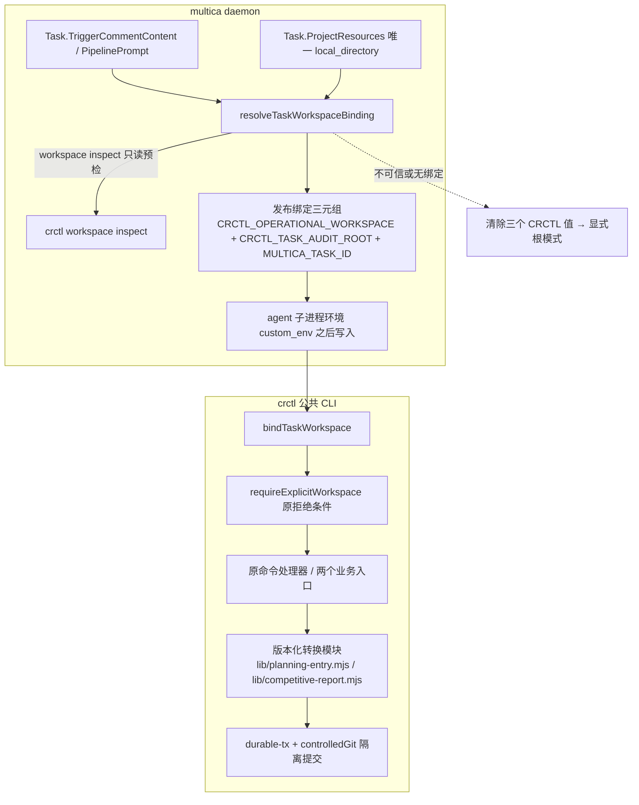

# CR-2026-075 — CR 执行入口与声明一致性修订方案 技术设计

## 1. 架构概览

本设计承接已审批 `prd.md` 的 FR-01～FR-16 与 AC-A1～A8、AC-B1～B20，目标版本继承 `cr.md` 的 `0.48`。交付面为三仓：tools 承载公共 CLI 归一、两个业务受控写入入口与确定性转换模块、合同/提示对齐；multica 承载 task 级 operational 绑定与普通 Issue 委派接线；knowledge-base（ai-first-platform-docs）只承载本 CR 文档与（若有）部署记录，不承载业务代码。代码与文档路径一律取 `crctl workspace inspect CR-2026-075 --workspace <workspace>` 的 `resources[].worktreePath` 与 `operationalWorkspace` 原样值（`dep-1`、`dep-7`），不按目录命名拼接、不用主 checkout 的陈旧 CR 快照。

PRD 的内部任务分解对应两段设计：**A 段**（FR-01～04、14）把一个已验证的 operational 绑定从 daemon 预检发布到 task 环境，并让公共 CLI 在入口处消费它；**B 段**（FR-05～13、15、16）补齐两个业务受控写入入口、确定性转换与合同/部署对齐。B 段在第 4.9 节的 A 段验证门槛满足后才启用 FR-14 的提示收敛。

**实施状态口径**：本 CR 已在三个 CR worktree 上实施了一部分（见 §1.2.1 的逐条差异）。本 SDD 描述的是**目标设计**；凡某项在当前 `resources` HEAD 上已实现，本文档在对应条目上标注「已实施」并把其测试落点降级为回归护栏，**不以「已改代码」冒充「已验收」**——所有 `AC-*` 的通过判定仍以 §5.2 的证据与独立评审、人工审批为准。



分层与依赖方向沿用 `dep-24`：Agent → Pipeline → Skill → crctl →（转换模块 → 事务原语）。绑定解析（daemon）与绑定消费（CLI）是同一事实的两个消费面，不建立共享可覆写 context 文件；转换模块是纯函数层，不反向依赖 CLI，也不形成第二命令入口（`dep-2`）。

### 1.1 术语预检与边界场景

首次状态推进（`requirement-approved → tech-designing`）前核对以下术语；本 CR 未发现需要需求负责人裁决的语义冲突，但存在一处 PRD 未逐字展开、且改变机器可观察行为的边界，按「canonical term → 实现命名」显式硬化并给出代表场景，供评审与人工审批核对。

| canonical term（PRD/附件） | 实现命名 / 边界 | 代表场景（本次已验证边界） |
| --- | --- | --- |
| 「两个 CRCTL 绑定变量」（FR-03 第 1 条） | `CRCTL_OPERATIONAL_WORKSPACE` + `CRCTL_TASK_AUDIT_ROOT`（FR-02 列举的三个变量中唯二 CRCTL 前缀者；`MULTICA_TASK_ID` 是第三个、由第 1 条另行要求有效） | `CRCTL_TASK_AUDIT_ROOT` 单独存在（今日普通任务的既有环境）**不得**被判为「完整绑定」→ 见 1.3 DEC-2 的成对写入约束 |
| 「可信绑定」（FR-02「无可信绑定时清除旧 CRCTL 绑定值」） | 扩展 `taskCRWorkspaceRoot` 的既有定义：Pipeline 预检根，或任务自身唯一 `local_directory` 项目根且该根真实携带 CR 账本（`dep-28`） | 无 `execution_context` 的普通任务若其项目根带 `change-requests/`，仍是有可信绑定的任务（否则会静默丢掉 `dep-29` 的 gitguard 归因） |
| 「旧 `CRCTL_WORKSPACE` 不参与判断」 | 该变量仍是既有环境变量（`dep-28` 写入），但**不是**绑定声明、不作根来源、不参与完整性判定 | 只设 `CRCTL_WORKSPACE` + `MULTICA_TASK_ID` 的环境仍是显式根模式，缺根报 `WORKSPACE_REQUIRED` |
| 「遗漏 workspace」（FR-03 第 2 条） | 仅 `flags.workspace === undefined`（真缺参）；空串、纯空白、裸 `--workspace`（布尔）均**不是**遗漏，走原 `WORKSPACE_REQUIRED` | `crctl advance CR-2026-075 --to X --trigger Y --workspace ""` 在绑定环境仍报 `WORKSPACE_REQUIRED` |
| 「本地纠正」（FR-04 第一类） | 机器侧**两个被刻意保留的触发点**（DEC-7）：`bindTaskWorkspace` 在 `flags.workspace` 存在但不是可用字符串时**故意不归一**（`dep-2` 实测 3421 行直接 return），随后 `requireExplicitWorkspace` 返回 `WORKSPACE_REQUIRED`；以及无绑定声明时缺 `--workspace` 返回同一码 | 本 run 实测（有效绑定、绑定未被改动）：`crctl next CR-2026-075 --workspace ""` 与 `--workspace "   "` 均返回 `WORKSPACE_REQUIRED` 非零、零业务写入；同一 run 补入与绑定同一真实目录的显式根即首次成功；补入异根（项目主 checkout）→ `WORKSPACE_CONTEXT_MISMATCH`（证明纠正不能扩权） |
| 「合法别名」（FR-03 第 2 条） | 同真实目录的路径别名：符号链接/junction、Windows 大小写、尾分隔符、`\\?\` 前缀；**不**包含「同一 installation 的主 checkout 与 CR worktree」 | 绑定=worktree 时显式传 KB 主 checkout → `WORKSPACE_CONTEXT_MISMATCH`；传 worktree 的大小写变体 → 接受 |
| 「互相冲突」（FR-03 第 3 条） | 绑定两值不属于同一 installation root（`deriveInstallRoot` 不同，`dep-7`） | operational 指向 A 项目 worktree、audit root 指向 B 项目根 → 拒绝 |
| 「索引路径及责任唯一」（FR-08） | 解析顺序：目标项目根 `dir-graph.yaml#knowledge-docs.subdirs.<kind>.path|index`（存在时）→ 调用方合同固定默认路径；任一时刻只维护解析出的单一索引 | 项目根未声明 `knowledge-docs` 时不得因此新建第二份索引；同一目录下 `_index.yml` 与 `_index.yaml` 同时存在 → `BUSINESS_WRITE_SCOPE_DENIED` |
| 「已完成重放」（FR-12） | 内容判定 + 提交定位：当前关联产物与本次确定性候选的业务投影一致，且能由提交消息 `AI-First-Intent: <intentDigest>` 唯一定位到本意图的隔离提交，且该提交之后没有任何提交再改动这些路径（§4.5 第 3 步）；`finishLedgerTransaction` 完成后 journal 目录被删除（`dep-5`），因此**不得**以「存在 complete journal」作为重放依据；返回成功前该 key 下必须无残留 journal（`committed` 恢复亦先经原语收敛） | 首次成功后同 payload 重跑 → `changed=false` 且 `commit` 与首次一致；内容一致但提交不可唯一解析、或该提交之后关联路径又被改动 → `TX_RECOVERY_CONFLICT`（不返回成功）；提交已落地但 finish 前中断 → 先收敛 journal 再 `changed=false` + 原提交 |
| 「首次写入」（FR-12「首次成功返回 `phase=complete`、`changed=true`」） | 现场分类的独立出口：主目标文件不存在且索引/主文件无同身份条目 → 直接进入写入/提交（规划与竞品 `new-date` 同此），不参与「候选 vs 现场」冲突判定；目标已存在才按合法冲突决定判定 | 规划首写、竞品 `new-date` 指向尚不存在日期 → `changed=true` + 新提交；报告已存在且正文不同且无合法决定 → `BUSINESS_INTENT_CONFLICT`（零写入） |
| 「已确认的正式 id/目标路径」（FR-10） | 规划 `id = {YYYY-MM-DD}-{slug}`、`doc_path`、`index_path` 均由**已确认 payload** 给出（`path` 必填并与推导路径比对）；日期取自 `id` 前缀，**不**取自本次执行时钟 | D 日确认、D+1 日首次执行或重放 → `id`/`path`/`artifacts` 与 D 日逐字一致；只有目标不存在时首次写入的审计时间字段取执行时钟 |
| 「业务意图摘要」（FR-10～12） | `intentDigest` = 已确认业务字段（含身份、推导路径、正文、冲突策略）canonical JSON 的 sha256，**不含**执行时钟时间字段与事务 id；同一摘要同时作为 journal 的 `inputDigest` 与完成提交的消息标记 | 同 payload 跨日执行/恢复/重放得到同一摘要；正文或策略变化 → 摘要变化 → 在途转 `TX_INPUT_CONFLICT`（零写入），已完成转 §4.5 第 4 步 |
| 「同一意图原事务恢复」（FR-12） | 期望摘要与 txId 传入恢复原语、在 `ledger-<key>` 锁内对同一 `latestLedger` 现场比对（0.3）；异意图 → `TX_INPUT_CONFLICT`、现场事务实例已被替换 → `TX_LEDGER_RECOVERY_REQUIRED`，均零写入且不改动旧现场；一致才走既有 committed / rollback 分支 | 同身份旧事务中断后，另一正文/策略的请求 → 非零、零业务写入、旧 journal 与已写文件保持原样；「锁外预读通过、现场随后被替换」的交错 → 同样零写入失败，不恢复他人现场 |
| 「合法冲突决定」（FR-11） | 报告已存在时 `conflict_strategy` 必填；`overwrite` + `confirmed=true` 即合法覆盖，走正常写入并回 `changed=true`，不计入成功重放；`new-date` 指向已存在日期则不算新的合法决定 | 报告已存在、确认新正文并选覆盖 → 新提交 + `changed=true`；同身份同正文同策略再跑 → `changed=false` + 原提交 |
| 「未声明维度」（FR-05） | `dir-graph` 未声明该类型的 `naming`/`locations`：WARN + `notChecked` 显式列出；声明存在但配置畸形 → FAIL（不用 WARN 豁免） | KB 当前未声明 `knowledge-docs`，`crctl validate change-requests/CR-2026-075/cr.md` 应 WARN「naming/locations 未检查」且仍 `valid: true` |

### 1.2 既有实现依赖与事实

本节按**三层口径**记录，正文只按 `dep-N` 引用；相对路径以各自 repo 根为基准。编号按正文首次出现顺序分配、只增不改（`dep-33`～`dep-34` 为 B-03/B-04 回修追加，`dep-38` 为本轮追加，均不复用已删编号）。核验覆盖「行为成立」，不以「文件或符号存在」代替。

- **(a) 当前依赖**（下表）：设计成立所依赖的事实。SHA 与结论均以**本轮**在 `resources[].worktreePath` 的受控 `rev-parse HEAD` + 源码实读重新核验。
- **(b) 起草快照基线**（§1.2.1）：2026-10-02 首版起草时核验的 SHA 与结论。**本 CR 自身的实施已改变其中若干条**，故该层只作历史依据（说明「当时是什么样、为什么这样设计」），**不得**再作为本轮 HEAD 事实、方案前提或验收依据。
- **(c) 待核实依赖**：无（见本节末）。

本轮受控 `rev-parse HEAD` 实测（2026-10-05，operational workspace = KB CR worktree）：

| repo | 本轮 HEAD |
| --- | --- |
| ai-first-platform-docs | `1ac7852c6631b85dfdbef1c05b5d1eef48c70499` |
| tools | `27a4300a0aa1793a442b543ddb8328cb0d3ce562` |
| multica | `9d1c10d267fe97a9a2232293796a0ef51d284eea` |

| 标识 | repo | commit SHA | relative path | stable symbol/对象 | 依赖结论 |
| --- | --- | --- | --- | --- | --- |
| dep-1 | ai-first-platform-docs | 1ac7852c6631b85dfdbef1c05b5d1eef48c70499 | change-requests/CR-2026-075/cr.md | status / owners / target-version / target-spec-id | 本 CR 当前 status=`tech-design-review-pending`（§10 记 0.5 轮状态口径）、三 owner 同为 `a0e71a32-…`、目标版本 `0.48`、目标 spec `ai-first-platform`；设计只消费不回写这些字段 |
| dep-2 | tools | 27a4300a0aa1793a442b543ddb8328cb0d3ce562 | skills/shared/crctl/scripts/crctl.mjs | main(4162) / parseArgs / bindTaskWorkspace(3407-3427) / requireExplicitWorkspace(3435-3440) / detectWorkspace(151) / authorityWorkspace / realpathOrSelf / sameRealPath | `main()` 实际顺序为 `bindTaskWorkspace`(4170) → `requireExplicitWorkspace`(4172) → `kb` 特判(4176) → `planning-entry` 特判(4179) → `detectWorkspace`/`loadGates`(4183-4184)。全部非 help 子命令仍要求显式非空 `--workspace`、失败关闭先于 `loadGates` 与任何 CR 读写；但**存在绑定声明时该要求先经 `bindTaskWorkspace` 归一**（仅 `flags.workspace === undefined` 才取 `CRCTL_OPERATIONAL_WORKSPACE` 的 realpath），归一值仍须与 authority realpath 相等否则 `OPERATIONAL_WORKSPACE_MISMATCH`；`CRCTL_WORKSPACE` 与 cwd 不作根来源。⇒ 起草结论「全部命令硬性要求调用方自带显式根」**已不成立**，须按 §2.1 的四模式判定与 §4.2.1 的纠正入口读 |
| dep-3 | tools | 27a4300a0aa1793a442b543ddb8328cb0d3ce562 | skills/shared/crctl/scripts/crctl.mjs | main 的分派 switch / `cmdKbInit` 特判 / `cmdBusinessEntry` 特判 | 新增子命令必须在此登记；当前已有**两处**「显式根校验之后、`detectWorkspace`/`loadGates` 之前特判派发」先例（`kb`@4176、`planning-entry`@4179），可用于不要求 `change-requests/` 存在的入口 |
| dep-4 | tools | 27a4300a0aa1793a442b543ddb8328cb0d3ce562 | skills/shared/crctl/scripts/crctl.mjs | fail(52) / ok(60) / auditLog(280) / auditLogOnce(288) / controlledGit(403) / loadShellRules(385) | 失败固定走 `fail(code,…)`→stderr 单一 JSON + 非零退出；成功固定走 `ok(obj)`→stdout 单一 JSON；`controlledGit` 对 join 后的参数逐条匹配 `rules.json` 形态，`git commit` 仅接受 `^-m (wip: |\[cr\] |merge\().*$` |
| dep-5 | tools | 27a4300a0aa1793a442b543ddb8328cb0d3ce562 | skills/shared/crctl/scripts/lib/durable-tx.mjs | beginLedgerTransaction(515) / abortLedgerTransaction(546) / finishLedgerTransaction(551) / recoverLedgerTransaction(480) / hasLedgerTransaction(458) / journalDir(186) | 锁 + journal + recoverable write-set + before/after 双哈希 CAS 复用面；`finishLedgerTransaction` 在标记 complete 后删除 tx 目录，故已完成事务不留下可查询的持久事实；`beginLedgerTransaction` 的 write-set 下限已被 CR-2026-063 原位放宽为「至少一个文件」(519) |
| dep-6 | tools | 27a4300a0aa1793a442b543ddb8328cb0d3ce562 | skills/shared/crctl/scripts/lib/durable-tx.mjs | loadExistingJournal(212) / loadOrCreateJournal(241) / `CR_OR_KEY_RE`(184) / TX_INPUT_CONFLICT | `CR_OR_KEY_RE = ^[A-Za-z0-9._-]{1,128}$`(184) 是 key 合法性判据；journal 目录按 `{op}/{cr-or-key}` 分桶，key 即幂等作用域，可在无 CR 场景以业务身份作 key；同 key 不同 `inputDigest` 硬失败 |
| dep-7 | tools | 27a4300a0aa1793a442b543ddb8328cb0d3ce562 | skills/shared/crctl/scripts/lib/workspace-transactions.mjs | deriveInstallRoot(47) / resolveRepositories(81) / getRepository(152) / crWorktreePath(66) | installation root 由 `git rev-parse --git-common-dir`(48) 解析，CR worktree 与主 checkout 得到同一 install root；repositories 只读 install root 的 `dir-graph.yaml` |
| dep-8 | tools | 27a4300a0aa1793a442b543ddb8328cb0d3ce562 | skills/shared/crctl/scripts/lib/workspace-transactions.mjs | gitRun(378) / gitMust(385) / matchFrontmatter(394) / refreshCrMdUpdated(403) | 固定 argv、`shell:false`；`gitRun` 返回 status/stdout/stderr 供只读查询，`gitMust` 非零抛 `TX_GIT_FAILED` |
| dep-9 | tools | 27a4300a0aa1793a442b543ddb8328cb0d3ce562 | skills/shared/crctl/scripts/lib/yaml-subset.mjs | parseYaml / matchEntryBlock / strictDiag | 零依赖行级 YAML 子集解析与块定位；解析/匹配失败必须硬失败（`unconsumed-line` / `invalid-shape` / `invalid-indentation`），禁止静默降级为空结果（工程纪律 #1） |
| dep-10 | tools | 27a4300a0aa1793a442b543ddb8328cb0d3ce562 | skills/shared/crctl/scripts/crctl.mjs | cmdVersionSet(2940) 步骤 1～10 / ledgerTxKey(698) / beginLedgerCommand(744) / recoverLedgerCommand(731) / queryTrackedChanges(2550) / gitHeadSha(370) | 既有「受控多文件写入」模板：可恢复优先 → tracked-clean 前置 → 行级纯函数编辑 → `beginLedgerTransaction`(expectedHash 取调用前 SHA) → `controlledGit add` 受限路径 → staged 集合恒等复核 → 带 `AI-First-Tx:` trailer 的 commit → `finishLedgerTransaction` → `auditLog` → `ok({changed, files, commit})`；`recoverLedgerCommand` 已改为传锁内取样器（`dep-34`/`dep-38`），不再传锁外 `currentHead`/`headMessage` |
| dep-11 | tools | 27a4300a0aa1793a442b543ddb8328cb0d3ce562 | skills/shared/crctl/scripts/crctl.mjs | `cmdValidate`(1616) 的 artifact 分支 / `cmdValidateDimensions`(1562) / `UNKNOWN_ARTIFACT`(1708) | 既有 artifact 分支仍只覆盖 `cr.md`、`_backlog.yml`、评审 YAML 及同名 basename、`test-report.md`、`approval.yml`、`traceability.yml`；未命中且 `dims.kind` 为空者一律 `UNKNOWN_ARTIFACT` 非零退出，`prd.md`/`sdd.md` 在此列（`test/crctl.test.mjs` 的 `CR-2026-075 B5/B7` 用例把这条钉成回归断言）。本轮新增的只是并列的维度报告层 `cmdValidateDimensions`，既有分支判据未改 |
| dep-12 | tools | 27a4300a0aa1793a442b543ddb8328cb0d3ce562 | skills/shared/validate-doc/SKILL.md | 触发条件 / 校验维度 / 执行时机 | **已按 FR-05 改写**：文件头明确「由调用方步骤规定或用户显式请求触发，不再保留写后自动调用的 blanket 承诺」，blanket 文本已不存在。故 §4.6 的对应项在本 CR worktree HEAD 上**已实施**，剩余工作是按 `dir-graph.yaml#knowledge-docs` 声明面补维度报告（`dep-11`）与矩阵/Agent 侧一致性核对 |
| dep-13 | tools | 27a4300a0aa1793a442b543ddb8328cb0d3ce562 | skills/shared/engineering-docs/SKILL.md | 支持类型表 / 委派约定 | **已按 FR-06 改写**：通用委派（frontmatter 必须通用委派 / 固定 `owClient.writeFile`）表述已删除，规划与竞品不再请求不存在的 `DESIGN-DOC` / `COMPETITIVE` 通用类型，改为指向 `crctl planning-entry` / `crctl competitive-report`。故 §4.6 的对应项在本 CR worktree HEAD 上**已实施**，剩余工作是两个业务 Skill/Agent 的定点登记（`dep-16`/`dep-18`/`dep-19`/`dep-20`） |
| dep-14 | tools | 27a4300a0aa1793a442b543ddb8328cb0d3ce562 | skills/shared/engineering-docs/schemas/common-defs.schema.json | definitions.isoDate(10) / baseFrontmatter.created(52)\|updated(53) | `isoDate` pattern 固定 `^\d{4}-\d{2}-\d{2}$`；`created`/`updated` 引用它，故渲染值必须是纯日期，不得放宽 pattern |
| dep-15 | tools | 27a4300a0aa1793a442b543ddb8328cb0d3ce562 | skills/shared/engineering-docs/scripts/src/utils/slug.ts | `today(now: Date = new Date())`(11-12) 及其消费点 `generators/base.ts` / `validators/index-sync.ts` | **已按 FR-07 改写**：`today()` 接受可注入 `now`，函数体为 `new Date(now.getTime() + 8 * 3600 * 1000)` 取 UTC 日历字段，已不依赖宿主本地时区。起草结论（「用宿主本地日历字段、会跨日错日期」）已不成立——见 §1.2.1。⇒ §4.7 的工程文档侧在本 CR worktree HEAD 上**已实施**，其测试落点由「新实现」降为「跨时区回归护栏」（§5.2 B8） |
| dep-16 | tools | 27a4300a0aa1793a442b543ddb8328cb0d3ce562 | skills/planning/write-planning-entry/SKILL.md | 参数 / 执行步骤 / 禁止事项 | 规划落盘合同**仍是 Agent 直接写文件**：步骤 1 读 `dir-graph.yaml#knowledge-docs.subdirs.product-planning.path`，步骤 5 追加 `docs/product-planning/_index.yml`；当前文本**尚无** `crctl planning-entry` 调用 ⇒ §8 第 1 行的「应改为」仍是待实施项（FR-06/FR-09 的 Skill 侧接管未完成），且是 `AC-B15` 的调用侧前提 |
| dep-17 | tools | 27a4300a0aa1793a442b543ddb8328cb0d3ce562 | skills/planning/planning-draft/SKILL.md | 输出文档格式（DESIGN-DOC） / 落盘责任说明 | 草稿只入对话上下文、不落盘，frontmatter `id: <待分配>`，落盘与正式 id 分配由调用方在确认后执行；是 FR-10「未确认零业务写入」的上游事实 |
| dep-18 | tools | 27a4300a0aa1793a442b543ddb8328cb0d3ce562 | skills/competitive/write-competitive-report/SKILL.md | 阶段 A / 阶段 B / 读写清单 / 注意事项 | 竞品落盘合同**仍是 Agent 直接写报告、改 `updates[]`、改 reports 索引**；当前文本**尚无** `crctl competitive-report` 调用 ⇒ §8 第 2 行的「应改为」仍是待实施项 |
| dep-19 | tools | 27a4300a0aa1793a442b543ddb8328cb0d3ce562 | agent-skill-matrix.yml | actors.product-planning-agent / actors.competitive-analyst-agent / pipeline-owners | 两个业务 Agent 的 `owns` 与 `can-call` 均**只有 Skill 级条目、均无 `crctl`**；矩阵不解析子命令权限。故 FR-13 的定点登记**尚未实施**，`AC-B20` 的机器侧前提未建立 |
| dep-20 | tools | 27a4300a0aa1793a442b543ddb8328cb0d3ce562 | agents/product-planning-agent.md / agents/competitive-analyst-agent.md | 职责与可调用能力小节 | 两 Agent 文档**未声明** crctl 调用关系（`product-planning-agent.md` 只出现「不得用 `crctl` 修改账本」这类禁止式表述）；是 FR-13 的定点登记对象 |
| dep-21 | tools | 27a4300a0aa1793a442b543ddb8328cb0d3ce562 | skills/shared/controlled-shell/rules.json | git[sub=commit].shapes / protectedPaths.deny\|ask | commit 形态仍仅三种前缀 `^-m (wip: |\[cr\] |merge\().*$`；`protectedPaths.deny` 仍只覆盖 `change-requests/` 的四本账本与 `review-annotations/`，`ask` 覆盖 `specs/`、`delivery/` 等，**不含** `docs/` 下的规划/竞品索引 ⇒ `AC-B10`/`AC-B13` 的机器侧前提未变 |
| dep-22 | tools | 27a4300a0aa1793a442b543ddb8328cb0d3ce562 | pipeline-templates/architecture-design.pipeline.json / code-implementation.pipeline.json | 各节点 prompt 中的 `--workspace` 示例 | 逐命令重复手填 workspace 仍在：`architecture-design` 4 处、`code-implementation` 3 处；绑定生效后按 FR-14 收敛，bootstrap 与 daemon 预检示例保留明确根 |
| dep-23 | tools | 27a4300a0aa1793a442b543ddb8328cb0d3ce562 | skills/cr/cr-review-record/SKILL.md 等七个 Skill | `crctl advance` 调用/说明文本 | 本轮实测：七个 Skill 内 `crctl advance` 文本共 **14 处**，其中**命令形态调用点 12 处**（cr-review-record 2、review-code 2、review-dev-plan 2、review-tech-design 1、write-dev-tasks 1、write-tech-design 2、review-requirement 2）**逐处仍缺显式 `{cr_id}` 位置参数**，另 2 处为纯散文提及（`write-tech-design`/`review-requirement` 各 1，无参数形态、由 `caller-contract.test.mjs` 的 `NON_EXEC_CR_DATA_HITS`/无参数形态排除在可执行扫描外）。是 FR-13 的机械清单；`AC-B11` 未达成 |
| dep-24 | tools | 27a4300a0aa1793a442b543ddb8328cb0d3ce562 | ARCHITECTURE.md | §3 Code Map / §4 分层 / §5 硬不变量 / §6 刻意不做 / §8 维护规则 | 零第三方依赖、状态与账本单一写者、行尾与硬失败纪律；§6 仍否决第二套事务框架（`durable-tx.mjs` 的 WAL/事务框架）、独立账本脚本库、通用 YAML 序列化库；§8 要求「crctl 新增写入子命令/新增依赖」触发本文档修订。**实测 §3 尚未记录绑定归一入口与两个业务入口** ⇒ §8 末行的「实施期补」仍是待实施项 |
| dep-25 | tools | 27a4300a0aa1793a442b543ddb8328cb0d3ce562 | skills/shared/crctl/scripts/test/caller-contract.test.mjs | CR_DATA_FIRST_WORDS(31-37) / PROJECTED(23) / TWO_WORD(24) / NON_EXEC_CR_DATA_HITS(40-) | 扫描面覆盖 skills/pipeline/agents/README，按首词集合判定「必须显式 `--workspace`」，并对投影命令强制 `--detail`；`PROJECTED` 仍为 advance/review-record/status/workspace inspect 四个；**`CR_DATA_FIRST_WORDS` 当前尚未登记 `planning-entry`**（`kb` 已由 CR-2026-074 登记）⇒ §5.1/DEC-3 要求的「新首词登记」是待实施项，未登记前新增子命令会被该扫描判红 |
| dep-26 | tools | 27a4300a0aa1793a442b543ddb8328cb0d3ce562 | skills/shared/crctl/scripts/test/gate-registry.json / suite-gate.mjs | manifest.files / `--run` | 套件事实源为磁盘测试文件集合与 manifest 的逐文件用例数比对；新增测试文件必须登记进 manifest，否则 `SUITE_MANIFEST_FILE_DRIFT` 硬失败。**实测 `planning-entry.test.mjs`（10 例）已登记**，`competitive-report.test.mjs` 尚不存在 |
| dep-27 | multica | 9d1c10d267fe97a9a2232293796a0ef51d284eea | server/internal/daemon/pipeline_task.go | `resolveTaskWorkspaceBinding`(201-239) / `parseExecutionContext`(111) / `preparePipelineTask`(252) / `findPipelineCRRoot`(269) / `installCrctlLauncher`(307) / `configureTaskGitEnvironment`(335) / `inspectPipelineWorkspace`(367) / `pipelineCRIDPattern` | **绑定解析已按本设计实现为唯一入口** `resolveTaskWorkspaceBinding`：Pipeline 分支复用 `preparePipelineTask` 已填的 `PipelineWorkspace`/`PipelineLocalWorkDir`；否则解析本次触发评论的唯一 `execution_context`（`parseExecutionContext`）并对项目 `local_directory` 根做 `findPipelineCRRoot` + `inspectPipelineWorkspace` 只读复检，声明与预检不同真实目录即拒；两者皆无则回落到任务自身 `local_directory` 根。原 `installPipelineCrctlLauncher`/`configurePipelineGitEnvironment` 已分别更名为 `installCrctlLauncher`/`configureTaskGitEnvironment` |
| dep-28 | multica | 9d1c10d267fe97a9a2232293796a0ef51d284eea | server/internal/daemon/daemon.go | `injectTaskCRWorkspaceEnv`(10732-10748) / `taskCRWorkspaceRoot`(10771-10795) / `layerCustomEnvAndHermesHome` / 装配顺序（custom_env@8645 → 绑定@8651 → task Git 环境@8652-8658）/ `installCrctlLauncher` 调用点@8319-8322 / `pipelineAuditDir` | 绑定恒在 `custom_env` 之后写入；无绑定（或缺 `MULTICA_TASK_ID`）时先删除三个 CRCTL 值再返回，绝不留半绑定；`taskCRWorkspaceRoot` 仍只认 Pipeline 预检根或任务自身唯一 `local_directory` 项目根（且该根真实带 `change-requests/`），无主机根列表回退。**起草结论「launcher 与 Git 环境配置当前仅在 `PipelinePrompt != ""` 时执行」已被本设计实现改变**：两个调用点现由 `taskBinding.bound()` 把关（launcher@8319、Git 环境@8652），即**可信普通委派同样获得 launcher 与 Git trust 配置** |
| dep-29 | multica | 9d1c10d267fe97a9a2232293796a0ef51d284eea | server/cmd/multica/cmd_gitguard.go | taskAuditRootEnv(90) / spoolTaskDenial(92) | gitguard 拒绝事件只写 `CRCTL_TASK_AUDIT_ROOT`(90) 下的 `.crctl/outbox`；无该变量则「本任务无诚实落点」而跳过审计，故该变量不可为满足成对规则而被静默清除 |
| dep-30 | multica | 9d1c10d267fe97a9a2232293796a0ef51d284eea | server/internal/daemon/types.go | Task.PipelinePrompt(149)\|PipelineCrID(150)\|PipelineWorkspace(154)\|PipelineLocalWorkDir(155)\|TriggerCommentContent(118)\|ProjectResources(108) / ProjectResourceData(47) | 设计所需输入均在 claim 载荷中可得：触发评论文本、项目资源、预检结果字段 |
| dep-31 | multica | 9d1c10d267fe97a9a2232293796a0ef51d284eea | server/internal/daemon/cr_workspace_binding_test.go / pipeline_task_test.go | 既有绑定与预检用例 | 既有测试组织（同包、表驱动、无框架）可直接扩展 A 段向量；**A 段向量已有用例**：`TestParseExecutionContext`、`TestResolveTaskWorkspaceBinding`、`TestTaskWorkspaceBinding`、`TestConfigureTaskGitEnvironment`、`TestInstallCrctlLauncher`，以及 `cr_workspace_binding_test.go` 的 10 个 `TestInjectTaskCRWorkspaceEnv*`（含半绑定不发布 / 需 task 身份 / 胜出 custom_env / 并发隔离 / 无绑定清旧值）。`TestConfigurePipelineGitEnvironment`/`TestInstallPipelineCrctlLauncher` 为改名前的同义用例 |
| dep-32 | multica | 9d1c10d267fe97a9a2232293796a0ef51d284eea | server/go.mod | gopkg.in/yaml.v3 v3.0.1 | `execution_context` 的 YAML 解析在 server 模块内用既有依赖完成（`parseExecutionContext` 已用 `yaml.Node` 实现重复键检测），不新增第三方依赖 |
| dep-33 | tools | 27a4300a0aa1793a442b543ddb8328cb0d3ce562 | skills/shared/controlled-shell/rules.json | `git[sub=log].shapes` / `git[sub=rev-parse].shapes` / `forbiddenFlags` | 只读 Git 形态受限且本 CR 不改白名单（FR-15、DEC-5）：`log` 仅 `^--oneline .+$`、`^--format=%B -1$`、`^--reverse --format=\S+ \S+$`；`rev-parse` 仅 `^(HEAD\|origin/\S+)$`、`--show-toplevel`、`--is-bare-repository`、`--verify \S+$`、`--verify -q \S+$`、`--git-dir`；**没有**任意 blob 读取形态。故完成提交的定位与核对只能用「提交消息匹配 + 路径范围遍历 + 短 SHA 规范化」，不能读历史 blob 内容 |
| dep-34 | tools | 27a4300a0aa1793a442b543ddb8328cb0d3ce562 | skills/shared/crctl/scripts/lib/durable-tx.mjs | `recoverLedgerTransaction` 的 committed 判据(499-510) / `rollbackLedgerPayload`(429) / `latestLedger`(411) | committed 判定 = `payload.phase === 'complete'` 直接删 tx 目录，或经 `sampleLockedCommitState`(465) 得到「消息集含 `AI-First-Tx: <该 journal 的 txId>` 且 `commitRequired` 且 `headSha !== payload.headBefore`」；未提供取样器时才回落到调用方 `currentHead`/`headMessage` 快照（`dep-38` 已把既有调用点切到取样器）。回滚按 before/after 双哈希判第三值，遇第三值抛 `TX_RECOVERY_CONFLICT` 且不改文件；同一 key 至多存在一个 journal（`beginLedgerTransaction` 见既有 journal 即 `TX_LEDGER_RECOVERY_REQUIRED`） |
| dep-35 | tools | 27a4300a0aa1793a442b543ddb8328cb0d3ce562 | skills/shared/crctl/scripts/lib/durable-tx.mjs | `acquireLock({scope:'ledger-<key>'})`(127) 的互斥语义 / `latestLedger` 重读(483) / `expect` 锁内比对(486-493) / `sampleLockedCommitState`(465-478) | 锁为独占 mkdir、无重入、无 TTL（同机活 PID 一律 `TX_LOCK_HELD`，仅 ESRCH 接管陈旧锁）；`recoverLedgerTransaction` 取得 `ledger-<key>` 锁后才 `latestLedger` 重读最新 journal。**起草结论「既不接收期望摘要也不接收原 txId」已被本设计实现改变**：签名现为 `{root,key,currentHead,headMessage,expect,sampleCommitState}`，`expect={inputDigest,txId}` 的比对就发生在同一把锁、同一 `latestLedger` 现场上（摘要不符 `TX_INPUT_CONFLICT`、txId 不符 `TX_LEDGER_RECOVERY_REQUIRED`，均零写入）；取样亦在该临界区内完成 |
| dep-36 | multica | 9d1c10d267fe97a9a2232293796a0ef51d284eea | CUSTOM.md | 文件头核对口径 / 《当前状态》/《合并兼容性》/《模块索引》/《CR 索引》/《代码改动明细（按功能模块分组）》M1～M13 / 《台账行模板》 | 台账按「正文《代码改动明细》（按功能模块分组 M1～M13，行号 `#N` 只增不改）+《模块索引》+《CR 索引》」三表一致组织；新增行照《台账行模板》逐列填写（位置 / 改动 / 原因追溯含 CR 与 TASK / 日期 / 合并注意）；文件头同步 `AIFIRST` 实测计数基线（只升不降）。**实测当前尚无 CR-2026-075 行、无 `bindTaskWorkspace`/`taskWorkspaceBinding` 登记** ⇒ 本轮 daemon 改动的台账登记是**未完成**项（§9 `scope_in`、PRD NFR-04） |
| dep-37 | tools | 27a4300a0aa1793a442b543ddb8328cb0d3ce562 | skills/shared/crctl/scripts/lib/durable-tx.mjs / skills/shared/crctl/scripts/crctl.mjs | 模块头不变量（`durable-tx.mjs` 不理解业务 phase/Git/状态机、仅 Node 标准库）/ `recoverLedgerTransaction` 的调用点 / `acquireLock` 持有期与释放点 | `recoverLedgerTransaction` 在全仓仍只有一个既有调用点 `crctl.mjs#recoverLedgerCommand`(731)，但**起草结论「锁外预读后传入 `currentHead`/`headMessage`」已被本设计实现改变**：现调用为 `recoverLedgerTransaction({root, key, sampleCommitState: sampleCommitStateReader(ws)})`(735)，锁外 `gitHeadSha` 只保留给 `syncLedgerIndex` 的触发条件。原语保持 Git 无关，锁内取样由调用方以回调注入；`beginLedgerTransaction` 返回的锁由写入者持有至 `finishLedgerTransaction`/`abortLedgerTransaction`，`recoverLedgerTransaction` 在 `acquireLock` 与 `finally` 的 `lock.release()` 之间执行全部判定，取样器在该区间内执行即处于锁内（SDD §4.5.4 第 2.c 步、B-09） |
| dep-38 | tools | 27a4300a0aa1793a442b543ddb8328cb0d3ce562 | skills/shared/crctl/scripts/crctl.mjs | `sampleCommitStateReader(ws)`(714-729) | §4.5.4 第 2.c 步的锁内取样器**已存在**：一律经 `controlledGit(ws,'rev-parse',['HEAD'])` 与 `controlledGit(ws,'log',…)`（`headBefore` 为 40 位十六进制且 ≠ headSha 时取 `--reverse --format=%B <headBefore>..<headSha>`，否则取 `--format=%B -1`）；HEAD 非 40 位十六进制、任一 git 非零或消息非数组即抛既有 `TX_GIT_FAILED`，**不回退到锁外快照**。本条为本轮新增编号（B-11 重核后补记的实现事实） |

**待核实依赖**：无。历史 CR 的 SDD/测试只作为格式与组织参照，不作为本次功能已通过证据。

#### 1.2.1 起草快照基线与被本 CR 实施改变的结论（历史依据，非当前事实）

下表记录 2026-10-02 首版起草时核验的 SHA 与结论，以及本轮实测到的差异。**该层不得作为本轮 HEAD 事实、方案前提或验收依据**；列出的目的是让评审能判断「哪些设计结论的前提已被自己的实施改掉、哪些仍成立」。

| 标识 | 起草快照 SHA（历史） | 起草时结论（历史依据） | 本轮实测差异 | 对设计结论的影响 |
| --- | --- | --- | --- | --- |
| dep-1 | KB `e125917b7d8a136cf665611dc30db7db1251fc97` | CR status=`tech-designing` | 现为 `tech-design-review-pending` | 无（设计只消费不回写）；状态口径改记 §10 的 0.5 轮 |
| dep-2 | tools `061a12ff0a40028b7aba979108c2977313e1fb11` | 全部非 help 子命令硬性要求显式非空 `--workspace` | `bindTaskWorkspace` 已在 `requireExplicitWorkspace` 之前归一真缺参 | **有影响**：入口判定必须写成四模式（§2.1），并据此界定 FR-04 纠正的合法触发点（§4.2.1）；原「全部命令要求显式根」的表述已删 |
| dep-12 / dep-13 | tools `061a12ff…` | validate-doc 仍有 blanket 自动调用承诺；engineering-docs 仍有通用委派与 DESIGN-DOC/COMPETITIVE 请求 | 两处文本已按 FR-05/FR-06 改写 | **有影响**：§4.6/§8 对应项从「待改写」改为「已实施，剩余为声明面补齐与一致性核对」；不再把「删除 blanket 文本」计入剩余工作量 |
| dep-15 | tools `061a12ff…` | `today()` 用宿主本地日历字段，跨时区错日期 | `today(now = new Date())` 已按 UTC+8 固定偏移实现 | **有影响**：FR-07 的工程文档侧已实施；§4.7 的剩余面只在 crctl lib 侧，§5.2 的 B8 降级为跨时区回归护栏 |
| dep-16 / dep-18 / dep-19 / dep-20 | tools `061a12ff…` | 业务 Skill 与 Agent 文档未接 crctl | 实测**仍未接**（无 `crctl planning-entry`/`competitive-report` 调用；矩阵与 Agent 文档无 crctl 关系） | 无（结论仍成立）；但 `AC-B15`/`AC-B20` 的机器侧前提仍未建立，§8 第 1/2 行与 §9 `scope_in` 保留为待实施 |
| dep-23 | tools `061a12ff…` | 12 处 `crctl advance` 缺 `{cr_id}` | 实测文本 14 处 = 命令形态 12 处（逐处仍缺 `{cr_id}`）+ 散文 2 处 | **有影响**：`AC-B11` 的机械清单口径须写明「12 处命令形态调用点」并排除 2 处散文提及，防止按 14 处误改 |
| dep-25 / dep-26 | tools `061a12ff…` | 新增子命令须同步分类与登记 | `planning-entry.test.mjs` 已登记 manifest；`CR_DATA_FIRST_WORDS` **尚未**登记 `planning-entry` | **有影响**：`AC-B11`/门禁红绿的前置是首词登记，§5.2 明确其为 TASK 内必做项，未登记会红 |
| dep-27 / dep-28 | multica `56bdc70db62f4fe2473b238f0ed36b05712af3a9` | 预检链仅 Pipeline；launcher 与 Git 环境配置仅 `PipelinePrompt != ""` | 绑定解析已实现为 `resolveTaskWorkspaceBinding` 唯一入口；两个接线点改由 `taskBinding.bound()` 把关 | **有影响**：`AC-A2`/FR-02 的「普通 CR 委派接入既有 launcher 与 Git 环境配置」已实施；剩余是 B 段与提示收敛，不再把 A 段接线列为待实施 |
| dep-31 | multica `56bdc70d…` | 既有测试可扩展 A 段向量 | A 段向量已有 5 个新用例 + 既有 10 个 `TestInjectTaskCRWorkspaceEnv*` | **有影响**：A 段验收从「新写用例」降为「在既有用例上补断言」，§5.2 A 组落点据此改写 |
| dep-35 / dep-37 | tools `061a12ff…` | 恢复原语不接收期望摘要/实例；唯一调用点传锁外快照 | `expect` 与 `sampleCommitState` 已入签名；调用点已改传取样器 | **有影响**：B-03/B-09 的设计已在 HEAD 落地，§4.5.4 第 2 步与 `dep-34`/`dep-38` 一致；剩余是 `competitive-report` 侧接线与故障注入用例 |
| dep-36 | multica `56bdc70d…` | 台账结构（表述） | 结构不变，但**无 CR-2026-075 行** | **有影响**：台账登记仍未完成，保留在 §9 `scope_in`，不得以「已改代码」声称已登记 |

历史基线 SHA 仅为「当时核验的是哪个提交」的指针，本轮按 `dep-33` 的白名单限制**未**读取其历史 blob 内容，故不对历史结论的原文逐字做再核验，只声明「该结论在本轮已不成立/仍成立」。

### 1.3 决策记录

| 编号 | Decision | Context | Alternatives | Consequences |
| --- | --- | --- | --- | --- |
| DEC-1 | 绑定归一实现为 `crctl.mjs` 内的私有 `bindTaskWorkspace(cmd, flags, env)`，在 `parseArgs` 之后、`requireExplicitWorkspace` 之前执行，只改 `flags.workspace` | `dep-2` 的入口检查是全部非 help 命令的唯一显式根关卡；把绑定塞进各命令处理器会同时改业务面与失败面，且与 FR-03「不补 CR-ID、不改业务处理器」冲突 | ①在各处理器内部分别归一（改动面大、易漏）；②新增公共 `--bound` 旗标（扩公开面、破坏原拒绝条件）；③在 `detectWorkspace` 内回退 env（正是 CR-2026-072 删除的行为，会重开错根隐患） | 归一集中一处、失败关闭先于任何文件读取；原 `WORKSPACE_REQUIRED`/`WORKSPACE_CONTEXT_MISMATCH` 语义与优先级保留 |
| DEC-2 | 绑定三元组成对发布：有可信绑定 → 写 `CRCTL_OPERATIONAL_WORKSPACE` + `CRCTL_TASK_AUDIT_ROOT`；无可信绑定 → 三个 CRCTL 值全部清除。普通任务的可信绑定沿用 `taskCRWorkspaceRoot` 定义（其项目根本身即 operational 根） | FR-03 第 1 条要求「任一 CRCTL 绑定变量存在即按绑定声明检查，两者必须完整有效」；而 `dep-29` 证明 audit root 不可丢：它是 gitguard 拒绝事件的唯一落点 | ①无 CR 上下文的任务一律清除两个变量 —— 会让普通任务的 gitguard 拒绝事件失去归因（`dep-29` 明确记录那条路径「本项目 B 的事件记到项目 A」正是被它修掉的缺陷），与 NFR-02 不降级冲突；②仅要求 `CRCTL_OPERATIONAL_WORKSPACE` 存在才算绑定 —— 与已审批 FR-03 第 1 条明文冲突，不在本阶段自行改写需求 | 普通任务获得「默认 workspace = 自身项目根」的行为；这是**有意**的放松，边界与风险在 §7 显式列出，并在 A 段测试中逐条覆盖（含「绑定不能被显式异根覆盖」） |
| DEC-3 | 两个业务入口命名为 `crctl planning-entry` 与 `crctl competitive-report`，均为单词形子命令，不改造 `CR_DATA_FIRST_WORDS`/`TWO_WORD` 结构；两者都不接 CR-ID、不带 gates/状态机 | FR-09 明确「非 CR 规划/竞品显式使用可信项目根，不伪造 CR-ID，不纳入 CR 状态机」；`dep-3` 提供 `kb init` 同款特判先例 | ①`crctl planning write` 两词形态（`TWO_WORD` 需扩张，扫描面与投影口径连带变化）；②挂到 `engineering-docs` 下（把业务写入塞进文档生成器，正是 FR-06 要消除的通用委派）；③新增独立 CLI（第二命令入口，违反 `dep-24` §6） | `dep-25` 只需在两个分类集合中登记新首词/命令；不扩公开面到 CR 账本 |
| DEC-4 | 确定性转换模块落 `skills/shared/crctl/scripts/lib/planning-entry.mjs` 与 `.../competitive-report.mjs`，纯函数 + 复用 `yaml-subset.mjs`（`dep-9`），由 `crctl.mjs` 独占调用 | 方案 §1.2 把「版本化脚本/模块」与 crctl 的职责分开：转换归模块、受控执行归 crctl；`dep-24` §3 规定 lib 不反向依赖 CLI、不形成第二入口 | ①放进 `skills/writeback/scripts/`（writeback 专属，跨语义域）；②直接写进 `crctl.mjs`（把业务转换与治理 CLI 混层，违反 §1.2 职责表）；③新增 npm 依赖做 YAML/日期处理（违反零依赖不变量） | 转换可单测、可回放；`crctl.mjs` 只做参数/范围校验、事务与回执 |
| DEC-5 | 两个业务入口的隔离提交沿用既有 commit 形态（`[cr] planning-entry …` / `[cr] competitive-report …`），不新增 `rules.json` 形态 | `dep-4`/`dep-21` 的交集只留下非 `wip:` 前缀的既有形态；FR-15 明文「不改 controlled-shell 白名单」 | ①新增 `docs(` 形态（越界改白名单）；②用 `wip: `（语义误导，且会让恢复判定把业务提交误读为临时提交） | 提交可被既有审计与恢复语义识别；`[cr] ` 前缀同时满足 KB `repositories[].commit_prefixes` 现有声明 |
| DEC-6 | 北京时间日历的唯一规则 = UTC+8 固定偏移（`Asia/Shanghai` 自 1991 年起无夏令时），工程文档侧在 `slug.ts` 实现、业务 timestamp 侧在 crctl lib 实现，两处用同一组边界向量做一致性测试 | FR-07 要求「不依赖宿主机默认时区」并保持 schema；`dep-14` 固定 `isoDate` pattern，`dep-15` 是宿主时区依赖的根因，而 engineering-docs 是独立 TS 包（带第三方依赖），crctl 侧必须零依赖，无法共享实现 | ①只在调用方提示词里写「用北京时间」（无机器证据，违反 FR-16）；②把 engineering-docs 改成零依赖 JS（超范围重构） | 两处实现必须同时通过同一向量集（§5.2），任一处漂移即红 |
| DEC-7 | FR-04 第一类本地纠正的**合法执行来源**取机器上两个已被本设计刻意保留的分支，纠正**不产生新授权**：①有效绑定 + 显式传入不可用 `--workspace`（空串/纯空白/裸旗标）→ `bindTaskWorkspace` 故意不归一 → `requireExplicitWorkspace` 返回 `WORKSPACE_REQUIRED`；②无绑定声明（FR-03 第 3 条显式 CLI 模式）+ 缺 `--workspace` → 同一码。纠正值必须通过 `bindTaskWorkspace` 的同一真实目录检查，异根即 `WORKSPACE_CONTEXT_MISMATCH` 停止 | FR-03 第 2 条让「真缺参」在有效绑定下**首次即成功**，故 FR-04 字面形态「旧显式入口完全不带 `--workspace` 且返回 `WORKSPACE_REQUIRED`」在绑定节点里按设计不可达；若不给出合法来源，`AC-B1`/`AC-B3` 与 FR-04/FR-16 的节点回放验收就永远不可达（B-10）。而 `dep-2` 的实测代码显示 `bindTaskWorkspace` 恰好对「显式但不可用」的值**不归一**（3421 行直接 return），这就是机器侧唯一为纠正保留的入口 | ①清除/覆盖 task 的可信绑定来制造「无绑定」——需 daemon 侧改行为或伪造环境，超 FR-03 且与 NFR-01 冲突；②切回旧 CLI 版本或绕过 launcher——违反 FR-04「不扫描或切换 CLI 版本」；③用独立测试或在测试里直接调内部函数冒充真实节点——违反 FR-16「以实际调用记录验收」；④新增第二执行器/权限框架来制造显式环境——违反 §7 排除项与 `dep-24` §6；⑤把 FR-04 的验收降为「只做一次合法调用」——回避 AC-B1 要求的纠正语义 | B1/B3 有了不清绑定、不切版本、不伪造错误码即可达的真实节点向量（§5.2 B1/B1-b/B3）；纠正的授权来源收敛为「既有可信绑定 + 调用方 FR-04 约定」，审计保留落在节点日志/回放与 `test-evidence/`（§4.2.1），不新增子命令、错误码或白名单形态；已批准 PRD 的「有效绑定首次归一、同 run 恰一次纠正、第二次失败停止、无新授权」四条约束全部保留 |

## 2. 数据模型

### 2.1 绑定三元组（A 段核心数据）

绑定是「task 子进程环境里的三个字符串」，不是新账本、不是新 persisted 结构，也不落地任何可覆写 context 文件。

| 变量 | 语义 | 有效性条件（任一不满足 → 该次调用拒绝，零业务写入） |
| --- | --- | --- |
| `MULTICA_TASK_ID` | 当前 task 身份 | 去空白后非空（既有变量，`dep-30` 的 claim 载荷携带） |
| `CRCTL_OPERATIONAL_WORKSPACE` | 本 task 的 operational workspace（CR worktree；普通任务为其项目根） | 去空白后非空、绝对路径、`realpathSync` 存在且为目录 |
| `CRCTL_TASK_AUDIT_ROOT` | 本 task 的 gitguard 审计根（CR 根；普通任务为其项目根） | 去空白后非空、绝对路径、`realpathSync` 存在且为目录 |

判据（`bindTaskWorkspace` 唯一实现，FR-03 第 1～4 条）：

```text
declared(op|audit)  = 变量存在于 process.env（含空串/空白）
present(op|audit)   = 变量存在且去空白后非空
若 !declared(op) 且 !declared(audit)         → 不作归一（显式 CLI 模式，help 等命令不受影响）
否则（绑定声明存在）:
  present(op) ∧ present(audit) ∧ present(taskId) ∧ 两路径有效 ∧ sameInstallRoot(op,audit)
      → 绑定有效
  否则                                        → WORKSPACE_CONTEXT_MISMATCH（非零、零业务写入）
```

跨字段一致性：`deriveInstallRoot(op)` 必须等于 `deriveInstallRoot(audit)`（`dep-7`）；不相等即「互相冲突」。

**入口模式判定（`bindTaskWorkspace` + `requireExplicitWorkspace` 的完整四模式，FR-03 与 FR-04 的判定面）**

绑定判据只回答「有没有可信绑定」，入口最终行为由**绑定有效性 × 调用方 `--workspace` 取值形态**两个维度共同决定。下表是本设计的唯一模式表；`AC-A1`/`AC-A5`/`AC-A6`/`AC-B1`/`AC-B3` 全部落在这四行，不再有第五种入口行为。

| 模式 | 绑定 | `--workspace` 形态 | 机器行为（实测依据 `dep-2`） | 是否产生业务写入 | 归属 |
| --- | --- | --- | --- | --- | --- |
| M1 归一 | 有效 | 真缺参（`undefined`） | 取 `CRCTL_OPERATIONAL_WORKSPACE` 的 realpath，**首次即成功**，不产生 `WORKSPACE_REQUIRED` | 是（正常业务） | `AC-A1`/`AC-A3`（FR-03 第 2 条第 1 句） |
| M2 纠正触发 | 有效 | 显式但不可用（空串/纯空白/裸旗标） | **不归一**（`dep-2` 3421 行直接 return）→ `requireExplicitWorkspace` 返回 `WORKSPACE_REQUIRED` | 否 | `AC-B1`（FR-04 第一类纠正的合法触发点，DEC-7） |
| M3 显式根 | 无绑定声明（两变量均不存在） | 真缺参 | 显式 CLI 模式，缺根返回 `WORKSPACE_REQUIRED` | 否 | `AC-A6`（FR-03 第 3 条） |
| M4 拒绝 | 有效 | 显式且是另一真实目录 | `WORKSPACE_CONTEXT_MISMATCH`，绑定不被覆盖 | 否 | `AC-A5`/`AC-B3`（FR-03 第 2 条第 2 句、FR-04 第二次失败/上下文冲突） |

M2 与 M4 的实测（本 run，有效绑定未被清除、未切 CLI、未伪造错误码）：

```text
crctl next CR-2026-075                          → exit 0（= M1 归一，next=write-tech-design）
crctl next CR-2026-075 --workspace ""           → WORKSPACE_REQUIRED, exit 1（= M2）
crctl next CR-2026-075 --workspace "   "        → WORKSPACE_REQUIRED, exit 1（= M2）
crctl next CR-2026-075 --workspace <主 checkout> → WORKSPACE_CONTEXT_MISMATCH, exit 1（= M4）
```

M2 是 FR-04 字面「旧显式入口缺根 → `WORKSPACE_REQUIRED`」在绑定已生效后的**唯一合法实例**：它由 `bindTaskWorkspace` 的「显式不可用不归一」分支与 `requireExplicitWorkspace` 的原语义共同产生，不依赖清除绑定、切换 CLI 版本、伪造错误码或以独立测试冒充节点。M3 则是无绑定 task 的字面实例。两条来源的授权边界、调用契约与审计保留见 §4.2.1。

### 2.2 `execution_context` 输入（FR-01）

普通 Issue 委派的输入是**本次触发评论** `Task.TriggerCommentContent` 中的唯一 YAML 块，不接受历史评论补齐、不以 `PipelinePrompt` 为空作为跳过理由。

```yaml
execution_context:
  cr_id: CR-YYYY-NNN            # 必填，^CR-[0-9]{4}-[0-9]{3,}$
  operational_workspace: '<abs>'# 必填，非空
  resources: [...]              # 可选；本设计只消费前两项，其余键原样忽略（不构成冲突）
```

解析规则（全部硬失败，无降级）：扫描围栏代码块（```yaml/```yml/``` 与无语言标记）；以 `yaml.Node` 解析以识别重复键；含顶层键 `execution_context` 的块必须**恰有一个**；块内 `cr_id`/`operational_workspace` 必须各出现一次、类型为字符串、取值合法；同一评论内多个 `execution_context` 块、重复键、非法值、类型不符 → 停止节点准备。文本中完全不含 `execution_context` → 该任务不是 CR 委派，走 2.1 的普通任务分支，不报错。

### 2.3 业务写入意图与回执

两个业务入口的输入是 Skill 已确认的 JSON payload（`--from <file>`，沿用 `dep-10` 的 `--from`/`--plan` 先例）。payload 只承载**业务字段**；路径由模块推导后与 payload 内声明比对，拒绝任意文件清单。

**规划 `ai-first.planning-entry/v1`**

| 字段 | 类型 | 说明 |
| --- | --- | --- |
| `schema` | string | 固定 `ai-first.planning-entry/v1` |
| `confirmed` | bool | 必须 `true`；否则 `BUSINESS_CONFIRMATION_REQUIRED` 零写入 |
| `id` | string | **必填**；正式规划 id = `{YYYY-MM-DD}-{slug}`。日期是确认时确定的身份，**不**与本次执行时钟比对（FR-10、B-01） |
| `slug` | string | **必填**；`^[a-z0-9][a-z0-9-]*$`（`dep-14`），必须等于 `id` 的 `{slug}` 段 |
| `source` | string | 上游草稿来源（`dep-16` 的 `source`） |
| `title` | string | 非空 |
| `target_version` | string | `MAJOR.MINOR[.PATCH]` 或 `unassigned`；经 `normalizeTargetVersion` 规范化后持久化（输入可带 v/V） |
| `owner` | string | 非空；缺省 `product-owner` |
| `body` | string | 已确认正文（不含 frontmatter）；读入后先做 `\r\n → \n` 规范化 |
| `path` | string | **必填**；已确认的目标文档相对路径（POSIX 分隔符）。与 §2.4 推导路径不一致 → `BUSINESS_WRITE_SCOPE_DENIED`；是幂等作用域的一部分 |
| `index_path` | string | 可选；声明期望索引路径，仅用于一致性核对（不参与 `intentDigest`，见 §4.5.1） |

**竞品 `ai-first.competitive-report/v1`**

| 字段 | 类型 | 说明 |
| --- | --- | --- |
| `schema` | string | 固定 `ai-first.competitive-report/v1` |
| `confirmed` | bool | 必须 `true`；否则 `BUSINESS_CONFIRMATION_REQUIRED` 零写入 |
| `competitor_id` | string | 必须已在竞品索引中登记（`dep-18` 的错误处理口径） |
| `report_date` | string | `^\d{4}-\d{2}-\d{2}$`；确认时确定的身份日期，**不**与本次执行时钟比对 |
| `title` / `sources[]` / `body` | string / string[] / string | 报告正文与来源 |
| `updates[]` | array | 每条 `{date,title,source,summary}`；`(date,title)` 为去重键 |
| `conflict_strategy` | enum | `overwrite` \| `new-date`；报告文件已存在时必须显式给出（`dep-18` 的选择规则），缺失 → `BUSINESS_CONFIRMATION_REQUIRED` |
| `path` | string | **必填**；已确认报告相对路径。与 §2.4 推导路径不一致 → `BUSINESS_WRITE_SCOPE_DENIED`；是幂等作用域的一部分 |
| `index_path` | string | 可选；与推导路径不一致 → `BUSINESS_WRITE_SCOPE_DENIED`（不参与 `intentDigest`，见 §4.5.1） |

**成功回执（stdout 单一 JSON，逐字满足 FR-12 表）**

```json
{
  "op": "planning-entry",
  "phase": "complete",
  "changed": true,
  "identity": { "kind": "planning", "id": "2026-10-02-x", "path": "docs/product-planning/2026-10-02-x.md" },
  "artifacts": ["docs/product-planning/2026-10-02-x.md", "docs/product-planning/_index.yml"],
  "commit": "<40-hex>"
}
```

竞品同构：`identity = {kind:"competitive", competitorId, reportDate, path}`，`artifacts` 恰三项（报告、竞品主文件、reports 索引）。`phase` 的取值域在本 SDD 内只有 `complete`；失败一律不输出该对象（`dep-4`）。

回执取值规则（FR-12）：`identity` 与 `artifacts` 一律取**已确认身份 + §2.4 推导路径**（不是执行时钟重算值、不是候选猜测值）；`commit` 在首次写入/合法覆盖成功时为本次隔离提交；在已完成同意图重放、或第 2 步 `committed` 收敛后由 3.c 定位到 C 时，为**该意图先前那次**提交（C 未必是当前 HEAD）。提交消息固定为：

```text
[cr] {planning-entry|competitive-report} {身份}

AI-First-Tx: <txId>              # 既有恢复原语判据（dep-5、dep-34）
AI-First-Intent: <intentDigest>  # §4.5 完成提交定位的唯一来源
```

### 2.4 受影响文件与索引（路径权威）

| 业务 | 目标文档 | 索引 | 路径权威 |
| --- | --- | --- | --- |
| 规划 | `<docsRoot>/{YYYY-MM-DD}-{slug}.md` | `<docsRoot>/_index.yml` | `docsRoot` = `dir-graph.yaml#knowledge-docs.subdirs.product-planning.path`（存在时）→ 否则合同默认 `docs/product-planning` |
| 竞品 | `<compRoot>/reports/{competitor-id}-{YYYY-MM-DD}.md` + `<compRoot>/{competitor-id}.md` | `<compRoot>/reports/_index.yml` | `compRoot` = `dir-graph.yaml#knowledge-docs.subdirs.competitive.path`（存在时）→ 否则合同默认 `docs/competitive` |

规则：解析出的相对路径必须落在项目根内（真实路径包含检查，不用字符串前缀）；同一目录下同时存在 `_index.yml` 与 `_index.yaml` → `BUSINESS_WRITE_SCOPE_DENIED`（不双写、不改名）；索引不存在时由本次写入创建（规划/竞品的索引是该业务合同的一部分），但**不**为其他文档类型新建索引（`dep-16`/`dep-18` 之外的索引不在本 CR 范围）。本表推导出的 POSIX 相对路径就是回执 `identity.path`/`artifacts` 与 §4.5.1 `intentDigest` 的输入；payload 的 `path`/`index_path` 只用于与推导结果比对，不参与摘要。

### 2.5 CR 侧字段

正文不修改 `cr.md` 的 status/owners/target-version/target-spec-id（`dep-1`），不新增 `_backlog.yml` 字段、不新增状态机状态或转换。FR-13 的版本口径修正只改文本示例与说明，不改 `normalizeTargetVersion` 行为与持久化格式。

## 3. 接口契约

### 3.1 crctl 公共入口（新增与扩展）

```text
crctl planning-entry   --from <confirmed-payload.json> [--workspace <project-root>]
crctl competitive-report --from <confirmed-payload.json> [--workspace <project-root>]
```

- 两者都**不接** `cr_id` 位置参数（`requireCr` 不适用）；`--workspace` 在绑定环境下可省略（按 2.1 归一），无绑定时必须显式给出，否则 `WORKSPACE_REQUIRED`。
- 两者在 `main()` 中按 `dep-3` 的特判先例派发：在 `requireExplicitWorkspace`（及 `bindTaskWorkspace`）之后、`detectWorkspace`/`loadGates` 之前，因此不要求项目根存在 `change-requests/`、不加载状态机与 gates。
- 参数面收窄：只接受上表 flags；任何未登记旗标 → `BAD_ARGS`（沿用 `dep-4` 的旗标袋语义）。`--from` 缺失/不可读 → `BAD_ARGS`/`BUSINESS_INPUT_INVALID`。
- 成功输出逐字为 §2.3 的回执；失败为 stderr 单一 `{error:{code,message,...}}` 且非零退出。两者都不注册 summary 投影（`dep-25` 的 `PROJECTED` 不含新命令），默认即完整字段。
- 身份、路径、`intentDigest` 与事务 key 全部按 §2.3 与 §4.5 计算，不读 cwd、不读历史评论、不用 `input.now` 推身份；失败面新增三个既有原语码的使用点：`TX_INPUT_CONFLICT`（同 key 在途异意图，锁内比对后零写入）与 `TX_RECOVERY_CONFLICT`（第三值/完成提交不可解析），以及 `TX_LEDGER_RECOVERY_REQUIRED`（同 key 在途事务实例与本请求观察不一致，零写入、保守失败）。

### 3.2 绑定归一（扩展现有入口）

```text
crctl <任何非 help 子命令> [--workspace <path>]
```

- 有完整有效绑定且**真缺参** → 使用 `CRCTL_OPERATIONAL_WORKSPACE` 的真实路径（M1，`dep-2` 3420 行）。
- 显式 `--workspace` 与绑定为同一真实目录或合法别名（§1.1）→ 接受。
- 显式路径不同、绑定不完整或互相冲突 → `WORKSPACE_CONTEXT_MISMATCH`（非零、零业务写入、先于 `detectWorkspace`；M4）。
- 显式但**不可用**（空串/纯空白/裸旗标）→ **不归一**，交 `requireExplicitWorkspace` 返回 `WORKSPACE_REQUIRED`（M2，`dep-2` 3421 行）。
- 无绑定声明 → 原显式 CLI 模式（M3）；缺 `--workspace` 仍 `WORKSPACE_REQUIRED`；`help` 等不受影响。

**FR-04 本地纠正的受控调用契约**（只约束调用方 Skill 的第二次调用形态，不新增 CLI 能力）：

```text
第 1 次调用（节点原始形态）  → 机器按 §2.1 模式表判定；若得 WORKSPACE_REQUIRED 且满足 §4.2.1 的五项前置
第 2 次调用（同节点、同 run）  → 仅允许把 --workspace 换成「已确认的显式根」这一个变化：
                                · M2：值必须与 CRCTL_OPERATIONAL_WORKSPACE 同一真实目录或合法别名（§1.1）
                                · M3：值必须是调用方本节点已确认的项目根
                              其余 argv、业务参数、CR-ID、触发 trigger、--from/--plan 一律逐字不变；
                              不得换子命令、不得换入口（不切 CLI 版本、不绕过 launcher）、不得新增授权旗标
第 2 次仍非零            → 停止自动纠正（AC-B3），进入既有异常或结构化事务恢复路径
```

契约的机器侧落点已存在且零改动：`bindTaskWorkspace` 的同一真实目录检查（`dep-2` 3424-3426）对纠正值同样生效，故纠正**无法**把根授权扩到绑定之外（M4）。本节不新增子命令、错误码、白名单形态或权限框架。

### 3.3 daemon 侧接口（multica）

| 接口 | 形态 | 说明 |
| --- | --- | --- |
| `resolveTaskWorkspaceBinding(ctx, task, localAssignment) (workspaceBinding, error)` | 内部函数，`server/internal/daemon/pipeline_task.go` | 唯一绑定解析点；返回 `{CRRoot, Operational}`，或空绑定（不是错误） |
| `preparePipelineTask` | 既有函数，语义不变 | Pipeline 分支的预检链复用（`dep-27`）；失败即终止任务准备 |
| `parseExecutionContext(text) (execCtx, error)` | 内部函数，同文件 | §2.2 的解析；错误即终止任务准备 |
| `injectTaskCRWorkspaceEnv(agentEnv, task, localAssignment, binding)` | 既有函数扩参 | §2.1 的成对写入/成对清除；仍是 `custom_env` 之后执行的唯一写入点（`dep-28`） |
| `configureTaskGitEnvironment(agentEnv, binding) (auditDir, error)` | 由 `configurePipelineGitEnvironment` 泛化 | 写 Git trust config、置 `GIT_CONFIG_GLOBAL`；`PipelinePrompt` 与「普通 CR 委派」两个调用点共用 |
| `installCrctlLauncher(binDir)` | 既有 `installPipelineCrctlLauncher` | 由「仅 Pipeline」放宽为「有绑定的任务」，同环境直接 `node crctl.mjs` 与 launcher 同结果 |
| `taskWorkspaceBinding`（新增内部结构） | 两个字符串字段 | 不持久化、不序列化回服务端；不引入新 API/DB 字段 |

`crctl workspace inspect <cr_id> --workspace <root>` 仍是**唯一**的 CR authority 核实通道（只读），daemon 不自行解析 `dir-graph.yaml` 判定 workspace 健康度。

### 3.4 校验通道（FR-05）

`crctl validate <file> --workspace <ws>` 本轮**只新增一个「维度报告层」**：既有 artifact/schema 分支（`dep-11`：`cr.md`、`_backlog.yml`、评审 YAML 及同名 basename、`test-report.md`、`approval.yml`、`traceability.yml`）的判据、错误码与退出语义逐字不变，本次不改其中任何判断，也不扩大 `UNKNOWN_ARTIFACT` 纠正集合（AC-B5/B7）。新增层的落点、输入与判据：

- **落点**：`cmdValidate` 分支派发之外的统一外壳（判定目标类型 → 读取声明 → 合并报告）；既有分支内部零改动。输出在既有 `file`/`valid`/`errors`/`warnings` 之外**新增** `dimensions` 键，既有键与退出码不变，调用方按新增键容错消费。
- **声明输入**：目标项目根 `dir-graph.yaml#knowledge-docs.subdirs.<kind>.{naming,locations}`；`kind` 用既有分支的同一判定；`dir-graph.yaml` 不存在 → 视为未声明。
- **未声明维度** → WARN + `dimensions.notChecked` 显式列出，不进 `errors`，`valid:true` 继续其他适用维度。
- **声明存在且文件违反** → 与既有 violations 同一路径进 `errors`、`valid:false`、非零退出。
- **声明存在但配置畸形**（`dir-graph.yaml` 不可解析、`knowledge-docs`/`subdirs`/字段类型错）→ FAIL，复用既有 `SCHEMA_INVALID` 码，不用 WARN 豁免。
- **触发条件**改为「调用方步骤规定或用户显式请求」（删除 `dep-12` 的 blanket 承诺）。

```json
{ "file": "…", "valid": true,
  "dimensions": { "checked": ["frontmatter"], "notChecked": [ { "dimension": "naming", "reason": "not-declared" }, { "dimension": "locations", "reason": "not-declared" } ] },
  "warnings": ["naming：dir-graph 未声明该类型规则，本次未检查"] }
```

当前基线（`dep-11` + KB 未声明 `knowledge-docs`）下实际可观测的是未声明 WARN 分支；`prd.md`/`sdd.md` 仍 `UNKNOWN_ARTIFACT`。声明违反与声明畸形两个分支必须同样落地（不由 WARN 替代），由 §5.2 的 validate 三态向量覆盖。

## 4. 关键算法与流程

### 4.1 A 段：绑定解析与发布（FR-01～02）

```text
resolveTaskWorkspaceBinding(task, localAssignment):
  if task.PipelinePrompt != "":
      # 既有路径：preparePipelineTask 已用 findPipelineCRRoot + workspace inspect 填充
      if task.PipelineWorkspace == "" or task.PipelineLocalWorkDir == "": return 空绑定
      return {CRRoot: clean(task.PipelineWorkspace), Operational: clean(task.PipelineLocalWorkDir)}
  ctx, err := parseExecutionContext(task.TriggerCommentContent)   # 2.2
  if err: return err                                              # 停止节点准备
  if ctx == nil:                                                  # 非 CR 委派
      return 普通任务绑定(localAssignment)                         # 下述
  root, err := 唯一已验证 KB local_directory 根(task.ProjectResources, localAssignment)
  if err: return err                                              # 无根/歧义 → 停止
  inspected, err := inspectPipelineWorkspace(ctx, root, ctx.CRID)  # 只读复检，dep-27
  if err: return err                                              # 坏 worktree/越界/非 healthy → 停止
  if !sameRealPath(realpath(ctx.Operational), realpath(inspected)): return err   # 声明≠预检
  return {CRRoot: root, Operational: inspected}

普通任务绑定(localAssignment):
  root := taskCRWorkspaceRoot(task, localAssignment)   # 既有定义（dep-28）
  if root == "": return 空绑定
  return {CRRoot: root, Operational: root}
```

发布（`injectTaskCRWorkspaceEnv`，仍**只**在 `layerCustomEnvAndHermesHome` 之后执行，保证 `custom_env` 不可覆写）：

```text
delete(agentEnv, "CRCTL_WORKSPACE"); delete(agentEnv, "CRCTL_OPERATIONAL_WORKSPACE"); delete(agentEnv, "CRCTL_TASK_AUDIT_ROOT")
if 绑定为空 or agentEnv["MULTICA_TASK_ID"] 为空: return          # 成对清除，绝不留半绑定（DEC-2）
agentEnv["CRCTL_OPERATIONAL_WORKSPACE"] = realpath(Operational)
agentEnv["CRCTL_TASK_AUDIT_ROOT"]        = realpath(CRRoot)
```

随后（有绑定即执行，不再限于 Pipeline）：`configureTaskGitEnvironment` 写 `<CRRoot>/.crctl/task-gitconfig` 并置 `GIT_CONFIG_GLOBAL`；`installCrctlLauncher(env.GitShimDir)`；Codex 提供者沿用 `pipelineCodexWritableRootConfig(auditDir)` 追加可写根。手工构造的执行上下文（注册 bootstrap、独立 CLI/CI、daemon 只读预检）没有绑定 → 保持显式根。

### 4.2 A 段：CLI 归一与拒绝（FR-03～04）

```text
bindTaskWorkspace(cmd, flags, env):
  opRaw, auditRaw = env.CRCTL_OPERATIONAL_WORKSPACE, env.CRCTL_TASK_AUDIT_ROOT
  if opRaw === undefined and auditRaw === undefined: return          # 显式 CLI 模式
  taskId = trim(env.MULTICA_TASK_ID ?? "")
  op, audit = trim(opRaw ?? ""), trim(auditRaw ?? "")
  if taskId == "" or op == "" or audit == "" or !isExistingDir(op) or !isExistingDir(audit)
     or deriveInstallRoot(realpath(op)) != deriveInstallRoot(realpath(audit)):
      fail("WORKSPACE_CONTEXT_MISMATCH", "绑定不完整或互相冲突；拒绝任何 CR 数据读写")
  if flags.workspace === undefined:
      flags.workspace = realpath(op); return                         # 真遗漏才归一
  if typeof flags.workspace !== "string" or trim(flags.workspace) == "":
      return                                                         # 空串/裸旗标 → 原 WORKSPACE_REQUIRED
  if !sameRealPath(realpathOrSelf(flags.workspace), realpath(op)):
      fail("WORKSPACE_CONTEXT_MISMATCH", "显式 workspace 与任务绑定不同根；绑定不可被覆盖")
```

调用位置：`main()` 内 `requireExplicitWorkspace(cmd, flags)` 之前（DEC-1，`dep-2` 4170-4172）。失败面与业务处理器零改动；`kb` 特判分支不受影响（bootstrap 无绑定）。

#### 4.2.1 FR-04 本地纠正：受控入口、授权来源与审计保留（B-10 关闭项）

FR-04 第一类纠正（「旧显式入口缺根 → `WORKSPACE_REQUIRED` → 补已确认显式根后同节点同 run 调用一次」）在 FR-03 生效后必须有一个**机器上真实可达、无需清除可信绑定**的合法来源，否则 `AC-B1`/`AC-B3` 不可达。本节给出该来源、授权边界与审计保留（B-10）。

**合法执行来源（两个，均为机器既有分支，`dep-2`）**

| 来源 | 触发条件（机器事实） | 典型可达节点 | 本 run 实测 |
| --- | --- | --- | --- |
| S1（M2） | 有效绑定 + 显式传入不可用 `--workspace`（空串/纯空白/裸旗标）→ `bindTaskWorkspace` 不归一 → `requireExplicitWorkspace` 返回 `WORKSPACE_REQUIRED` | Pipeline 节点、带 `execution_context` 的普通委派、本项目普通任务（`dep-27`/`dep-28` 三类都有可信绑定） | `--workspace ""` 与 `--workspace "   "` 均 `WORKSPACE_REQUIRED`、exit 1、零业务写入 |
| S2（M3） | 无绑定声明（两个 CRCTL 变量都不存在）且缺 `--workspace` → 显式 CLI 模式返回 `WORKSPACE_REQUIRED` | 无可信绑定的 task（`taskCRWorkspaceRoot` 返回空，如项目根不带 `change-requests/` 的非 CR 项目 task） | 不在本 CR 节点内产生；本 CR 三类节点均为有绑定场景（见 §1.2.1 `dep-27`/`dep-28` 行），故 S2 只作字面来源登记，不作本 CR 的主证据向量 |

**明确不构成授权来源**（写入 SDD 作为负面约束，评审与人工审批可逐条核对）：清除或覆盖 task 的可信绑定、切回旧 CLI 版本 / 绕过 launcher 直接换可执行体、伪造 `WORKSPACE_REQUIRED` 或任何错误码、以独立测试或在测试内直接调内部函数冒充真实节点回放、把旧环境快照 / replay 标签 / 逐次 env 日志当作执行授权、新增第二执行器或权限框架来制造显式环境。

**授权边界（纠正不产生新授权）**

1. 纠正的授权来源 = **同一 task 的既有可信绑定三元组**（daemon 在 `custom_env` 之后成对发布，`dep-28`）+ 调用方 Skill 的 FR-04 约定；纠正动作本身不新增任何授权。
2. 纠正值必须通过 `bindTaskWorkspace` 的同一真实目录检查：与 `CRCTL_OPERATIONAL_WORKSPACE` 不同根 → `WORKSPACE_CONTEXT_MISMATCH`，立即停止（`AC-B3`）。故纠正只能在既有可信根之内取别名，不能把根授权扩到绑定之外（M4 实测：显式传项目主 checkout 被拒）。
3. 五项前置（FR-04 明文，缺一不可）：①可信入口（S1 的有效绑定 / S2 的调用方自带已确认显式根）；②明确原意与合法输入（第 2 次调用只允许换 `--workspace` 一个参数）；③已有可信上下文；④节点日志可证明业务写入前失败；⑤无新授权需求。
4. 同节点同 run **恰一次**：第 2 次仍非零即停止自动纠正；`BAD_ARGS`、权限/路径拒绝、上下文冲突、审批问题、`CONTRACT_DRIFT`、注册指纹冲突、写入/提交结果不明一律不进纠正集合。
5. `crctl` 代码不做业务纠正、不自动重试、不切 CLI 版本；不跨 run 自动重启、不重置 review attempt；Pipeline 保持 `onFail: abort`。

**审计保留边界**

- 纠正**只以节点日志/回放验收**（FR-04/FR-16 明文），不宣称机器级计数。证据落 `change-requests/CR-2026-075/test-evidence/`，每条至少含：第 1 次的 `code=WORKSPACE_REQUIRED` 与 stderr 单一 JSON、零业务写入的证明（该 key 下无 journal、受控路径 `git status` 无变化、无 `auditLog` 成功记录）、第 2 次的实际命令与 exit/回执、以及「纠正次数 ≤1」的本节点回放计数。
- 计数口径按 PRD 成功指标：按**每条适用节点回放**衡量，**不**报告为跨 run 机器硬保证。
- 不引入持久化 attempt 计数、纠正台账或重试服务（§7 排除项）；`review-loop.yml` 的 attempt 记账只由 `crctl attempt`/`review-record` 维护，与纠正无关。

**本节的实现代价：零。** S1/S2 的两个分支、`WORKSPACE_REQUIRED` 码与 M4 的拒绝面在当前 `resources` HEAD 上已全部存在（`dep-2`），本 CR 不为此新增子命令、错误码、白名单形态、权限框架或第二执行器；本节只把「已存在的机器语义」写成 FR-04/FR-16 的可达验收口径。

### 4.3 B 段：两个业务入口的执行骨架（FR-09、FR-12）

```text
cmdBusinessEntry(wsRoot, flags, kind):
  1 语法解析：--from 必填且可读；未登记旗标 → BAD_ARGS
  2 可信上下文：项目根 = realpath(--workspace 或绑定归一值)；必须在项目根内解析 dir-graph（存在时）
  3 业务字段：payload 校验（schema/必填/枚举/日期/版本/已确认 id 与 path 形态）→ BUSINESS_INPUT_INVALID
  4 范围校验：推导文档路径与索引路径（2.4），与 payload 声明比对，真实路径包含检查 → BUSINESS_WRITE_SCOPE_DENIED
  5 确认与冲突策略：confirmed === true；报告已存在时 conflict_strategy 必填 → BUSINESS_CONFIRMATION_REQUIRED
  6 意图摘要与幂等/恢复：intentDigest + businessTxKey（4.5.1/4.5.2）；在途事务经 recoverBusinessLedgerCommand
     在**锁内**比对期望摘要与 txId、并以**锁内现场取样**判定 Git 完成事实后收敛（不一致 → TX_INPUT_CONFLICT /
     TX_LEDGER_RECOVERY_REQUIRED，均零写入、不动旧现场；取样失败 → TX_GIT_FAILED 保守失败、不回滚，§4.5.4 第 2 步）
     → 现场分类（首次写入 / 内容一致 / 内容不同 / 现场矛盾）→ 已完成重放核对（4.5 第 3 步）
     → 首次写入或合法覆盖决定（4.5 第 4 步）→ BUSINESS_INTENT_CONFLICT / TX_RECOVERY_CONFLICT
  7 事务与提交：仅首次写入/合法覆盖/回滚后补成进入本步；beginLedgerTransaction({key, inputDigest: intentDigest, commitRequired: true})
     → controlledGit add(仅推导路径) → staged 集合恒等 → commit（AI-First-Tx + AI-First-Intent trailer）→ 提交后身份复核
     → finishLedgerTransaction → auditLog → ok(回执)
```

首失败即唯一结果；第 1～5 步与第 6 步的锁内期望比对零业务写入。第 6 步的恢复分支只可能作用于**本请求已观察到的同一已确认意图事务**（异意图摘要、或已被替换的事务实例，都在锁内比对处失败：`TX_INPUT_CONFLICT` / `TX_LEDGER_RECOVERY_REQUIRED`，均零写入），其回滚按既有 write-set 语义把本意图的未收敛写入还原为 before——是否回滚由**锁内现场取样**到的 Git 完成事实判定（取样失败即 `TX_GIT_FAILED` 保守失败、不回滚）——这不是新业务写入，但**确实改动文件**，所以「1～6 全部零业务写入」的旧表述据此收窄；第三值一律 `TX_RECOVERY_CONFLICT`、不改文件。第 7 步仅在首次写入/合法覆盖/回滚后补成时执行；未收敛（含成功路径上仍残留 journal）不返回 `phase=complete`、不输出成功回执（FR-12 / AC-B18）。

`tracked-clean` 前置与 `expectedHash` 取调用前 SHA 的 CAS 语义逐字沿用 `dep-10`：候选生成后并发修改 → `CAS_CONFLICT`，不覆盖第三值（AC-B17）。

### 4.4 B 段：确定性转换（FR-06～08、10～11）

`lib/planning-entry.mjs`（纯函数，零第三方依赖）：

```text
buildPlanningEntry(input, current) -> { docText, indexText, identity, artifacts } | TxError
  id        = input.id                                    # 已确认身份，不由执行时钟重算（B-01）
  docPath   = join(docsRoot, `${id}.md`)                  # docsRoot 由调用方解析后传入（2.4）；必须等于 input.path
  frontmatter = DESIGN-DOC 字段集（dep-16）+ created/updated = beijingDate(now)
  body      = input.body（原文，不重排、不补写）
  indexText = 在现有 index 实体块中按 id 追加/更新条目（created-at = beijingIso(now)）
  created/updated/created-at 属自动审计时间：目标文档/索引已存在时从既有文件逐字继承（4.5.3），仅目标不存在时用执行时钟
  同 id 不同已确认内容（slug 冲突）→ 不覆盖：由 Skill 按原 slug 冲突规则追加短 hash 形成**新身份**后重新确认（4.5 第 4.a 步）
```

`lib/competitive-report.mjs`：生成报告文本（frontmatter 含 `addedAt` = `beijingIso(now)`，`reportDate` 取已确认 `report_date`、不重算）；对竞品主文件只重写 `updates[]` 条目集合，正文逐字保留；`(date,title)` 已存在则跳过（既不重复写也不因 source/summary 变化替换）；reports 索引按 `reportDate` 倒序重排并置 `status: new`。报告/竞品主文件/索引已存在时，`addedAt`/`updated` 等自动审计时间从既有文件逐字继承（4.5.3），仅目标文件不存在时用执行时钟。两份模块都不推进 CR 状态、不写审批、不读 `specs/`。

`yaml-subset.mjs`（`dep-9`）承担读写：块定位失败、字段缺失、跨行正则不匹配一律硬失败（工程纪律 #1），禁止静默降级。

### 4.5 B 段：幂等、重放与冲突（FR-10～12）

**幂等作用域** = 「可信项目根 + 正式业务身份」：规划为正式 `id`/目标文档路径；竞品为 `(competitor-id, report-date)`/已确认报告路径。以下四个小节依次定义摘要、key、时间字段与判定顺序；4.5.4 是唯一裁决。

#### 4.5.1 业务意图摘要 `intentDigest`（SDD-CLOSE-03）

```text
intentDigest(payload)：
  1 文本字段先做 \r\n → \n 规范化（纪律 #1）；target_version 先过 normalizeTargetVersion
  2 canonical JSON：对象键字典序、数组保序、无多余空白、UTF-8，键集固定为
      规划：{v:1, kind:"planning", id, docPath, indexPath, title, source, targetVersion, owner, body}
      竞品：{v:1, kind:"competitive", competitorId, reportDate, reportPath, mainPath, indexPath,
             title, sources[], body, updates[]（payload 顺序）, conflictStrategy}
    docPath/reportPath/mainPath/indexPath 取 §2.4 推导结果的 POSIX 相对路径
  3 返回 sha256(canonicalJson) 的 64 位十六进制串
```

`intentDigest` **不含**任何由执行时钟生成的时间字段（`created`/`updated`/`created-at`/`addedAt`），也**不含**事务 id/锁标识；可选声明字段 `index_path` 只用于比对，不参与摘要。故同一已确认 payload 在北京时间 D 日与 D+1 日执行、恢复或重放得到同一摘要——这是 B-01 的机器依据。

#### 4.5.2 事务 key：安装根共享 journal 下的 workspace 隔离

```text
businessTxKey(kind, 项目根, 身份) = 'biz-' + kind + '-' + sha256('v1|' + realpath(项目根) + '|' + 身份串).slice(0,32)
  身份串：规划 = id；竞品 = competitorId + '/' + reportDate
  journal 目录：{deriveInstallRoot(项目根)}/.crctl/transactions/ledger/{key}    # dep-5/dep-7
```

- key 含 `realpath(项目根)`，故同一 installation root 下的不同项目根/不同 worktree 不共享现场；`rollbackLedgerPayload` 又按 journal 内的 `targetRoot` 写入，双重隔离。
- key 只含身份、不含内容：**同一身份的不同意图共享同一 key**，这正是「异意图不得先恢复/改写旧现场」的判据来源；因共享 key 也共享同一把 `ledger-<key>` 锁（`dep-35`），该比对必须与恢复动作同处一个临界区，不得用锁外读到的 journal 决定恢复对象（4.5.4 第 2 步）。
- key 命中 `CR_OR_KEY_RE = ^[A-Za-z0-9._-]{1,128}$`（`dep-5`）；同一 key 至多一个 journal（`dep-34`）。

#### 4.5.3 时间字段继承规则

比较对象 = 已确认业务字段 + 正文/索引业务内容，**排除**执行时钟生成的时间字段与事务标识。目标文件（文档/报告/主文件/索引）**已存在**时，这些时间字段从既有文件逐字继承、不重写；仅目标不存在时用 §4.7 的 `beijingDate(now)`/`beijingIso(now)` 生成。继承后候选文本与现有文件在业务投影上可比，而不因跨日执行或重放产生差异。

#### 4.5.4 判定顺序（不得调换）

```text
1 输入/范围/确认（4.3 的 1～5）+ 计算 intentDigest 与 key —— 零业务写入、零 Git 写入
2 在途事务的同意图恢复（比对、取样与动作同处一个临界区；判定只在锁内做）：
   a 只读预读 pre = loadExistingJournal({root: installRoot, op:'ledger', key})（dep-6）
       仅用于构造 expect.txId 期望值，不作任何判定，也不提供消息范围起点或提交完成事实；pre 为空 → 转 3
   b recoverBusinessLedgerCommand(wsRoot, key, expect={inputDigest: intentDigest,
       txId: pre == null ? null : pre.journal.txId})（既有 recoverLedgerTransaction 原语路径）
       原语在**取得 ledger-<key> 锁之后**用 latestLedger 重读最新 journal，并以该现场对象完成下列全部判定
       （零写入、零文件/journal 变更，dep-35）：
         摘要不一致（含 journal 缺该字段）→ TX_INPUT_CONFLICT（在途异意图；旧 journal 与已写文件原样保留）
         txId 不一致 → TX_LEDGER_RECOVERY_REQUIRED（同意图但现场事务实例已被替换；保守失败、不自行收敛、不改旧现场）
         无 journal（他人已收敛或从未存在）→ 视为无在途，转 3
         一致 → 同一锁内现场按既有分支判定：
             payload.phase = complete → committed（删该 tx 目录、零文件改动）
             commitRequired 为真 → 先按 2.c 在锁内现取 Git 完成事实，再判 committed；取样失败即保守失败，不进入回滚
             否则 → rolledBack（既有 write-set 语义把本意图未收敛写入还原为 before）→ 转 3
             第三值 → 既有 TX_RECOVERY_CONFLICT（原样抛出，不改文件）
c 锁内 Git 完成事实取样（dep-33 形态，均经 controlledGit；取样器实现见 dep-38、签名与锁内比对见 dep-35/dep-37；
        与 2.b 同一临界区、同一 journal 现场，原语在该步
        调用调用方提供的取样器 sampleCommitState({targetRoot: payload.targetRoot, headBefore: payload.headBefore})，
       回调在原语持锁期间执行、原语 await 其返回后再释放锁；原语自身保持 Git 无关，取样只在此一处发生）：
       headSha = git rev-parse HEAD（payload.targetRoot 项目根）
       messages = headBefore 为 40 位十六进制且 ≠ headSha 时取 git log --reverse --format=%B <headBefore>..<headSha>；
                  否则取 git log --format=%B -1（限制为 headSha 单条）
       取样失败或形态被拒（git 非零、headSha 非 40 位十六进制、messages 非数组）→ TX_GIT_FAILED 硬失败：
         零写入、journal 与已写文件原样保留、不进入任何回滚；禁止回退到锁外预读的 HEAD/消息，也禁止降级为单条
       committed = commitRequired 且 headSha ≠ payload.headBefore 且 messages 任一条含
         `AI-First-Tx: <该 journal 的 txId>`
   d 收敛即回执前置：committed → 不回滚、不新建事务，转 3 核对完成投影（成功后 commit 取 3.c 定位到的 C，
       不取 HEAD）；rolledBack → 现场已回到 before，转 3 重新分类
3 现场分类与已完成同意图重放核对（零写入）：
   a candidate = 转换模块对当前现场生成的候选投影（时间字段按 4.5.3 继承）
   b classifyScene(kind)（按主目标文件与索引/主文件条目的组合判定）：
       firstWrite       = 主目标文件不存在且索引/主文件无同身份条目
                          （规划：文档不存在且规划索引无该 id 条目；竞品：该 report_date 报告不存在
                            且 reports 索引无该日期条目）
       presentSame      = 主目标存在，且关联产物整体业务投影逐字等于 candidate
       presentDifferent = 主目标存在，且关联产物整体业务投影不等于 candidate
       inconsistent     = 主目标与索引/主文件互相矛盾（有文档无索引条目、有索引条目无文档、
                          报告与 reports 索引不一致）→ TX_RECOVERY_CONFLICT（零写入）
   c 完成提交定位：git log --oneline --fixed-strings --grep='AI-First-Intent: <intentDigest>' -- <relPaths…>
       （dep-33 允许的形态；命中 0 条 = 无完成事实 → C = null；>1 条 = TX_RECOVERY_CONFLICT，不做选择）
       唯一命中的短 SHA 经 git rev-parse --verify 规范化为 40 位 = 原业务意图提交 C
   d C 存在：git log --oneline --full-history C..HEAD -- <relPaths…> 必须为空
       （空 = C 之后无任何提交改动关联产物，故当前关联产物逐字等于 C 的完成投影）
       非空 → 关联产物在 C 之后被再次改动（第三值）→ TX_RECOVERY_CONFLICT
       空 且 candidate === 当前关联文件（业务投影逐字，时间字段继承后）→
         ok(phase=complete, changed=false, identity/artifacts 同该意图先前回执, commit=C)
       空 但 candidate ≠ 当前文件 → TX_RECOVERY_CONFLICT（不返回成功）
   e C 不存在：firstWrite → 4.a；presentDifferent → 4.b/4.c/4.d；
       presentSame → TX_RECOVERY_CONFLICT（内容与候选一致但无本意图隔离提交：他人写入/已回滚/提交不可解析）
4 首次写入与合法冲突决定（零写入判定，只决定能否进入第 5 步）：
   a 首次写入（3.b 的 firstWrite）→ 直接转 5：规划与竞品（含 conflict_strategy=new-date 且该日期报告
       尚不存在）同此；主目标不存在时不要求 conflict_strategy，也**不**按「候选 ≠ 现场」判冲突
   b 规划 且 presentDifferent（同身份不同已确认内容、无覆盖策略）→ BUSINESS_INTENT_CONFLICT
       （Skill 按原 slug 冲突规则追加短 hash 形成新身份后重新确认）
   c 竞品 且 presentDifferent 且 conflict_strategy=overwrite 且 confirmed=true → 合法覆盖：
       以当前报告文件为 before → 转 5（changed=true）
   d 竞品 且 presentDifferent 且 conflict_strategy=new-date → 「新日期」不新（该日期报告已存在）
       → BUSINESS_INTENT_CONFLICT
   e 竞品 且报告已存在但缺 conflict_strategy → BUSINESS_CONFIRMATION_REQUIRED（4.3 第 5 步已在业务写入前拦截；此处仅保留判定表面的完备性说明，不重复判定）
   f 其余（身份漂移、无法归类的差异）→ 原冲突码失败，不返回成功
5 首次写入/合法覆盖/回滚后补成：beginLedgerTransaction({root: installRoot, targetRoot: 项目根, key,
     inputDigest: intentDigest, writes, headBefore: gitHeadSha(项目根), commitRequired: true})
   → controlledGit add（仅推导路径）→ staged 集合恒等 → commit（消息 = §2.3 的三行形态）
   → 提交后复核：重跑 3.c，要求恰好一条命中且其 40 位等于 `git rev-parse HEAD`（否则 TX_RECOVERY_CONFLICT）
   → finishLedgerTransaction → auditLog → ok(changed=true, commit=HEAD)
```

判定要点：

- **成功回执前置 = 该 key 无残留 journal（B-07）**：两个返回 `phase=complete` 的出口（3.d 已完成重放、第 5 步补成）都要求 `hasLedgerTransaction(root, key) === false`。第 2 步的 `committed` 分支已删除 tx 目录，第 5 步由 `finishLedgerTransaction` 删除。故「提交已落地、finish 前中断」的请求必须先经原语收敛旧 journal，才能返回 `changed=false` + `commit=C`（B-07）；否则残留 journal 会使随后同身份的**合法覆盖**在 `beginLedgerTransaction` 处撞上 `TX_LEDGER_RECOVERY_REQUIRED` 而不可达。若在成功路径上仍读到残留 journal → 先按第 2 步收敛；收敛后仍残留 → `TX_RECOVERY_CONFLICT`（不返回成功）。
- **不得回滚已落地结果（B-09）**：第 2 步的 committed 判据只取决于 journal 自身的 `commitRequired`/`headBefore`/`txId` 与**锁内现场取样**得到的 Git 完成事实；取值来源是「取得 `ledger-<key>` 锁之后、在同一个 `latestLedger` 现场上现取的 HEAD 与消息集」，调用方锁外预读的快照不再是判据（锁外重复一次查询同样不构成安全边界）。写入者从 `beginLedgerTransaction` 到 `finishLedgerTransaction` 全程持有该锁（`dep-10`），陈旧锁只在持有者进程不存在（ESRCH，`dep-35`）时可被接管，故取样窗口与任何本 key 的提交窗口互斥：即使「R 锁外预读 → W 提交 C → W 在 finish 前中断 → R 接管陈旧锁」且 txId 与摘要都未变，锁内取样也已在提交之后取到 headSha=C 与含 `AI-First-Tx: <txId>` 的消息集 → committed，只删 tx 目录、零文件改动，C 与已提交文件不被回滚（该交错无 J1→J2 替换，B17-b 不覆盖）。消息集取 `headBefore..headSha` 范围（`--reverse --format=%B`）而非仅 HEAD 单条，故「本事务提交已落地、之后仍有提交」同样不落进回滚分支（`dep-34`）；取样不可用时一律 `TX_GIT_FAILED` 保守失败（零写入、journal 保留、不回滚）。
- **核对证据与实际恢复对象绑定（B-03）**：摘要与 txId 的比对、以及恢复/收敛动作，都在同一把 `ledger-<key>` 锁内、同一个 `latestLedger` 现场对象上完成（`dep-35`）；锁外预读只提供 `expect.txId` 期望值（不给消息范围起点，也不给提交完成事实）。故「锁外核对通过 → 旧事务被他人收敛 → 同身份事务替换现场」的交错不会使本请求回滚他人现场：替换后摘要不一致 → `TX_INPUT_CONFLICT` 零写入；摘要相同而事务实例不同 → `TX_LEDGER_RECOVERY_REQUIRED` 零写入（保守失败，重试按新现场重新判定）。
- **首次写入是独立出口（B-06）**：3.e/4.a 给出 `firstWrite` 直达第 5 步的入边，规划与竞品（含 `new-date`）在目标不存在时都返回 `changed=true` + 新提交，不进入任何冲突分支；只有「目标已存在且 candidate 不同」才按 4.b～4.d 判定。
- **合法覆盖不是成功重放**：4.c 走第 5 步并返回 `changed=true` 与新提交；只有 3.d 返回 `changed=false` 与**原**提交；两者不互相代替（B-02）。
- **在途异意图不得先恢复**：第 2 步的摘要比对在原语锁内、先于任何删除/回滚动作，故恢复分支只作用于本请求已确认的同一意图事务，FR-10～12 的「仅同意图恢复 / `TX_INPUT_CONFLICT` 零重写」由此闭合（B-03）。
- **完成提交的唯一来源**：不是「最后一个碰过这些路径的提交」，而是提交消息中带本意图摘要的唯一提交；配合 3.d 的 `C..HEAD` 路径范围为空，才能在**不读历史 blob**（`dep-33` 无该形态）的前提下证明「当前产物就是该提交的完成结果」（`dep-34`）——另一意图（如规划 B 更新共享 `_index.yml`）产生的提交不会被子意图 A 的重放误认为完成（B-04）。
- **恢复回执（AC-B18）**：第 2 步 `committed` 与 3.d 一样返回 `changed=false` + 3.c 定位到的原提交 C（可能不是 HEAD）；`rolledBack` 后必须重走第 5 步写入与提交才返回 `phase=complete` 且 `changed=true`；第 5 步的 `beginLedgerTransaction` 仍以既有 `TX_LEDGER_RECOVERY_REQUIRED` 拦截「本请求未观察到的在途事务」（零写入，既有行为不变）；未收敛、第三值、`TX_LOCK_HELD`、`CAS_CONFLICT` 一律非零且 stdout 无成功回执。
- **无跨仓/跨远端承诺**：commit 只在本 worktree 本地生成与核实（FR-12）。
- **冲突时保持现场**：2.b（摘要/txId 不符）、3.b（inconsistent）、3.c（>1 命中）、3.d 与 `TX_RECOVERY_CONFLICT` 一律零业务写入，既有的 journal、已写文件与 HEAD 都不删不改，交由原异常入口裁决；不自行补账、不换身份、不重映射为成功（FR-12）。

### 4.6 B 段：合同与提示对齐（FR-05～08、13～14）

- `validate-doc`：§3.4 的维度报告 + 触发条件改写（**触发条件已实施**，见 `dep-12`）；`AGENTS.md` 改写为「validate-doc 或调用方规定的等价检查」，不新增通用校验闸门。
- `engineering-docs`：删除「frontmatter 必须通用委派」与固定 `owClient.writeFile` 表述、规划/竞品不再请求不存在的 DESIGN-DOC/COMPETITIVE 通用类型（**已实施**，见 `dep-13`）；剩余为参考模板与完整执行之别的说明补齐。
- 日期：§4.7（**工程文档侧已实施**，见 `dep-15`）。
- 索引：§2.4 的单一解析顺序；`engineering-docs` 只维护调用方声明路径的索引。
- 12 处**命令形态** `crctl advance` 补 `{cr_id}`（`dep-23`：实测命令形态 12 处逐处仍缺，另 2 处为散文提及不得按 14 处误改）；矩阵/Agent 定点登记两个业务 Agent 的 `crctl` 调用关系（`dep-19`/`dep-20`，实测**尚未**登记），只声明各自业务操作；新子命令首词必须登记进 `caller-contract.test.mjs` 的 `CR_DATA_FIRST_WORDS`（`dep-25`，实测 `planning-entry` 尚未登记，不登记则门禁红）。
- FR-04 的调用方纠正约定按 §4.2.1 落到 Skill 文本：只允许换 `--workspace` 一个参数的同节点同 run 一次纠正，并明确列出「不构成授权来源」的负面清单。
- FR-14 的提示收敛在 §4.9 的门槛满足后执行：删除受控 CR 后续节点中重复手填 workspace 的示例（`dep-22`），保留 execution_context 传递、显式 CR-ID、业务阶段与角色职责、写入/检查/发布要求、共享权威合同短指针；bootstrap 与 daemon 预检示例保留明确根。

### 4.7 日期渲染（FR-07）

唯一规则：`beijingDate(now) = new Date(now.getTime() + 8h)` 取 UTC 日历字段拼 `YYYY-MM-DD`；`beijingIso(now)` 同法拼 `YYYY-MM-DDTHH:mm:ss+08:00`。

- 工程文档侧（`dep-15`）：`today(now = new Date())` 走同一规则，**该实现已在本 CR worktree HEAD 落地并逐字核对为 `new Date(now.getTime() + 8 * 3600 * 1000)` 取 UTC 日历字段**，`isoDate` pattern 不动（`dep-14`）；`base.ts` 与 `index-sync.ts` 的消费点随之已修正。剩余面只有 crctl lib 侧（`beijingDate`/`beijingIso`）与跨宿主时区的同向量回归。
- 业务 timestamp 侧：crctl lib 生成 `addedAt`/`created-at`；竞品 `reportDate` 仍是纯日期；CR/角色/审计的既有完整 timestamp 不动。
- 身份日期与执行时钟分离：正式 id 的 `{YYYY-MM-DD}` 与竞品 `report_date` 来自已确认 payload（§2.3），**不**由 `beijingDate(now)` 重算；`beijingDate(now)`/`beijingIso(now)` 只用于目标文件不存在时首次写入的自动审计时间，目标已存在时逐字继承（§4.5.3）。
- 不批量重写存量文档，不调整前端 UTC 显示行为。

### 4.8 部署与回退（FR-15）

顺序：① tools 侧 CLI/绑定归一 + 两个业务操作（暂留原提示）；② 验证两条入口/直接脚本/业务失败与恢复；③ 同步 shared 与调用方合同、短提示、Agent instructions、部署副本与实际 imported Skills；④ 核对实际生效版本。回退：先恢复安全显式 workspace 调用，再撤绑定；撤业务操作前停止调用并收敛在途事务，无等价入口则暂停正式落盘、保留草稿。不迁移或重写已有 CR/指纹/账本/review attempt。

multica 侧部署副本 = `cr-prompts-revised/{requirement-writer,dev-agent,quality-reviewer-agent,cr-coordinator-agent}.md` 及其维护的部署副本、`delegation-contract.md` 与既有 delegation-contract 测试；"仓库已改" 不等于 "实际生效"，验收必须含生效版本比对（AC-B14）。

### 4.9 A 段验证门槛

FR-14 的提示收敛只在 A 段以下全部为真后执行：①A1～A8 向量有实际执行证据；②Pipeline 与普通 Issue 两条入口的绑定均覆盖；③绑定冲突/不完整/异根向量零业务写入。门槛未满足时提示保持原样，不借「文字已改」宣称行为已变。

## 5. 技术选型、测试与回滚

### 5.1 选型

| 选择 | 理由 | 被否方案 |
| --- | --- | --- |
| 复用 `dep-5`/`dep-10` 的锁 + journal + write-set + `AI-First-Tx` trailer | `dep-24` §6 否决第二套事务框架；两个业务操作的多文件一致性正是该 envelope 已表达的边界 | 自建 journal/锁；`casWriteMulti`（已删除） |
| 转换模块纯函数 + `yaml-subset.mjs` | 可单测、零依赖、不打乱既有文件字段序（`dep-24` 不变量 3） | 引入 `yaml`/`gray-matter` 通用序列化器（全量重排、扩 diff 面） |
| YAML 解析用 multica 既有 `gopkg.in/yaml.v3`（`dep-32`）+ `yaml.Node` | 需要检测重复键；不增新依赖 | 手写正则解析（无法可靠识别重复键/多块） |
| 北京时间 = UTC+8 固定偏移 | 与 `Asia/Shanghai` 在 1991 年后等价；无需 TZ 数据库、无需宿主时区（FR-07 要求不依赖宿主） | 依赖宿主 `Intl` 时区（宿主缺 tzdata 时静默降级）、依赖 `TZ` 环境变量 |
| 重放判定走内容 + Git 提交可解析 | `finishLedgerTransaction` 删除 journal，complete 事实不可持久查询（`dep-5`）；内容比较不引入注册式幂等键 | 新增持久化完成记录（FR-12 明文禁止注册式幂等键与持久化 attempt 账本） |
| 完成提交定位 = 提交消息 `AI-First-Intent: <intentDigest>` + `git log --grep` + `<C>..HEAD` 路径范围 | 摘要由已确认业务字段确定性派生，不是调用方注册的幂等键；定位与核对全部落在 `dep-33` 的既有白名单形态内，不读历史 blob、不改 `rules.json` | ①`git log -1 -- <paths>` 取最后碰过路径的提交（另一意图更新共享索引时会误认完成，B-04）；②读历史 blob 比对（`dep-33` 无该形态，需改白名单，FR-15 禁止）；③新增持久化完成台账 |
| 在途事务意图核对 = `loadExistingJournal` 的 `inputDigest` + 由身份派生的 `businessTxKey`；committed 判据的 Git 完成事实 = 取得同一 `ledger-<key>` 锁后的**锁内现场取样**（`sampleCommitState`） | 同一身份的不同意图共享 key 但摘要不同，故可在**恢复之前**零写入地拒绝异意图；取样与写入者的 `begin→commit→finish` 共用同一把锁，故「锁外取样在前、提交在后」的交错不能把已提交结果判成未提交 | ①不加核对直接 `recoverLedgerCommand`（先回滚/改动旧现场先，B-03）；②把身份拆成不同 key 使异意图各自建现场（同身份并行写入，破坏幂等作用域）；③保留调用方锁外 HEAD/消息快照作为 committed 判据、或在锁外重复一次查询/换 key/换意图（同 txId 未替换时仍会误回滚已提交文件，B-09） |

### 5.2 验证落点与可达性

| 向量 | 落点（复用既有组织，不新建框架） | 可观测结果 |
| --- | --- | --- |
| A1、A2、A6、A8 | tools `crctl.test.mjs`（绑定归一/显式模式/冲突/直接 node 调用/Windows 动态路径）+ multica `pipeline_task_test.go`/`cr_workspace_binding_test.go` **在既有用例上补断言**（`dep-31`：A 段向量已有 `TestParseExecutionContext`/`TestResolveTaskWorkspaceBinding`/`TestTaskWorkspaceBinding`/`TestConfigureTaskGitEnvironment`/`TestInstallCrctlLauncher` 与 10 个 `TestInjectTaskCRWorkspaceEnv*`） | 首次缺参归一成功（M1，零 `WORKSPACE_REQUIRED`）；异根与非完整绑定非零且零写入（M4）；help 不受影响 |
| A3、A4、A5、A7 | multica `pipeline_task_test.go`、`cr_workspace_binding_test.go`（同包表驱动） | 普通 Issue 预检/绑定；缺失/重复/冲突上下文与坏 worktree 停止节点准备；并发 task 隔离、`custom_env` 不可覆写、无绑定清旧值 |
| B1 | **真实节点日志/回放**（Pipeline 提示词行为，以实际调用记录验收）：在有效绑定的真实节点里按 S1 触发 M2——显式传入空串/纯空白 `--workspace`，取得 `WORKSPACE_REQUIRED`；同节点同 run 只补一次已确认显式根 | 第 1 次 `WORKSPACE_REQUIRED` 非零且零业务写入；第 2 次同节点同 run 首次成功；节点日志显示纠正次数 = 1、无恢复委派、无版本扫描；与 A1 的区分点是「A1 全程无错误码、B1 先出现 `WORKSPACE_REQUIRED`」（§2.1 M1 vs M2） |
| B1-b（S2 字面来源） | 真实节点日志/回放：**无绑定声明**的 task（S2/M3）缺 `--workspace` → 补调用方已确认项目根一次 | 同上；本 CR 三类节点均有绑定（`dep-27`/`dep-28`），故 S2 在本 CR 内**只作字面来源登记**，其机器行为由 A6 向量覆盖，不得用「造一个无绑定环境」当作本 CR 的 B1-b 证据 |
| B3 | 节点日志/回放 + `crctl.test.mjs` 入口向量：第 2 次纠正后仍非零、`--workspace` 补成异根（M4）、`BAD_ARGS`、权限/路径拒绝、上下文冲突 | 第 2 次非零即停止自动纠正并进入既有异常/事务恢复路径；异根补参得 `WORKSPACE_CONTEXT_MISMATCH` 且绑定未被覆盖；stdout 无成功回执 |
| B4 | 节点日志/回放 + `pipeline-structure.test.mjs` 提示结构用例（`dep-22`：现存重复 `--workspace` 示例 4+3 处） | 短提示仍含上下文/CR-ID/业务输入输出/职责/发布合同；显式与 bootstrap 说明未误删；收敛只在 §4.9 门槛满足后发生 |
| B2、B5～B7 | tools `crctl.test.mjs`（validate 分支；B5/B7 已有回归用例钉住 `prd.md`/`sdd.md` 仍 `UNKNOWN_ARTIFACT`，`dep-11`） | 额外 `validate prd.md` → `UNKNOWN_ARTIFACT`；维度 WARN 与未检查声明；`prd.md`/`sdd.md` 仍未知类型 |
| B8 | tools `engineering-docs/scripts`（vitest，跨宿主时区向量）+ crctl 侧同日向量。**工程文档侧已实施（`dep-15`），本向量降级为跨时区回归护栏**：断言 `today(now)` 在非北京宿主时区下仍渲染同一 `YYYY-MM-DD`，并与 crctl 侧 `beijingDate` 同向量一致 | 北京时间跨日边界两侧渲染匹配 `isoDate`；业务 timestamp 保持 |
| B9～B13、B16 | tools `crctl.test.mjs` + `planning-entry.test.mjs`（已登记 manifest，10 例，`dep-26`）/ 待新增 `competitive-report.test.mjs`（同目录、`node --test`）。B11 的机械清单口径 = `dep-23` 实测的 **12 处命令形态调用点**（另 2 处散文提及不得改），且新子命令首词必须先登记进 `CR_DATA_FIRST_WORDS`（`dep-25`） | 已确认落盘、未确认零写入、越界拒绝、索引唯一、CR-ID 补全、版本口径、审批前提；真实调用不在缺位置参数处 `BAD_ARGS` |
| B14 | 部署副本与实际 imported Skills 的版本比对（命令 + 结果入 `test-evidence/`） | 生效版本与仓库一致 |
| B15、B17～B18 | `crctl.test.mjs` 业务入口用例 + 新增 `planning-entry.test.mjs`/`competitive-report.test.mjs` + `fault-harness.test.mjs`/`durable-tx.test.mjs` 既有故障注入 | 首次成功回执字段齐全；重放 `changed=false` 同提交；CAS 冲突不覆盖；中断按同意图原事务恢复；首次写入直达新提交；提交落地后先收敛再回执（完成事实按锁内取样判定，B-09）；返回成功前无残留 journal |
| B15-a（B-01 跨日身份） | `planning-entry.test.mjs`（注入固定执行时钟，同一 payload 在 D/D+1/D+2 三个日历日各跑一次） | 三次 `identity.id/docPath/artifacts` 与 `intentDigest` 逐字相同；D+1 首次落盘后 D+2 重放 `changed=false` 且 `commit` 等于 D+1 的提交 |
| B15-b（B-02 合法覆盖） | `competitive-report.test.mjs`（报告已存在 + 新正文 + `conflict_strategy=overwrite` + `confirmed=true`） | exit=0、`changed=true`、新提交；同 payload 再调 → `changed=false`、同一提交；缺 `conflict_strategy` → `BUSINESS_CONFIRMATION_REQUIRED` 零写入；`new-date` 指向已存在日期 → `BUSINESS_INTENT_CONFLICT` 零写入 |
| B17-a（B-03 异意图在途） | `durable-tx.test.mjs` 故障注入（同 key 事务中断在 written 之后、commit 之前）+ 另一正文/策略的请求 | 第二个请求经锁内摘要比对得 `TX_INPUT_CONFLICT` 非零、零业务写入，旧 journal 与已写文件保持原样；随后同意图请求按原事务收敛（`rolledBack` → 补成 `changed=true`） |
| B17-b（B-03 交错替换） | `durable-tx.test.mjs` / `crctl.test.mjs` 注入交错时序：请求 A 完成只读预读后，由测试路径收敛旧 journal 并以同身份异意图事务替换现场，再让 A 进入恢复 | A 必须 `TX_INPUT_CONFLICT` 非零、零业务写入；替换现场后新事务的 journal 与已写文件逐字保持（A 未回滚他人现场）；同摘要、异 txId 的变体 → `TX_LEDGER_RECOVERY_REQUIRED` 非零、零写入 |
| B15-c（B-06 首次写入出口） | `planning-entry.test.mjs`（无目标文档、无 journal、无完成提交）/ `competitive-report.test.mjs`（`new-date` 指向尚不存在日期） | exit=0、`changed=true`、`identity`/`artifacts` 取已确认身份与推导路径、`commit` = 本次提交；断言不出现 `BUSINESS_INTENT_CONFLICT`/`TX_RECOVERY_CONFLICT`，且首写不要求 `conflict_strategy` |
| B18-b（B-07 提交落地、finish 前中断） | `durable-tx.test.mjs` 故障注入（commit 成功后、`finishLedgerTransaction` 前中断）+ 同 payload 重跑 + 随后合法覆盖（`overwrite` + `confirmed=true` + 新正文） | 重跑先经原语收敛旧 journal（该 key 下 journal 目录消失、业务文件零改动），返回 exit=0 / `changed=false` / `commit` = 携带本意图 trailer 的提交（可为非 HEAD）；随后合法覆盖不再撞 `TX_LEDGER_RECOVERY_REQUIRED`，返回 exit=0 / `changed=true` / 新提交 |
| B18-c（B-09 锁外快照与锁内现场分叉） | `durable-tx.test.mjs` 注入交错时序：请求 R 先按 §4.5.4 第 2.a/2.b 步完成只读预读并固定 `expect={inputDigest,txId}`（**提交前**快照）；写入者 W 完成带 `AI-First-Tx: <txId>` 的提交 C 后在 `finishLedgerTransaction` 前中断（`ledger-after-commit` 故障点），锁经 `_setPidProbe`/ESRCH 呈现为陈旧锁；R 再以同一 expect 进入恢复 | R 在取得 `ledger-<key>` 锁后现取到 `headSha=C` 与含 trailer 的消息集 → committed：exit=0 / `changed=false` / `commit=C`（可为非 HEAD）、C 与已提交文件逐字保留（未还原为 `before`）、该 key 下 journal 目录消失；取样回调内以同 key 调 `beginLedgerTransaction` 必抛 `TX_LOCK_HELD`（证明取样持锁）；把预读快照固定为提交前 HEAD/空消息时结论不变（判据不消费锁外快照） |
| B18-d（B-09 取样失败保守失败） | `durable-tx.test.mjs` 故障注入：同 B18-c 现场，但锁内取样不可用（`git rev-parse` 非零 / HEAD 形态被拒 / 取样器抛 `TX_GIT_FAILED`） | 非零 `TX_GIT_FAILED`、stdout 无成功回执、零业务写入：已提交文件与 HEAD 原样、journal 未删除也未回滚；git 恢复可用后同一请求重跑得 committed（exit=0 / `changed=false` / `commit=C`、journal 消失），证明保守失败不造成不可恢复的卡死 |
| B-08（CUSTOM.md 登记） | multica 收尾核对（非新增用例）：`CUSTOM.md` 新增行 + 同口径计数对比 | 本轮 daemon 改动在《代码改动明细》有行（编号顺延、原因追溯含 CR-2026-075 与 TASK）、《模块索引》/《CR 索引》与正文行号一致、`AIFIRST` 计数只升不降 |
| B18-a（B-04 完成提交定位与第三值） | `planning-entry.test.mjs`/`competitive-report.test.mjs`（规划 A 完成 → 规划 B 完成并更新共享 `_index.yml` → 重放 A；另测「A 提交后另有提交时恢复」） | 重放 A 不得返回 B 的提交：按 §4.5 第 3.c/3.d 步归入 `TX_RECOVERY_CONFLICT`；A 的完成提交仍由 `AI-First-Intent` 唯一命中；提交已落地但随后另有提交时恢复返回 `committed` 而非回滚 |
| B-05（validate 范围） | `crctl.test.mjs` validate 分支（未声明 / 已声明违反 / 已声明畸形三态） | 未声明 → WARN + `notChecked` 且 `valid:true`；违反 → `errors` + 非零；畸形 → `SCHEMA_INVALID` 非零；既有分支与 `UNKNOWN_ARTIFACT` 结果不变 |
| B19、B20 | tools `check-skill-matrix.test.mjs`、`check-agents-contract.test.mjs`、`contract-scan.test.mjs`、`lint-prompts.test.mjs` | 合同一致性；矩阵只声明 Skill 级关系 |

新增测试文件必须登记进 `gate-registry.json#manifest`（`dep-26`），全量门禁以 `node suite-gate.mjs --run` 执行为准；tools 测试一律先规范化行尾（`\r\n → \n`），跨行匹配失败硬失败（工程纪律 #1）。Windows 动态路径用例必须在 Windows 运行（AC-A8）。新增用例不得绕过 `controlledGit` 直接 `spawnSync('git', …)` 取证：完成提交核查只能用 `dep-33` 的形态（含测试内的对方提交注入）。

### 5.3 回滚与风险

- 回滚面分层：绑定（`injectTaskCRWorkspaceEnv` + `bindTaskWorkspace`）可独立回退到显式根模式，业务入口可独立停用（Skill 回到原步骤，草稿保留）。
- 风险：普通任务获得「默认 workspace = 自身项目根」（DEC-2）改变了缺失参数的观察行为；缓解 = 该行为只在存在可信绑定时生效，`--workspace` 显式异根仍拒绝，且 A 段测试逐条覆盖三种模式。
- 风险：`finishLedgerTransaction` 删除 journal 使重放依赖 Git 可解析性；缓解 = 提交由本操作独占生成、路径固定且提交消息带 `AI-First-Intent` 摘要，定位/核对失败时失败关闭（不返回成功），不引入持久完成记录。
- 风险：`durable-tx.mjs#recoverLedgerTransaction` 的 committed 判据改为**锁内现场取样** Git 完成事实（并新增可选 `expect` 与 `sampleCommitState` 入参），触及共享恢复原语与既有调用点 `recoverLedgerCommand`；缓解 = 判据语义不变（`commitRequired` + HEAD 前移 + `AI-First-Tx` trailer 命中），只把完成事实的取值来源从调用方锁外快照改为锁内取样，并把取样失败固定为保守失败（`TX_GIT_FAILED` 零写入、journal 保留、不回滚，不新增错误码）；`phase=complete`、第三值、CAS 与锁语义分支逐字不变，两个调用点同传取样器。

## 6. FR 与 AC 逐项映射

### 6.1 FR 覆盖

| FR | 技术落点 | 验收关联 |
| --- | --- | --- |
| FR-01 | §2.2、§3.3、§4.1 | AC-A3、AC-A4 |
| FR-02 | §2.1、§4.1、§4.6 | AC-A1、AC-A2、AC-A7 |
| FR-03 | §1.1、§2.1、§3.2、§4.2 | AC-A5、AC-A6 |
| FR-04 | §4.2（纠正约定）、§4.6 | AC-B1～B3 |
| FR-05 | §3.4、§4.6 | AC-B5～B7 |
| FR-06 | §4.4、§4.6 | AC-B9 |
| FR-07 | §4.7 | AC-B8 |
| FR-08 | §2.4、§4.4 | AC-B10 |
| FR-09 | §3.1、§4.3、§4.4 | AC-B15、AC-B16、AC-B19 |
| FR-10 | §2.3、§4.4、§4.5 | AC-B9、AC-B15、AC-B17 |
| FR-11 | §2.3、§4.4、§4.5 | AC-B9、AC-B15 |
| FR-12 | §2.3、§4.3、§4.5 | AC-B15～B18 |
| FR-13 | §4.6、§5.1 | AC-B11～B13、AC-B20 |
| FR-14 | §4.6、§4.9 | AC-B4 |
| FR-15 | §4.8、§5.3 | AC-B14 |
| FR-16 | §5.2、§7 | 全部 AC 的证据面 |

### 6.2 AC 逐项设计与验收映射

A 段：

| AC | 设计落点 | 可观测结果 | 可达性说明 |
| --- | --- | --- | --- |
| AC-A1 | §4.1 发布 + §4.2 归一 | Pipeline 任务内 `crctl <cmd> <cr_id> …`（无 `--workspace`）首次成功，日志无 `WORKSPACE_REQUIRED`、无恢复委派 | 绑定在 `custom_env` 之后写入，晚于任何配置来源；`bindTaskWorkspace` 先于原检查，故不会先生成错误再纠正 |
| AC-A2 | §4.1 launcher + `GIT_CONFIG_GLOBAL` | 同环境 `node crctl.mjs …` 与 `crctl …`（launcher）输出一致 | 两者 argv 都进同一 `main()` 入口，绑定消费面唯一 |
| AC-A3 | §2.2、§4.1 | 有唯一 `execution_context` 的普通 Issue 任务获得绑定，不依赖 `PipelinePrompt` 非空 | `resolveTaskWorkspaceBinding` 对两分支分别判据，`TriggerCommentContent` 是普通分支唯一输入 |
| AC-A4 | §2.2、§4.1 | 缺失/重复键/多块/非法值、无根/歧义/越界/坏 worktree 一律停止节点准备或零写入失败 | 解析错误在绑定解析阶段返回错误、终止任务准备；`inspectPipelineWorkspace` 的越界与 healthy 检查原样复用 |
| AC-A5 | §4.2 | 同真实目录/合法别名接受；异根 `WORKSPACE_CONTEXT_MISMATCH` 且绑定未被覆盖 | 比较用 `realpathOrSelf` + `sameRealPath`；否则在 `detectWorkspace` 之前 `fail` |
| AC-A6 | §4.2 第 3 条 | 独立 CLI/bootstrap 显式根有效；仅 task ID 不绑定；旧 `CRCTL_WORKSPACE` 不作 fallback；缺根 `WORKSPACE_REQUIRED`；help 可用 | 声明判据只看两个 CRCTL 变量；`main()` 在 help 分支已提前返回 |
| AC-A7 | §4.1 写入点 + §7 | 并发 task 各自环境；`custom_env` 后注入；无绑定清三值；配置不能覆盖绑定 | `agentEnv` 每任务新构建；写入点固定在 `layerCustomEnvAndHermesHome` 之后 |
| AC-A8 | §4.2 + §5.2 | Windows 空格/中文路径、POSIX、`git --`/`--cwd` 的 argv 保持完整 | 绑定只写 `flags.workspace` 字符串，不重拼 shell 命令；`controlledGit`/`gitRun` 均 `shell:false` |

B 段：

| AC | 设计落点 | 可观测结果 | 可达性说明 |
| --- | --- | --- | --- |
| AC-B1 | §4.2.1（合法来源 S1/S2 + 授权与审计边界）、§3.2 纠正调用契约、§2.1 模式表 M1/M2/M3 | 真实节点里第 1 次调用得 `WORKSPACE_REQUIRED`（M2：显式传入空串/纯空白；或 M3：无绑定声明且缺参）+ 日志证明零业务写入 → 同节点同 run 只补一次已确认显式根即首次成功；纠正次数 = 1、无恢复委派、无版本扫描 | **可达性**：S1 由 `bindTaskWorkspace` 3421 行「显式不可用不归一」与 `requireExplicitWorkspace` 的原语义共同产生，本 run 在有效绑定、绑定未被改动的前提下已实测（`--workspace ""` 与 `"   "` 均 `WORKSPACE_REQUIRED`、exit 1、零业务写入）；不需要清除可信绑定、切 CLI 版本、伪造错误码或以独立测试冒充节点。**与 A1 首次归一的区分**：A1 走 M1（真缺参直接归一、全程不出现错误码），B1 必须先实际出现 `WORKSPACE_REQUIRED` 才允许纠正。**授权边界**：纠正值须通过 `bindTaskWorkspace` 的同一真实目录检查，补异根即 M4 被拒，故纠正不产生新授权 |
| AC-B2 | §4.6 | 额外 `validate prd.md` 得 `UNKNOWN_ARTIFACT` 后继续原 PRD 自检与登记/发布 | `dep-11` 保持 PRD/SDD 未知类型（已有回归用例钉住），纠正集合不扩大 |
| AC-B3 | §4.2.1（第二次失败即停）、§2.1 M4、§4.3 | 第 2 次纠正仍非零 / 补成异根（`WORKSPACE_CONTEXT_MISMATCH`）/ `BAD_ARGS` / 权限或路径拒绝 / 上下文冲突 / 写入不明 → 停止自动纠正并进入既有异常或合法事务恢复，stdout 无成功回执 | 纠正上限是调用方约定，crctl 侧不做重试；M4 的拒绝面在 `bindTaskWorkspace` 内先于 `detectWorkspace`，本 run 实测显式传项目主 checkout 被拒且绑定未被覆盖 |
| AC-B4 | §4.6 | 短提示仍含上下文/CR-ID/业务输入输出/职责/发布合同；显式与 bootstrap 说明未误删 | 收敛只删重复的 `--workspace` 示例，保留项逐条列出 |
| AC-B5 | §3.4、§4.6 | 无 blanket 自动调用承诺、无新增通用校验闸门；原必需自检与评审保留 | 触发条件改写 + AGENTS 措辞对齐 |
| AC-B6 | §3.4 | 未声明维度 WARN 且明确未检查；必需配置无效/违反规则仍失败 | WARN 只出现在声明缺失分支；畸形声明走 FAIL |
| AC-B7 | §3.4 | 既有评审 YAML 分支有效；`prd.md`/`sdd.md` 仍 `UNKNOWN_ARTIFACT` | 既有分支未改；错误码未扩 |
| AC-B8 | §4.7 | common 日期跨日边界正确、宿主时区无关；业务 timestamp 保留 | 两处实现同规则 + 同向量集 |
| AC-B9 | §2.3、§4.4、§4.6 | 已确认规划/竞品按各自字段/id/章节落盘，不调用未支持通用类型；未确认零写入 | `confirmed !== true` 在事务前返回；`identity`/`path` 取已确认 payload 与推导路径，不取执行时钟重算值 |
| AC-B10 | §2.4 | 只维护解析出的单一索引；无合同不新建；无双索引、不全仓改名 | 索引路径解析唯一，双索引存在即拒绝 |
| AC-B11 | §4.6 | 12 处调用含 CR-ID，真实调用不在缺位置参数处 `BAD_ARGS` | 逐处文本修订 + 既有扫描测试兜底 |
| AC-B12 | §2.3、§4.6 | `0.16.0`/v 前缀输入规范化至无前缀值；边界维持 | `normalizeTargetVersion` 行为不改，只改文档表述 |
| AC-B13 | §4.6 | grant/TTY 与写入前提与实现一致；除定点业务登记外不放宽授权 | 审批/验签/白名单零改动 |
| AC-B14 | §4.8 | 仓库、部署副本、实际 imported Skills 与 Agent instructions 生效版本一致 | 部署步骤带生效版本比对证据 |
| AC-B15 | §2.3、§4.5 | 首次与重放回执字段、提交与身份一致；不重复登记；合法覆盖与重放分支互不代替；首次写入（目标不存在）有独立出口直达写入 | 重放判定在事务前完成；完成提交由 `AI-First-Intent` 唯一定位，且 `C..HEAD` 对关联路径为空（§4.5 第 3 步）；目标不存在时不经冲突分支（§4.5 第 3.b/4.a 步） |
| AC-B16 | §4.3 第 4 步 | 越界/任意文件清单/超范围输入在业务写入前拒绝 | 路径由推导产生，payload 声明只用于比对 |
| AC-B17 | §4.3 第 7 步、§4.5 | 候选生成后并发变化 → 既有 CAS/冲突结果，不覆盖、不由 Skill 补账 | `expectedHash` 取调用前 SHA；在途异意图在 `ledger-<key>` 锁内比对后 `TX_INPUT_CONFLICT` 零写入且不动旧现场（现场事务实例被替换 → `TX_LEDGER_RECOVERY_REQUIRED` 零写入），恢复遇第三值 `TX_RECOVERY_CONFLICT` |
| AC-B18 | §4.3、§4.5 | 中断非零退出、stderr 有既有错误/合法恢复、stdout 无成功回执；收敛后才 `phase=complete` | write-set + `AI-First-Tx` trailer 恢复语义原样复用；恢复原语在 `ledger-<key>` 锁内核对 `journal.inputDigest`/`txId`；`committed` 只删 journal、不回滚（完成事实在取得 `ledger-<key>` 锁后现场取样，锁外快照不作判据；取样失败 `TX_GIT_FAILED` 保守失败、零写入、不回滚），并转完成投影核对后回 `changed=false` + 原提交 C；`rolledBack` 后必须重走写入与提交才 `changed=true`；两个成功出口都要求该 key 无残留 journal |
| AC-B19 | §2.4、§4.4 | 需索引但无获准入口 → 中止完整执行，只留参考模板/草稿 | 索引不可解析/不可写即失败，不跳过后报完成 |
| AC-B20 | §4.6 | 两角色矩阵/Agent/Skill/必要索引一致，只声明各自操作 | 只登记 Skill 级关系，不宣称子命令级授权 |

### 6.3 SDD-CLOSE（PRD 显式延后到 SDD 的设计项）

| 编号 | PRD 出处 | 关闭结论 |
| --- | --- | --- |
| SDD-CLOSE-01 | §1.3「模块名称、命令名称…由 SDD 确定」 | 命令名 `crctl planning-entry` / `crctl competitive-report`（DEC-3）；调用形态见 §3.1 |
| SDD-CLOSE-02 | §1.3、§7 任务 B「版本化转换模块落点由 SDD 确定」 | `skills/shared/crctl/scripts/lib/planning-entry.mjs`、`.../competitive-report.mjs`（DEC-4）；纯函数、零依赖、复用 `yaml-subset.mjs` |
| SDD-CLOSE-03 | FR-10「序列化算法由 SDD 定义」、FR-12「序列化算法归 SDD」 | 幂等比较对象（业务投影，排除执行时钟时间字段，§4.5.3）、`intentDigest` 的 canonical 字段集与序列化/摘要算法（§4.5.1）、身份→事务 key 的确定映射（§4.5.2）、完成提交定位与第三值分支（§4.5.4 第 3 步）、现场分类与首次写入出口（第 3.b/4.a 步）、在途事务的锁内期望比对（第 2 步）全部给出；候选文本用行级编辑生成，不改既有文件字段序 |
| SDD-CLOSE-04 | FR-12「事务实现方案由 SDD 确定」 | 复用 `beginLedgerTransaction`/`finishLedgerTransaction`/`recoverLedgerTransaction` + `controlledGit` + `AI-First-Tx` trailer（§4.3、DEC-5）；**锁内**经可选 `expect={inputDigest,txId}` 入参对同一 `latestLedger` 现场比对（异意图 `TX_INPUT_CONFLICT`、实例被替换 `TX_LEDGER_RECOVERY_REQUIRED`，均零写入），且 committed 判据的 Git 完成事实由同一临界区内的 `sampleCommitState` 现场取样（`headSha` + `headBefore..headSha` 消息集；取样失败 `TX_GIT_FAILED` 保守失败、零写入、journal 保留、不回滚；不再消费调用方锁外快照，B-09）；错误码零新增，`phase=complete`/第三值/CAS/锁语义不变，既有调用点 `recoverLedgerCommand` 随之改传取样器 |
| SDD-CLOSE-05 | FR-12「完整错误枚举、校验实现…归 SDD」 | 错误与优先级见 §4.3 与下表；阶段序不改变 PRD 表列的固定码语义 |
| SDD-CLOSE-06 | FR-05「校验被描述为自动触发」 | 触发条件与维度报告实现见 §3.4（新增维度层 + 既有分支零改动，B-05）；WARN/FAIL 判据见 §1.1 与 §3.4 |
| SDD-CLOSE-07 | FR-08「索引路径及责任唯一」 | 解析顺序与双索引拒绝见 §2.4；本 CR 不为任何项目新增 `knowledge-docs` 声明（缺口记入 follow_up） |
| SDD-CLOSE-08 | FR-01/02「多仓路径 authority」 | CR 根（ledger/audit）与 operational workspace（业务写入）由同一绑定对给出，install root 一致性校验见 §2.1/§4.2；业务写入路径取 `resources[].worktreePath` 或 operational workspace，不拼接 |
| SDD-CLOSE-09 | §5.1 证据组织「具体新增测试位置及可执行计划由开发期 SDD/PLAN/TASK 确认」 | 新增 `test/planning-entry.test.mjs`、`test/competitive-report.test.mjs`，扩展 `crctl.test.mjs`、`durable-tx.test.mjs`、`caller-contract.test.mjs`、`pipeline-structure.test.mjs`，登记 `gate-registry.json`；执行口径 `node suite-gate.mjs --run`（§5.2） |
| SDD-CLOSE-10 | FR-15「核对实际生效版本」 | 生效版本核对的最小证据 = 部署副本与仓库文件的逐字节比对结果 + 实际 imported Skills 的取用路径列表，落 `test-evidence/`（§4.8） |

**本轮（0.5）关闭状态复核**：`SDD-CLOSE-01`～`10` 的关闭结论逐条不变（未受 B-10/B-11 根因影响的设计不重写）。两项复核声明：①「命令面新增两个子命令」的关闭（01/02）**以 §8 第 1/2 行的 Skill 侧接管仍未完成为前提**——`dep-16`/`dep-18` 实测两个业务 Skill 尚未调用新入口，故 `AC-B9`/`AC-B15` 的机器侧前提未建立，关闭的是**命名与落点决策**而非实施完成；②「AC 闭环」的成立**不等于可达性已证**——`AC-B1`/`AC-B3` 的可达性由 §4.2.1 + §6.2 承担（合法来源 S1/S2、授权边界、审计保留），本关闭表不替代该判定；`AC-B11` 的口径以 §1.2 `dep-23` 实测的「12 处命令形态调用点」为准（`dep-38` 为 B-11 重核新增的锁内取样器事实，不改变任一关闭项）。

错误枚举与优先级（两个业务入口，`SDD-CLOSE-05`）：`BAD_ARGS`（解析/缺 `--from`）→ `WORKSPACE_REQUIRED`/`WORKSPACE_CONTEXT_MISMATCH`（入口）→ `BUSINESS_INPUT_INVALID` → `BUSINESS_WRITE_SCOPE_DENIED` → `BUSINESS_CONFIRMATION_REQUIRED`（4.3 第 5 步）→ 幂等/恢复阶段（4.5.4 第 2～4 步，顺序按 FR-10/FR-11 明文「先未完成同意图事务恢复、再已完成重放、再身份漂移冲突」）：`TX_INPUT_CONFLICT`（2.b 锁内摘要比对，在途异意图，零写入）→ `TX_LEDGER_RECOVERY_REQUIRED`（2.b 锁内 txId 比对，现场事务实例已被替换，零写入）→ `BUSINESS_INTENT_CONFLICT`（4.b/4.d）→ `TX_RECOVERY_CONFLICT`（2.b 第三值/3.b/3.c/3.d）→ `REGISTRATION_INPUT_MISMATCH`（仅引用注册边界）→ `TX_LOCK_HELD`/`CAS_CONFLICT` → `TX_GIT_FAILED`（含第 2.c 步锁内 Git 完成事实取样失败：零写入、journal 保留、不回滚）/写入中断。同一阶段内取首失败；PRD 表列四类固定码的语义不变。全部非零、零业务写入或按既有结构化恢复收敛；stdout 不出现成功回执。

## 7. 安全与性能考量

- **路径语义**：绑定与业务路径全部用 `realpathOrSelf` + `sameRealPath`（Windows 大小写不敏感）与真实目录包含检查，不用字符串前缀；`local_directory` 拒绝主机/用户根名单（`dep-28` 既有规则，不改）。
- **授权边界**：`custom_env`、主机遗留变量与历史评论都不能取得根授权：绑定写入点固定在 `custom_env` 之后（`dep-28`）；历史评论不参与解析；无绑定时清除三值（A7）。**本地纠正同样不取得新授权**（§4.2.1）：授权来源只有同一 task 的既有可信绑定与调用方 FR-04 约定；纠正值必须与 `CRCTL_OPERATIONAL_WORKSPACE` 同一真实目录或合法别名，否则 `WORKSPACE_CONTEXT_MISMATCH` 停止；清除绑定、切 CLI 版本、伪造错误码、旧环境快照/replay 标签/逐次 env 日志、独立测试冒充节点、第二执行器或权限框架**均不构成授权来源**。纠正只以节点日志/回放验收，按每条适用节点回放计 ≤1，不宣称跨 run 机器硬保证，不引入持久化纠正计数。
- **审计**：`CRCTL_TASK_AUDIT_ROOT` 保持 gitguard 拒绝事件的唯一落点（`dep-29`）；两个业务入口的写入走 `auditLog` + `AI-First-Tx` trailer；`.crctl` 自忽略。
- **不宣称机器级强保证**：矩阵与提示词只声明 Skill 级调用关系；`docs/` 下的规划/竞品索引不在 `protectedPaths` 内（`dep-21`），本 CR 不新增 guard 覆盖面，也不把提示词约定说成机器约束（记入 follow_up）。
- **性能**：绑定复用一次只读预检（`workspace inspect`），不在每条命令重复根探索；无轮询、无重试服务、无持久化 attempt 账本；业务写入固定 ≤3 个文件，行级改写避免全量重排。
- **并发与恢复**：`acquireLock` 以 `ledger-<key>` 串行化同 key 事务（`dep-35`），期望摘要/txId 的比对、Git 完成事实的取样与恢复动作同处该临界区（取样回调在锁内执行、取样期间持锁），故「锁外预读通过后现场被替换」的交错只会得到 `TX_INPUT_CONFLICT`/`TX_LEDGER_RECOVERY_REQUIRED` 零写入失败，「锁外取样早于提交、提交后 finish 前中断」的交错在锁内取样处看到提交而不回滚（B-09）；`CAS_CONFLICT`/`TX_RECOVERY_CONFLICT` 一律不覆盖第三值；两个成功出口都要求该 key 无残留 journal；多文件可恢复但不承诺瞬时可见或全局原子。
- **不泄露凭据**：回执只含业务身份、路径、提交 SHA；不输出环境变量值、不输出 token。

## 8. Prompt 采纳影响与文档同步

本 CR 触及 `crctl.mjs` 的 dispatch 分支（新增两个子命令与绑定归一入口），故按 CR-2026-021 FR-25/AC-15 逐条列出**应改为调用新增/扩展能力**的 skill 清单，供 `review-tech-design` 与人工审批核对；`rules.json#protectedPaths.deny` 本次不改（FR-15 明文），因此本节覆盖面为「命令面新增/变更」。

| Skill / 文档 | 现状 | 应改为 |
| --- | --- | --- |
| `skills/planning/write-planning-entry/SKILL.md` | 步骤 4/5 由 Agent 直接写文件与 `_index.yml`，步骤 6 调 validate-doc | 调 `crctl planning-entry --from <confirmed-payload.json>`；消费 §2.3 回执（`exit=0` + 合法 JSON + `phase=complete` + 正确 `changed` + 匹配 `identity/artifacts` + 非空 `commit`）；校验按调用方步骤触发 |
| `skills/competitive/write-competitive-report/SKILL.md` | 阶段 B 步骤 1～3 由 Agent 写报告、改 `updates[]`、改 reports 索引 | 调 `crctl competitive-report --from …`；冲突策略（覆盖/新日期）在 payload 显式给出；正文与 `(date,title)` 去重由模块负责 |
| `skills/shared/validate-doc/SKILL.md` | 「任何文档写入/修订完成后」自动触发 —— **已按 FR-05 改写**（`dep-12`） | 剩余：补 WARN/未检查维度语义说明；触发条件文本不再重复改 |
| `skills/shared/engineering-docs/SKILL.md` | frontmatter 通用委派 + 固定 `owClient.writeFile` 表述 —— **已按 FR-06 改写**（`dep-13`） | 剩余：明确参考模板与完整执行的区别；类型面保持 `dep-13` |
| `skills/cr/cr-review-record`、`skills/develop/{review-code,review-dev-plan,review-tech-design,write-dev-tasks,write-tech-design}`、`skills/requirement/review-requirement` | **12 处命令形态** `crctl advance` 缺 `{cr_id}`（`dep-23`；另 2 处散文提及不改） | 全部补显式 `{cr_id}`；`--workspace` 在绑定环境可省，但业务参数与阶段说明不得删 |
| `skills/shared/crctl/SKILL.md` | 能力表无绑定归一、无两个业务入口；IDE 用法仍含隐式根描述 | 增补绑定归一、两个业务入口、§4.2.1 的调用方本地纠正约定（**含「不构成授权来源」负面清单**：不得清绑定、切 CLI 版本、伪造错误码、以独立测试冒充节点）；修订 workspace 说明与本设计一致 |
| `agents/product-planning-agent.md`、`agents/competitive-analyst-agent.md`、`agent-skill-matrix.yml`、`agents/_index.yml` | 无 crctl 关系（`dep-19`/`dep-20` 实测确认） | 定点登记各自业务操作；只声明 Skill 级关系，不宣称子命令级授权 |
| `skills/shared/crctl/scripts/test/caller-contract.test.mjs` | `CR_DATA_FIRST_WORDS` 未登记 `planning-entry`（`dep-25`），不登记则门禁红 | 登记两个新子命令首词（只加分类集合，不扩扫描面/投影口径） |
| `pipeline-templates/architecture-design.pipeline.json`、`code-design`/`code-implementation.pipeline.json` 的受控 CR 后续节点 | 逐命令 `--workspace <workspace>`（实测 4+3 处，`dep-22`） | 按 §4.9 门槛删重复示例，保留 execution_context/CR-ID/阶段/职责/发布合同 |
| `skills/requirement/requirement-register/SKILL.md`、`pipeline-templates/requirement-authoring.pipeline.json`、`README.md` | 版本示例口径不一；README 为人读总览 | 示例统一推荐 `0.16.0` 并说明 v/V 兼容输入/无前缀持久化；README 只同步总览与权威链接，不复刻可执行细节 |
| `tools/ARCHITECTURE.md` | §3 仍未记录绑定归一与两个业务入口（`dep-24` 实测确认） | 按 `dep-24` §8 在实施期补「绑定归一入口 + 两个业务写入子命令 + 权限/事务边界」；只读引用不变量，不改不变量本身 |

## 9. 批准范围

**scope_in**

- tools：`skills/shared/crctl/scripts/crctl.mjs`（新增私有 `bindTaskWorkspace`、`intentDigest`、`businessTxKey`、`recoverBusinessLedgerCommand` 与两个业务入口的命令面、事务接线、提交定型；`cmdValidate` 的新增维度层）；新增 `skills/shared/crctl/scripts/lib/planning-entry.mjs`、`lib/competitive-report.mjs`；`skills/shared/crctl/scripts/lib/durable-tx.mjs`（`recoverLedgerTransaction` 新增可选 `expect={inputDigest,txId}` 锁内比对与可选 `sampleCommitState({targetRoot,headBefore})` 取样器：committed 判据的 Git 完成事实改为**锁内现场取样**，取样失败复用 `TX_GIT_FAILED` 保守失败、不回滚；原语保持 Git 无关，锁内比对/取样只在提供对应入参时生效；`phase=complete`、第三值、CAS、锁与 `begin`/`abort`/`finish` 语义逐字不变，错误码零新增）；`skills/shared/engineering-docs/scripts/src/utils/slug.ts` 与其两处消费点（`generators/base.ts`、`validators/index-sync.ts`）；测试 `crctl.test.mjs`、新增 `planning-entry.test.mjs`、`competitive-report.test.mjs`、`caller-contract.test.mjs`、`pipeline-structure.test.mjs`、`durable-tx.test.mjs`、`gate-registry.json`；合同与提示：`skills/shared/{crctl,validate-doc,engineering-docs}/SKILL.md`、`skills/planning/{planning-draft,write-planning-entry}/SKILL.md`、`skills/competitive/write-competitive-report/SKILL.md`、`skills/cr/cr-review-record/SKILL.md`、`skills/develop/{review-code,review-dev-plan,review-tech-design,write-dev-tasks,write-tech-design}/SKILL.md`、`skills/requirement/{review-requirement,requirement-register}/SKILL.md`、`agents/{product-planning-agent,competitive-analyst-agent}.md`、`agent-skill-matrix.yml`、`agents/_index.yml`、`pipeline-templates/{architecture-design,code-implementation}.pipeline.json`、`AGENTS.md`、`README.md`、`ARCHITECTURE.md`。
- multica：`server/internal/daemon/pipeline_task.go`、`server/internal/daemon/daemon.go`、同包测试 `pipeline_task_test.go`、`cr_workspace_binding_test.go`；`cr-prompts-revised/{requirement-writer,dev-agent,quality-reviewer-agent,cr-coordinator-agent}.md`、`cr-prompts-revised/delegation-contract.md` 及其维护的部署副本与 delegation-contract 测试；`CUSTOM.md`（按实施时台账现行结构登记本轮 daemon 改动：正文《代码改动明细》新增行、编号顺延取当时最大 `#N`+1、`// AIFIRST:` 挂钩点与「原因/追溯」含 CR-2026-075 与 TASK 编号，并同步《模块索引》《CR 索引》两表与正文行号一致；PRD NFR-04、`dep-36`）。
- ai-first-platform-docs：本 CR 的 `change-requests/CR-2026-075/*`（含 `test-evidence/`）。
- 批准范围层面的调用契约（不新增机器能力）：`skills/shared/crctl/SKILL.md` 内的**调用方本地纠正约定**（§4.2.1）与「不构成授权来源」负面清单属本 CR 的批准范围——它承载 FR-04 的可达性口径（`AC-B1`/`AC-B3`），**不得**移入 `follow_up`，也**不得**以 `scope_out` 的「不新增执行器/权限框架」为由省略：后者约束机器能力，本项是 Skill 文本的调用契约，两者不冲突。机器侧不需要任何新代码（§4.2.1 末段）。

**scope_out**

- PRD §7 全部排除项：不另拆 CR；不纳入 source 默认值/manual 修复、source required 前端语义、UTC 显示；不新增 PRD/SDD validator、状态机/gates、Pipeline 种类、Skill 种类、执行器、重试服务、持久化 attempt 账本、数据库/API 字段；不改审批权限、验签、controlled-shell 白名单；不新增通用文档/索引写入器、任意文件接口、事务/权限框架、`auto-invoked-by`、反向调用清单、能力注册服务、矩阵第五类扫描；不统一所有时间格式、不改变既有 schema 类型、不批量重写存量文档或迁移既有 CR/账本/指纹/review attempt；不全仓改索引后缀、不删改 legacy CLI/MCP；不承诺瞬时可见或全局原子。
- 本 CR 不修改 `rules.json`（含 `protectedPaths` 与 commit 形态）；不修改 `_backlog.yml`/`cr.md` 之外的任何受控账本格式；不修改 `specs/`、`delivery/`。

**zero_diff**

- `crctl.mjs` 既有子命令的处理算法、状态机转换、gates 判据、审批 TTY/验签分支、`detectWorkspace`/`resolveToolsRoot` 语义：零改动。本次在 `crctl.mjs` 内的改动面**仅四类**（逐项列出以消除范围歧义）：①`main()` 入口的前置归一 `bindTaskWorkspace`（新增私有函数 + 一处调用点）；②两个新子命令分支及其私有 helper（`cmdBusinessEntry`、`intentDigest`、`businessTxKey`、`recoverBusinessLedgerCommand`，全部新增、不被既有命令调用）；③`cmdValidate` 的**新增维度层**（§3.4：声明读取 + `dimensions` 报告 + 畸形声明 FAIL），既有 artifact/schema 分支的判断逐字不改；④既有私有 helper `recoverLedgerCommand` 的取样器接线（把调用方锁外预读的 `currentHead`/`headMessage` 入参换成锁内取样的 `sampleCommitState`，B-09；判定语义、错误码与回滚分支不变）。
- `normalizeTargetVersion` 及其持久化格式：零改动（只改文档示例口径）。
- `dep-11` 既有 validate artifact/schema 分支（`cr.md`、`_backlog.yml`、评审 YAML 及同名 basename、`test-report.md`、`approval.yml`、`traceability.yml` 与 `UNKNOWN_ARTIFACT` 归属）：判据、错误码与退出语义零改动。本轮**确实修改** `cmdValidate`，但只新增维度层（读 `dir-graph.yaml#knowledge-docs` 声明、输出 `dimensions`、未声明 WARN、声明畸形复用 `SCHEMA_INVALID` FAIL）；因此本节只声称「既有分支零改动」，不再声称「validate 算法零改动」（B-05）。
- `skills/shared/controlled-shell/rules.json`（git 白名单与 `forbiddenFlags`）：零改动；完成提交定位与消息范围读取全部落在既有白名单形态（`dep-33`）。`durable-tx.mjs` 的改动面**仅两类**：①`recoverLedgerTransaction` 新增可选 `expect={inputDigest,txId}` 锁内比对（未提供 expect 时行为不变）；②该函数的 committed 判据取值来源改为锁内现场取样（可选 `sampleCommitState` 回调；`currentHead`/`headMessage` 两个调用方快照入参据此退场），判据语义、`commitRequired` 条件、`AI-First-Tx` trailer 匹配与 `phase=complete`/第三值/回滚分支逐字不变，取样失败新增保守失败出口（复用 `TX_GIT_FAILED`，零写入、journal 保留、不回滚，不新增错误码）。既有调用点 `recoverLedgerCommand` 随判据来源同步改为传取样器——这是本次**确实修改**的既有调用点（B-09 要求的共享原语安全边界，不属算法重写）；`beginLedgerTransaction`/`abortLedgerTransaction`/`finishLedgerTransaction`/`acquireLock`/`rollbackLedgerPayload` 与 `crctl.mjs` 其余既有子命令逐字不变。
- `skills/shared/engineering-docs/schemas/*.json`、`templates/*`：零改动。
- multica `gitguard` 的 `Check` 语义、`SpoolDenial` 路径规则、`isBlacklistedRealPath`/`findLocalDirectoryAssignment` 判据：零改动。
- `approval.yml`/`review-annotations`/`traceability.yml`/`tasks/_index.yml` 结构：零改动。
- **FR-04 本地纠正的机器面：零改动。** 本 CR 不为 `AC-B1`/`AC-B3` 修改 `bindTaskWorkspace`/`requireExplicitWorkspace` 的任何分支、不新增子命令/错误码/白名单形态/权限框架/第二执行器；§4.2.1 的合法来源全部落在既有代码的既有分支上（`dep-2`）。也不引入持久化纠正计数、纠正台账或重试服务。

**follow_up**

- `docs/` 下规划/竞品索引未纳入 gitguard `protectedPaths`：受控写入只能靠新入口与提示词约束，机器级 guard 覆盖留给后续 CR（对应 FR-13「不宣称矩阵实现子命令级授权」的同类缺口）。
- 目标项目根未声明 `knowledge-docs.subdirs.*`（`naming`/`locations`），使 validate-doc 的命名/路径维度只能 WARN：是否补声明属各使用方仓库的目录图治理，本 CR 不代改。
- PRD/SDD validator（`UNKNOWN_ARTIFACT` 之外）与 source 默认值修复（AIFI-40）不在本 CR。
- 若日后需要「已完成意图」的持久事实（而非 Git 可解析性），需另行设计；本设计不引入注册式幂等键。
- **不得下沉到 follow_up 的项（显式声明，B-10）**：FR-04 纠正的合法执行来源、授权边界与审计保留已在 §4.2.1 关闭，其 Skill 文本落点已在 §8 与 `scope_in` 登记；把它移入 `follow_up` 或交给 PLAN/TASK 盲补即视为 B-10 未关闭。

## 10. 变更记录

| 日期 | 版本 | 说明 |
| --- | --- | --- |
| 2026-10-02 | 0.1 | 首版 SDD：承接 PRD FR-01～FR-16 / AC-A1～A8、B1～B20；A 段绑定归一与 B 段两个业务受控写入的设计、错误枚举、验证落点与批准范围；`dep-1`～`dep-32` 在 resources HEAD 核验；SDD-CLOSE-01～10 关闭 PRD 显式延后项 |
| 2026-10-02 | 0.2 | 技术评审 attempt 1 BLOCK 回修（B-01～B-05）：①规划身份与目标路径改由已确认 payload 给出（`id`/`path` 必填），`intentDigest` 只含已确认业务字段，跨日执行/恢复/重放不依赖执行时钟（§1.1、§2.3、§4.4、§4.5.1/§4.5.3）；②明确合法覆盖出口与判定顺序，合法覆盖走正常写入而非成功重放（§4.5.4 第 4.b 步）；③引入 `intentDigest` 作为 journal `inputDigest` 与「安装根共享 journal 下的 workspace+身份 key」，恢复前先核对意图，异意图 `TX_INPUT_CONFLICT` 零写入，恢复后按 `committed`/`rolledBack` 决定回执（§4.5.2、§4.5.4 第 2 步、§4.3）；④完成提交改由提交消息 `AI-First-Intent` 唯一定位，并用 `C..HEAD` 路径范围证明未被后续提交改动，第三值 `TX_RECOVERY_CONFLICT`（§4.5.4 第 3 步、§2.3）；⑤统一 §3.4/§6.3/§9 的 validate 修改边界，明确既有分支零改动与新增维度层（B-05）；补 §5.2 回修向量与 `dep-33`/`dep-34` |
| 2026-10-02 | 0.4 | 技术评审 cycle 2 首次回修（B-09）：committed 判据的 Git 完成事实改为**锁内现场取样**——`recoverLedgerTransaction` 在取得 `ledger-<key>` 锁、`latestLedger` 重读、`expect` 比对通过后，用 `sampleCommitState({targetRoot,headBefore})` 现取 HEAD 与 `headBefore..headSha` 消息集；锁外预读只保留 `expect.txId`，不再充当判据（同 txId 未被替换、提交后 `finish` 前中断的交错不再误回滚已提交文件）；取样失败固定为 `TX_GIT_FAILED` 保守失败（零写入、journal 保留、不回滚）；§4.3 第 6 步、§4.5.4 第 2 步与判定要点、§5.1/§5.3、§6.3 SDD-CLOSE-04、§7、§9 与 §5.2 向量（B18-c/B18-d）同步；既有调用点 `recoverLedgerCommand` 随之改传取样器，错误码零新增 |
| 2026-10-02 | 0.3 | 技术评审 attempt 2 BLOCK 回修（B-03 部分解决 + B-06/B-07/B-08）：①恢复前的意图核对移入 `ledger-<key>` 锁内——`recoverLedgerTransaction` 新增可选 `expect={inputDigest,txId}` 入参并对同一 `latestLedger` 现场比对（锁外预读只提供期望值与 `headBefore..HEAD` 消息范围），异意图 `TX_INPUT_CONFLICT`、实例被替换 `TX_LEDGER_RECOVERY_REQUIRED`，均零写入；②`§4.5.4` 重排为「锁内恢复 → 现场分类 → 完成提交定位 → 首次写入/合法冲突决定 → 写入提交」，`firstWrite` 成为直达第 5 步的独立出口（规划与 `new-date` 竞品均不再落入冲突分支）；③成功回执前置 = 该 key 无残留 journal，`committed` 收敛后才回 `changed=false` + 原提交 C，修掉「提交已落地但 finish 前中断阻断随后合法覆盖」（B-07）；④`§9 scope_in` 补 `durable-tx.mjs` 可选入参与 multica `CUSTOM.md` 登记，`zero_diff` 同步收窄（B-08）；补 `dep-35`/`dep-36` 与 B15-c/B17-b/B18-b 向量 |
| 2026-10-05 | 0.5 | 技术评审 cycle 2 attempt 2 BLOCK 回修（B-10 + B-11）。**B-10（FR-04 纠正的授权边界缺口）**：①新增 §4.2.1，给出 FR-04 第一类本地纠正的两个**合法执行来源**——S1 = 有效绑定 + 显式传入不可用 `--workspace`（`bindTaskWorkspace` 3421 行不归一 → `requireExplicitWorkspace` 返回 `WORKSPACE_REQUIRED`）、S2 = 无绑定声明时缺参（原显式 CLI 模式）；两者都不需要清除可信绑定、切 CLI 版本、伪造错误码或以独立测试冒充真实节点；本 run 已在有效绑定、绑定未被改动的前提下实测四种入口形态（`--workspace ""`/`"   "` → `WORKSPACE_REQUIRED` exit 1；真缺参 → 归一成功；显式异根 → `WORKSPACE_CONTEXT_MISMATCH`）；②新增 §2.1 **四模式判定表**（M1 归一 / M2 纠正触发 / M3 显式根 / M4 拒绝）与 §1.1「本地纠正」术语行；③新增 DEC-7 与 §3.2 的纠正受控调用契约（第 2 次调用只允许换 `--workspace` 一个参数、其余 argv 逐字不变）；④明确授权边界（授权来源只有既有可信绑定 + 调用方 FR-04 约定；纠正值须过同一真实目录检查故不扩权）与审计保留（只以节点日志/回放验收、落 `test-evidence/`、按每条适用节点回放计 ≤1、不宣称跨 run 机器硬保证、不引入持久化纠正计数）；⑤同步 §5.2（B1/B1-b/B3 拆为三个具体向量）、§6.2（AC-B1/AC-B3 可达性说明重写）、§7、§8、§9（`scope_in` 登记 Skill 侧调用契约、`zero_diff` 声明机器面零改动、`follow_up` 显式禁止下沉）；机器侧**不需要任何新代码**。**B-11（依赖事实未与当前 HEAD 闭合）**：①§1.2 改为三层口径，(a) 当前依赖在本轮受控 `rev-parse HEAD`（KB `1ac7852c…`／tools `27a4300a…`／multica `9d1c10d2…`）+ 源码实读上重核 `dep-1`～`dep-38`，新增 `dep-38`（`sampleCommitStateReader`）；②新增 §1.2.1 记录起草快照基线（KB `e125917b…`／tools `061a12ff…`／multica `56bdc70d…`）与被本 CR 实施改变的结论及**对设计结论的影响**——`dep-2`（入口不再一律要求显式根）、`dep-12`/`dep-13`（validate-doc/engineering-docs 已改写）、`dep-15`（`today(now)` 已按 UTC+8 实现）、`dep-23`（实测 14 处文本 = 12 处命令形态 + 2 处散文）、`dep-25`（`planning-entry` 首词未登记）、`dep-27`/`dep-28`（绑定解析与 launcher/Git 接线已实施）、`dep-31`（A 段用例已有）、`dep-35`/`dep-37`（`expect`/取样器已入签名、唯一调用点已改传取样器）、`dep-36`（CUSTOM.md 无 CR-2026-075 行，登记未完成）；③据此改写 §4.6/§4.7（区分已实施与待实施）、§5.2（B8 降级为跨时区回归护栏、B11 口径改为 12 处命令形态、B4 独立成行）、§8（逐行标注已实施/待实施与实测证据）；④`dep-2`/`dep-28`/`dep-35`/`dep-37` 的起草结论已按当前代码更正（不再是「全部命令要求显式根」「launcher 仅 Pipeline」「原语不接收期望摘要」「唯一调用点传锁外快照」）。未受两条 blocker 根因影响的设计（A 段发布链、B 段字段/摘要/事务/冲突判定、`SDD-CLOSE-01～10` 的其余项、FR-05～FR-13 的判定面）未重写；`SDD-CLOSE-01～10` 结论不变，错误码与白名单仍零新增 |
